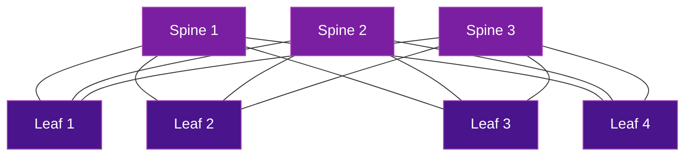

# CLOS Fabrics & Load Balancing

Modern data center networks use **CLOS (Spine-Leaf)** topologies with multiple equal-cost paths. SRv6 provides deterministic traffic placement across these paths, solving the fundamental limitations of traditional ECMP hashing.

## CLOS Topology Refresher

A CLOS fabric provides full bisectional bandwidth between any two leaf switches through multiple spine switches:



## The ECMP Problem

Traditional ECMP (Equal-Cost Multi-Path) uses a hash of packet headers (5-tuple) to select a path. This works well for diverse traffic, but fails with:

- **Elephant flows** — large, long-lived flows that saturate a single path
- **Synchronized workloads** — AI/ML training where thousands of flows start and end simultaneously
- **Hash collisions** — multiple flows hashing to the same spine, causing congestion while other spines are idle
- **Hash polarization** — similar hash results at multiple layers of the fabric

## SRv6 Deterministic Path Placement

Instead of relying on hashing, SRv6 allows the **source** (host, NIC, or controller) to explicitly choose which spine each flow traverses:

```
Traditional ECMP:
  Packet → Hash(5-tuple) → Spine selection    (probabilistic)

SRv6 Path Placement:
  Packet → SRv6 SID(Spine-N) → Spine selection  (deterministic)
```

Each spine is assigned an SRv6 uSID. The source encapsulates the packet with the desired spine's SID, guaranteeing the path.

### Benefits

| Aspect | ECMP | SRv6 Deterministic |
|--------|:----:|:------------------:|
| Path selection | Hash-based (probabilistic) | Explicit (deterministic) |
| Elephant flow handling | Poor (collisions) | Optimal (controlled placement) |
| Fabric utilization | 60-80% typical | Near 100% achievable |
| Application awareness | None | Source can control path |
| Flowlet support | Limited | Native via SID switching |

## Global Load Balancing (GLB) and Flowlets

### What are Flowlets?

A **flowlet** is a burst of packets within a flow, separated by idle gaps. Unlike flow-level load balancing (which pins an entire flow to one path), **flowlet-based** load balancing can reassign traffic to different paths between bursts without causing reordering.

```
Flow timeline:
  ████████──gap──████████──gap──████████──gap──████████
  Flowlet 1       Flowlet 2       Flowlet 3       Flowlet 4
  → Spine 1       → Spine 2       → Spine 3       → Spine 1
```

### GLB with SRv6

Global Load Balancing (GLB) uses SRv6 to steer flowlets across different spines:

1. **Monitor** fabric link utilization or congestion signals
2. **Assign** each new flowlet to the least-loaded spine via SRv6 SID
3. **Reroute** between flowlet gaps — no packet reordering

This is especially powerful for **AI training** workloads where collective operations (AllReduce, AllGather) create predictable traffic bursts with natural gaps.

## BGP in CLOS + SRv6

BGP is the standard routing protocol for CLOS fabrics (replacing OSPF/IS-IS in many DC deployments). With SRv6:

### eBGP Underlay

Each leaf-spine link runs an eBGP session (each switch has its own ASN or uses BGP unnumbered):

```
Leaf ASN 65001 ──eBGP── Spine ASN 65100
Leaf ASN 65002 ──eBGP── Spine ASN 65100
```

### SRv6 Locator Advertisement

Each switch advertises its SRv6 locator via BGP, making SRv6 SIDs reachable across the fabric.

### Overlay Services

BGP EVPN over SRv6 provides:

- **L2 bridging** across the fabric (VXLAN replacement)
- **L3 routing** between VRFs
- **Distributed anycast gateway** at every leaf

## SRv6 vs VXLAN in Data Centers

| Aspect | VXLAN + ECMP | SRv6 uSID |
|--------|:------------:|:----------:|
| Encapsulation | UDP/VXLAN | IPv6 + SRH (or just DA with uSID) |
| Path control | Hash-based only | Deterministic or hash-based |
| TE capability | None | Full SR Policy support |
| Overhead | 50 bytes | 40 bytes (no SRH) or 56+ bytes (with SRH) |
| Flowlet support | Limited | Native via SID update between bursts |
| Standards | RFC 7348 | RFC 8986, RFC 9800 |

## Further Reading

- :material-arrow-right: [AI/ML Training Networks](../use-cases/ai-networking.md) - SRv6 for GPU cluster fabrics
- :material-arrow-right: [BGP Overlay Services](bgp-overlay-services.md) - EVPN and L3VPN over SRv6
- :material-arrow-right: [uSID / SRv6 Compression](usid-compression.md) - Efficient path encoding
- :material-arrow-right: [Traffic Engineering](../use-cases/traffic-engineering.md) - SR Policies

## References

1. [RFC 7938 - Use of BGP for Routing in Large-Scale Data Centers](https://datatracker.ietf.org/doc/rfc7938/) - Defines BGP as the routing protocol for CLOS DC fabrics
2. [RFC 8986 - SRv6 Network Programming](https://datatracker.ietf.org/doc/rfc8986/) - SRv6 behaviors used for path placement in DC fabrics
3. [draft-filsfils-srv6ops-srv6-ai-backend](https://datatracker.ietf.org/doc/draft-filsfils-srv6ops-srv6-ai-backend/) - SRv6 deterministic path placement for AI backend networks
4. [RFC 9800 - Compressed SRv6 Segment List Encoding](https://datatracker.ietf.org/doc/rfc9800/) - uSID compression enabling efficient spine selection
