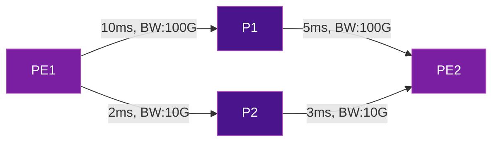
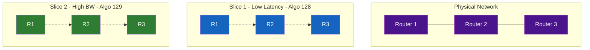

# Flex-Algorithm

**IGP Flexible Algorithm (Flex-Algo)** allows operators to define custom path computation algorithms within the IGP (IS-IS or OSPFv3). Combined with SRv6, it enables **network slicing** — multiple logical topologies over a single physical infrastructure.

## The Problem

Traditional IGP computes a single shortest path based on link metric. But modern networks need different paths for different services:

- **Voice/Video:** Lowest latency path
- **Bulk data:** Highest bandwidth path
- **Critical services:** Path avoiding certain nodes/links
- **Redundancy:** Disjoint paths for protection

## The Solution

Flex-Algo lets you define **multiple algorithms** (algo 128-255), each with its own:

- **Metric type** (IGP metric, latency, TE metric)
- **Constraints** (include/exclude affinities, SRLGs)
- **Calculation type** (SPF, strict SPF)

Each algorithm produces its own set of SRv6 SIDs, creating independent forwarding planes.

## How It Works



| Algorithm | Metric | Best Path PE1→PE2 | Use Case |
|:---------:|--------|:------------------:|----------|
| **Algo 0** | IGP metric (default) | PE1→P2→PE2 | Default routing |
| **Algo 128** | Latency | PE1→P2→PE2 (5ms) | Low-latency services |
| **Algo 129** | TE metric (bandwidth) | PE1→P1→PE2 (100G) | High-bandwidth services |

### Per-Algorithm SRv6 Locators

Each Flex-Algo gets its own SRv6 locator, which means its own set of SIDs:

```
Node PE2 advertises:
  Algo 0:   fcbb:bb01:0002::/48  → Default IGP path
  Algo 128: fcbb:bb02:0002::/48  → Latency-optimized path
  Algo 129: fcbb:bb03:0002::/48  → Bandwidth-optimized path
```

To steer traffic on the low-latency path, simply use the Algo 128 SID as the destination. The IGP handles path computation automatically.

## Network Slicing with Flex-Algo

Flex-Algo is the foundation of **SRv6 network slicing** for 5G and enterprise services:



## Configuration

=== "Cisco IOS-XR"

    ```cisco
    !! Define Flex-Algo 128 (low latency)
    router isis CORE
     flex-algo 128
      metric-type delay
      advertise-definition
     !
     address-family ipv6 unicast
      segment-routing srv6
       locator LATENCY algo 128
      !
     !
    !

    !! Define SRv6 locator for Algo 128
    segment-routing
     srv6
      locators
       locator LATENCY
        micro-segment behavior unode psp-usd
        prefix fcbb:bb02::/48
        algorithm 128
       !
      !
     !
    !
    ```

=== "Juniper"

    ```junos
    set protocols isis source-packet-routing flex-algorithm 128
    set protocols isis source-packet-routing flex-algorithm 128 metric-type delay
    set routing-options source-packet-routing srv6 locator latency fcbb:bb02::/48 algorithm 128
    ```

## Flex-Algo Properties

| Property | Options | Description |
|----------|---------|-------------|
| **Algorithm ID** | 128-255 | User-defined algorithm number |
| **Metric Type** | IGP, delay, TE | Which metric to optimize |
| **Calculation Type** | SPF, Strict SPF | How to compute the path |
| **Include-any** | Admin groups | Links MUST have at least one of these affinities |
| **Include-all** | Admin groups | Links MUST have ALL of these affinities |
| **Exclude-any** | Admin groups | Links MUST NOT have any of these affinities |
| **Exclude SRLG** | SRLG values | Avoid links sharing a risk group |

## Verification

=== "Cisco IOS-XR"

    ```cisco
    show isis flex-algo 128
    show segment-routing srv6 locator LATENCY
    show isis route ipv6 fcbb:bb02:0002::/48 detail
    ```

=== "Juniper"

    ```junos
    show isis flex-algorithm 128
    show spring-traffic-engineering srv6-sid
    ```

!!! tip "Production validated"
    According to a [joint announcement by Cisco and SoftBank](https://news-blogs.cisco.com/apjc/2022/04/27/cisco-marks-worlds-first1-with-the-deployment-of-srv6-flex-algo-on-softbanks-5g-commercial-network/), SRv6 Flex-Algo was deployed on a commercial 5G network in April 2022.

## Further Reading

- :material-arrow-right: [Traffic Engineering](../use-cases/traffic-engineering.md) - SR Policies for TE
- :material-arrow-right: [5G Transport](../use-cases/5g-transport.md) - Network slicing for 5G
- :material-arrow-right: [uSID / SRv6 Compression](usid-compression.md) - Efficient SID encoding
- :material-file-document: [RFC 9352](../rfcs/rfc9352.md) - IS-IS Extensions for SRv6

## References

1. [RFC 9350 - IGP Flexible Algorithm](https://datatracker.ietf.org/doc/rfc9350/) - Defines Flex-Algo extensions for IS-IS, OSPFv2, and OSPFv3 enabling custom path computation with constraint-based metrics
2. [Cisco Marks World's First SRv6 Flex-Algo Deployment on SoftBank's 5G Network](https://news-blogs.cisco.com/apjc/2022/04/27/cisco-marks-worlds-first1-with-the-deployment-of-srv6-flex-algo-on-softbanks-5g-commercial-network/) - Cisco blog announcing the first commercial SRv6 Flex-Algo deployment for 5G network slicing
3. [Cisco IOS-XR: Enabling Segment Routing Flexible Algorithm](https://www.cisco.com/c/en/us/td/docs/iosxr/ncs5500/segment-routing/72x/b-segment-routing-cg-ncs5500-72x/enabling-segment-routing-flexible-algorithm.html) - Cisco IOS-XR configuration guide for Flex-Algo on NCS 5500 routers
