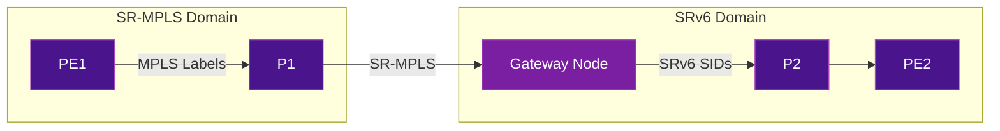
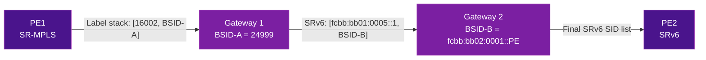

# Interworking & Migration

Most networks don't start from zero. Migrating from MPLS or SR-MPLS to SRv6 requires a clear strategy for **coexistence** during the transition. This page covers the common migration paths and interworking mechanisms.

## Migration Strategies

### Option 1: Greenfield (Clean Start)

New network built entirely on SRv6, no MPLS legacy.

```
Day 0: Deploy SRv6 from scratch
       No MPLS, no LDP, no RSVP-TE
```

**Who chose this:** Iliad (Italy), Rakuten Mobile (Japan) — both started as new operators and deployed SRv6-only networks from day one.

**Pros:** Simplest architecture, no interworking complexity
**Cons:** Only possible for new networks

### Option 2: Parallel Overlay (Ship-in-the-Night)

Run SRv6 and MPLS as two separate planes on the same physical infrastructure:

```
┌─────────────────────────────────┐
│        Physical Network          │
│                                  │
│  ┌──────────┐  ┌──────────┐    │
│  │ MPLS     │  │  SRv6    │    │
│  │ Plane    │  │  Plane   │    │
│  │ (legacy) │  │  (new)   │    │
│  └──────────┘  └──────────┘    │
└─────────────────────────────────┘
```

1. Deploy SRv6 alongside existing MPLS
2. Migrate services one by one from MPLS to SRv6
3. Decommission MPLS when all services are migrated

**Pros:** Low risk, gradual migration, rollback possible
**Cons:** Dual-stack complexity during transition

### Option 3: SR-MPLS → SRv6 uSID (Incremental)

If you already have SR-MPLS, the migration to SRv6 is simpler because both share the SR architecture:

1. **Phase 1:** Deploy SR-MPLS (replace LDP/RSVP with segment routing)
2. **Phase 2:** Upgrade nodes to support SRv6 uSID
3. **Phase 3:** Enable SRv6 on upgraded nodes, use interworking for non-upgraded
4. **Phase 4:** Complete migration, disable SR-MPLS

### Option 4: Direct MPLS → SRv6 (Skip SR-MPLS)

Some operators skip SR-MPLS entirely and go directly from traditional MPLS to SRv6 uSID. This avoids a double migration but requires more careful planning.

**Who chose this:** According to their [public announcement](https://blog.lacnic.net/en/unveiling-the-future-of-the-network-implementation-of-srv6-usid-in-telefonica-vivos-infrastructure/), Telefonica VIVO went directly to SRv6 uSID to avoid double migration costs.

## Interworking Mechanisms

### SR-MPLS ↔ SRv6 Gateway

A gateway node translates between SR-MPLS and SRv6 at the domain boundary:



#### What the Gateway Does

1. **SR-MPLS → SRv6:** Receives MPLS packet, pops labels, encapsulates with SRv6 SRH
2. **SRv6 → SR-MPLS:** Receives SRv6 packet, decapsulates, pushes MPLS labels

#### BGP Multi-Domain

BGP can signal both SR-MPLS and SRv6 SIDs for the same VPN prefix, allowing the gateway to perform the translation:

```
BGP Update for prefix 10.0.0.0/24:
  ├── SR-MPLS Label: 24001
  └── SRv6 SID: fcbb:bb01:0002::DT4
```

### Binding SID (BSID) for Cross-Domain

A **Binding SID** represents an entire SR Policy as a single SID. This enables stitching across domains:

```
Domain A (SR-MPLS): PE1 → BSID=24999 → Gateway
Domain B (SRv6):    Gateway → fcbb:bb01:0002::DT4 → PE2

The BSID at the gateway maps to the SRv6 segment list in Domain B.
```

### VPN Service Interworking

For L3VPN and EVPN services spanning both domains:

| Service | SR-MPLS Side | Gateway | SRv6 Side |
|---------|:------------:|:-------:|:---------:|
| L3VPN | VPN label + SR-MPLS transport | Label↔SID translation | End.DT4/DT6 SID |
| EVPN | EVPN label + SR-MPLS transport | Label↔SID translation | End.DX2/DT2 SID |
| TE | SR-MPLS label stack | BSID stitching | SRv6 SR Policy |

## MTU Considerations During Migration

SRv6 encapsulation adds overhead. During migration, you may have mixed MTU requirements:

| Encapsulation | Overhead |
|---------------|:--------:|
| SR-MPLS (3 labels) | 12 bytes |
| SRv6 (no SRH, uSID in DA) | 40 bytes (IPv6 header) |
| SRv6 (with SRH, 1 SID) | 64 bytes |
| SRv6 (with SRH, 3 SIDs) | 96 bytes |
| SRv6 uSID (6 hops in 1 container) | 40 bytes |

!!! tip "uSID reduces the MTU problem"
    SRv6 uSID compression means that for up to 6 hops, the overhead is just the 40-byte outer IPv6 header (no SRH needed). This makes SRv6 uSID comparable to or better than a 3-label MPLS stack.

**Recommendation:** Ensure all links in the SRv6 domain support at least **9100 bytes MTU** (jumbo frames) to accommodate SRv6 encapsulation without fragmenting inner packets with a 1500-byte MTU.

## Gateway Implementation Details

The gateway node is the linchpin of any SR-MPLS/SRv6 interworking deployment. It must maintain forwarding state for **both** data planes and perform real-time header translation at line rate.

### Packet Walk: SR-MPLS to SRv6

The following diagram shows the step-by-step transformation of a packet crossing from an SR-MPLS domain into an SRv6 domain through a gateway node.

```
Ingress (SR-MPLS side)                          Egress (SRv6 side)
═══════════════════════                          ═════════════════════

  ┌─────────────────────┐                        ┌─────────────────────────────┐
  │ Transport Label: 16002│                       │ IPv6 Header                 │
  │ Transport Label: 16005│                       │   SA: fcbb:bb01:0100::      │
  │ VPN Label: 24001     │                        │   DA: fcbb:bb01:0002::DT4   │
  │ ──────────────────── │                        │ ─────────────────────────── │
  │ Inner IPv4 Packet    │                        │ Inner IPv4 Packet           │
  │   10.0.0.0/24        │                        │   10.0.0.0/24              │
  └─────────────────────┘                        └─────────────────────────────┘

         │                                                  ▲
         │  Step 1: Receive MPLS packet                     │
         │  Step 2: Pop all MPLS labels                     │
         │  Step 3: VPN label 24001 → lookup SRv6 SID       │
         │  Step 4: Encapsulate with IPv6 + optional SRH    │
         │  Step 5: Forward into SRv6 domain                │
         └──────────────────────────────────────────────────┘
```

**Step-by-step breakdown:**

| Step | Action | Details |
|:----:|--------|---------|
| 1 | **Receive MPLS packet** | Gateway receives a packet with a stack of MPLS labels: transport labels (imposed by the SR-MPLS ingress PE) on top, followed by the VPN service label at the bottom of the stack |
| 2 | **Pop MPLS labels** | The transport labels have already been popped by penultimate-hop-popping (PHP) or are terminated at the gateway. The gateway pops the remaining VPN label |
| 3 | **Look up VPN label mapping** | The VPN label (e.g., 24001) is used to look up the corresponding SRv6 SID. This mapping is learned via BGP, where the remote PE advertised both an MPLS label and an SRv6 SID for the same VPN prefix |
| 4 | **Encapsulate with SRv6** | The gateway builds an outer IPv6 header. The destination address is set to the SRv6 End function SID (e.g., `End.DT4` for L3VPN decapsulation). If intermediate SRv6 segments are needed, a Segment Routing Header (SRH) is inserted |
| 5 | **Forward into SRv6 domain** | The packet is forwarded as a native IPv6 packet into the SRv6 domain based on the outer IPv6 destination address |

### Packet Walk: SRv6 to SR-MPLS (Reverse Direction)

The reverse direction mirrors the process:

```
Ingress (SRv6 side)                              Egress (SR-MPLS side)
═══════════════════                              ═════════════════════

  ┌─────────────────────────────┐                ┌─────────────────────┐
  │ IPv6 Header                 │                │ Transport Label: 16007│
  │   DA: fcbb:bb01:0100::E     │                │ VPN Label: 24050     │
  │ SRH (optional)              │                │ ──────────────────── │
  │ ─────────────────────────── │                │ Inner IPv4 Packet    │
  │ Inner IPv4 Packet           │                │   172.16.0.0/24      │
  └─────────────────────────────┘                └─────────────────────┘

         │                                                  ▲
         │  Step 1: Receive SRv6 packet at gateway SID      │
         │  Step 2: Decapsulate (remove IPv6 + SRH)         │
         │  Step 3: Look up destination → find MPLS labels   │
         │  Step 4: Push VPN label + transport labels        │
         │  Step 5: Forward into SR-MPLS domain              │
         └──────────────────────────────────────────────────┘
```

!!! info "Gateway SID Function"
    The gateway advertises a dedicated SID (e.g., an `End` or `End.X` function) that serves as the entry point from the SRv6 domain. When the gateway processes this SID, it knows to perform the cross-domain translation.

### BGP Signaling at the Gateway

The gateway learns both MPLS labels and SRv6 SIDs for the same prefix through **BGP multi-protocol extensions**. A dual-stack PE (or the gateway itself acting as a route-reflector client) receives BGP VPN updates carrying both types of reachability information.

```
BGP VPNv4 Update from PE2 (SRv6-capable):
  Route Distinguisher: 65000:100
  Prefix: 10.0.0.0/24
  Next-Hop: fcbb:bb01:0002::
  Extended Community: RT 65000:100
  ├── Prefix-SID Attribute:
  │     SRv6 SID: fcbb:bb01:0002::DT4
  │     SID Structure: (block=32, node=16, function=16, arg=0)
  └── MPLS Label: 24001 (for SR-MPLS peers)

BGP VPNv4 Update from PE1 (SR-MPLS-only):
  Route Distinguisher: 65000:100
  Prefix: 172.16.0.0/24
  Next-Hop: 10.255.0.1
  Extended Community: RT 65000:100
  └── MPLS Label: 24050
```

The gateway maintains a **cross-reference table** that maps each VPN prefix to both its MPLS label and its SRv6 SID, enabling bidirectional translation:

| VPN Prefix | MPLS Label | SRv6 SID | Origin PE |
|-----------|:----------:|----------|-----------|
| 10.0.0.0/24 | 24001 | `fcbb:bb01:0002::DT4` | PE2 (SRv6) |
| 172.16.0.0/24 | 24050 | -- | PE1 (SR-MPLS) |
| 192.168.1.0/24 | 24070 | `fcbb:bb01:0003::DT4` | PE3 (dual-stack) |

!!! warning "Gateway Scalability"
    The gateway must maintain state for every VPN prefix that crosses the domain boundary. In large networks, this can reach hundreds of thousands of entries. Proper capacity planning and route filtering at domain boundaries are essential.

---

## Binding SID Deep Dive

The **Binding SID (BSID)** is one of the most powerful abstractions in the SR architecture, defined in [RFC 9256 (SR Policy Architecture)](https://datatracker.ietf.org/doc/rfc9256/). It is essential for multi-domain migration.

### What Is a Binding SID?

A BSID is a **single SID** (either an MPLS label or an SRv6 SID) that **represents an entire SR Policy** -- including all its segment lists, weighted paths, and constraints. When a packet is steered onto a BSID, the node that owns the BSID expands it into the full segment list of the associated policy.

```
Without BSID:
  Ingress PE must know the FULL path across all domains:
  [16001, 16002, 16005, fcbb:bb01:0002::1, fcbb:bb01:0003::DT4]
  ^^^^^^^^^^^^^^^^^^^^^^  ^^^^^^^^^^^^^^^^^^^^^^^^^^^^^^^^^^^^^^^^^^
     SR-MPLS segments              SRv6 segments

With BSID:
  Ingress PE only needs to know:
  [16001, 16002, 24999]
                 ^^^^^
            BSID at gateway — represents the entire SRv6 path
```

### Why BSID Is Critical for Migration

BSID provides **domain isolation**: neither domain needs to understand the other's SID format, addressing scheme, or internal topology.

| Benefit | Explanation |
|---------|-------------|
| **Abstraction** | SR-MPLS domain sees a simple MPLS label (the BSID), not SRv6 SIDs |
| **Scalability** | Ingress PE segment list stays short regardless of end-to-end path length |
| **Flexibility** | The SRv6 path behind the BSID can change without affecting the SR-MPLS domain |
| **Incremental migration** | New SRv6 segments can be added behind the BSID without touching the SR-MPLS domain configuration |

### BSID Stitching Across Domains

In a multi-domain network, each domain boundary has a gateway that owns a BSID. Traffic is stitched from one domain to the next by chaining BSIDs:



1. **PE1** pushes `[16002, BSID-A(24999)]` -- transport to Gateway 1, then the BSID
2. **Gateway 1** receives the packet, matches BSID-A (24999), and expands it into the SRv6 segment list for Domain B: `[fcbb:bb01:0005::1, BSID-B]`
3. **Gateway 2** receives the packet, matches BSID-B, and expands it into the final SRv6 segments to reach PE2

### BSID Allocation: Static vs Dynamic

| Allocation Method | Description | Use Case |
|:-:|-------------|----------|
| **Static** | Operator manually assigns a specific label or SID as the BSID for each SR Policy | Production networks where predictable values are needed for troubleshooting, policy enforcement, and cross-domain contracts |
| **Dynamic** | The headend or gateway automatically allocates a BSID from a reserved range when the SR Policy is instantiated | Lab environments, automated deployments, or when BSIDs are only consumed locally |

!!! tip "Best Practice for Migration"
    Use **static BSID allocation** at domain boundaries during migration. This ensures that cross-domain stitching configurations remain stable even when SR Policies are re-optimized or the gateway restarts.

### Worked Example: SR-MPLS Traffic Hitting a BSID

Consider traffic from an SR-MPLS domain that needs to reach `10.0.0.0/24` behind PE2 in the SRv6 domain:

```
1. PE1 (SR-MPLS) receives customer traffic for 10.0.0.0/24
2. BGP next-hop resolves to Gateway via SR-MPLS transport
3. PE1 pushes label stack:
     ┌──────────────────────────┐
     │ Transport: 16005 (to GW) │
     │ BSID: 24999              │  ← represents SRv6 SR Policy to PE2
     │ ======================== │
     │ Customer IPv4 packet     │
     └──────────────────────────┘

4. Packet arrives at Gateway, transport label already popped (PHP)
5. Gateway processes BSID 24999 → expands into SRv6 SR Policy:
     ┌─────────────────────────────────────┐
     │ IPv6 SA: fcbb:bb01:0100::           │
     │ IPv6 DA: fcbb:bb01:0005::1          │  ← first SRv6 segment
     │ SRH: [fcbb:bb01:0002::DT4]          │  ← remaining segments
     │ =================================== │
     │ Customer IPv4 packet                 │
     └─────────────────────────────────────┘

6. Packet traverses SRv6 domain using standard SRv6 forwarding
7. PE2 processes End.DT4 → decapsulates and delivers to VRF
```

---

## Control Plane Coexistence

During migration, the control plane must advertise reachability information for **both** SR-MPLS and SRv6 simultaneously. This section covers how IS-IS and BGP handle dual data-plane coexistence.

### IS-IS with Dual SR Data Planes

IS-IS can advertise **both** SR-MPLS Prefix-SIDs and SRv6 Locators in the same IGP instance. There is no need to run separate IS-IS instances for each data plane.

```
IS-IS LSP from Node R5 (dual-stack capable):
  ├── TLV 135 (IPv4 Reachability):
  │     Prefix: 10.255.0.5/32
  │     Sub-TLV: Prefix-SID = 16005 (MPLS label = SRGB base + 5)
  │
  └── TLV 236 (IPv6 Reachability):
        Prefix: fcbb:bb01:0005::/48
        Sub-TLV: SRv6 Locator
          Algorithm: 0
          SRv6 End SID: fcbb:bb01:0005::1
```

| IS-IS TLV | Purpose | Data Plane |
|-----------|---------|:----------:|
| TLV 135 + Prefix-SID sub-TLV | Advertise MPLS Prefix-SID for an IPv4 node address | SR-MPLS |
| TLV 236 + SRv6 Locator sub-TLV | Advertise SRv6 locator and associated End SIDs | SRv6 |
| TLV 22 + Adj-SID sub-TLV | Advertise per-adjacency MPLS SID | SR-MPLS |
| TLV 22 + SRv6 End.X SID sub-TLV | Advertise per-adjacency SRv6 SID | SRv6 |

!!! note "Single IGP Instance"
    A key advantage of SR is that both data planes share the **same IS-IS topology database**. You do not need separate IGP instances or processes. A single IS-IS instance computes SPF once and installs both MPLS and SRv6 forwarding entries as appropriate.

### BGP Multi-Protocol: Dual SID Signaling

BGP VPNv4/VPNv6 and EVPN routes can carry both MPLS labels and SRv6 SIDs simultaneously, enabling the gateway to choose the appropriate encapsulation based on the egress domain.

```
BGP VPNv4 Update (dual-stack PE advertising both):
  ├── NLRI: RD:65000:100 10.0.0.0/24
  ├── Next-Hop: 10.255.0.2 (IPv4) / fcbb:bb01:0002:: (IPv6)
  ├── Extended Communities:
  │     Route Target: 65000:100
  ├── MPLS Label: 24001
  └── SRv6-VPN SID TLV:
        SRv6 SID: fcbb:bb01:0002::DT4
        SID Behavior: End.DT4 (63)
        SID Structure: BL=32, NL=16, FL=16, AL=0
```

### Preference and Fallback Logic

When a node has **both** SR-MPLS and SRv6 paths available for the same destination, a preference mechanism determines which is used:

| Priority | Criteria | Typical Configuration |
|:--------:|----------|----------------------|
| 1 | **Explicit SR Policy** | If an SR Policy (with candidate path) steers traffic for the prefix, it takes precedence regardless of data plane |
| 2 | **BGP color extended community** | Color-based steering can select an SRv6 or SR-MPLS SR Policy |
| 3 | **Address family preference** | Operator-configured preference: some deployments prefer SRv6 when available, falling back to SR-MPLS |
| 4 | **IGP metric / best path** | Standard BGP best-path selection when no explicit steering is configured |

!!! tip "Fallback Strategy During Migration"
    Configure SR-MPLS as the **primary** transport during early migration phases and SRv6 as the **backup**. As confidence grows, reverse the preference. This allows instant rollback by simply changing the preference knob without removing any configuration.

```
! Example: IOS XR preference configuration concept
router bgp 65000
  address-family vpnv4 unicast
    ! Prefer SRv6 transport when available
    transport prefer srv6
    ! Fall back to SR-MPLS if SRv6 path is unavailable
    transport fallback sr-mpls
```

---

## SID Allocation Planning

A well-designed SID allocation plan is critical for a successful SRv6 deployment. Poor planning leads to renumbering, operational complexity, and scaling limitations.

### Choosing Your SID Block

Per [RFC 9602](https://datatracker.ietf.org/doc/rfc9602/), the recommended SRv6 SID block ranges are:

| Block | Purpose | Notes |
|-------|---------|-------|
| `5f00::/16` | IANA-registered SRv6 SID block | Globally routable, for use across organizational boundaries (RFC 9602) |
| `fc00::/7` (ULA space) | Private/internal use | Commonly used in enterprise and SP networks that do not need global SRv6 reachability |
| `fcbb:bbXX::/32` | Common convention in Cisco deployments | De facto standard in many production SRv6 networks |

!!! warning "Avoid Using Global Unicast (2000::/3) for SIDs"
    While technically possible, using globally routable IPv6 space for SRv6 SIDs creates confusion between transit IPv6 traffic and SRv6-encapsulated traffic. Use the dedicated `5f00::/16` block or ULA space instead.

### Locator Structure

The SRv6 locator is structured as follows per [RFC 8986](https://datatracker.ietf.org/doc/rfc8986/) and [RFC 9800](https://datatracker.ietf.org/doc/rfc9800/):

```
|<---------- Locator ---------->|<-- Function -->|<- Argument ->|
|<-- Block -->|<---- Node ----->|                |              |
|   B bits    |     N bits      |    F bits      |   A bits     |
|             |                 |                |              |
 fcbb:bb01   :     0005        :     0001       :   0000
 (32 bits)       (16 bits)        (16 bits)        (variable)
```

| Field | Typical Length | Purpose |
|-------|:-:|---------|
| **Block** | 32-48 bits | Identifies the SRv6 domain. All nodes in the same domain share this prefix |
| **Node** | 16-24 bits | Uniquely identifies a node within the domain |
| **Function** | 16 bits | Identifies the behavior (End, End.DT4, End.DX2, etc.) on the node |
| **Argument** | 0-variable bits | Optional parameters for the function (e.g., flow entropy) |

### uSID Considerations

For uSID (micro-SID) deployments as defined in [RFC 9800](https://datatracker.ietf.org/doc/rfc9800/), the structure changes significantly:

```
Standard SRv6 SID (128-bit):
|<--- Locator (48-bit) --->|<- Function (16-bit) ->|<- Args (64-bit) ->|
  fcbb:bb01:0005              :0001                   :0000:0000:0000

uSID Container (128-bit, carrying up to 6 micro-SIDs):
|<- Block (32-bit) ->|<----- 6 x 16-bit uSIDs ------>|
  fcbb:bb01            :0005:0007:0003:0002:0000:0000
                        ^^^^  ^^^^  ^^^^  ^^^^
                        uSID1 uSID2 uSID3 uSID4  (2 slots empty = end)
```

| Parameter | Standard SRv6 | uSID |
|-----------|:---:|:---:|
| Block length | 32-48 bits | 32 bits (fixed) |
| Per-node SID size | 128 bits | 16 bits |
| SIDs per container | 1 | Up to 6 |
| SRH needed (up to 6 hops) | Yes | No |
| Overhead (up to 6 hops) | 40 + 24 x N bytes | 40 bytes (IPv6 header only) |

### Numbering Plan Example: Medium Network (100 Nodes)

The following allocation plan covers a medium-size service provider with 100 nodes across 4 regions:

```
SRv6 Block: fcbb:bb01::/32  (uSID block)

Region allocation (bits 33-40 = region ID):
  Region 1 (Core):        fcbb:bb01:01XX::/40   (nodes 0x0100 - 0x01FF)
  Region 2 (East):        fcbb:bb01:02XX::/40   (nodes 0x0200 - 0x02FF)
  Region 3 (West):        fcbb:bb01:03XX::/40   (nodes 0x0300 - 0x03FF)
  Region 4 (Data Center): fcbb:bb01:04XX::/40   (nodes 0x0400 - 0x04FF)

Per-node function allocation (16-bit function space):
  0x0001       End (node SID)
  0x0002       End.X (adjacency SID, link 1)
  0x0003       End.X (adjacency SID, link 2)
  0x0010-001F  End.DT4 (L3VPN v4, up to 16 VRFs)
  0x0020-002F  End.DT6 (L3VPN v6, up to 16 VRFs)
  0x0030-003F  End.DT2U (EVPN unicast)
  0x0040-004F  End.DT2M (EVPN multicast)
  0x0050-005F  Flex-Algo End SIDs (Algo 128-143)
  0xFE00-FEFF  Reserved for BSID (static)
  0xFF00-FFFF  Reserved for future use
```

**Example node assignments (Region 1 -- Core):**

| Node | Hostname | Locator | End SID | End.DT4 (VRF CUST-A) |
|:----:|----------|---------|---------|----------------------|
| 1 | core-rtr-01 | `fcbb:bb01:0101::/48` | `fcbb:bb01:0101::1` | `fcbb:bb01:0101::10` |
| 2 | core-rtr-02 | `fcbb:bb01:0102::/48` | `fcbb:bb01:0102::1` | `fcbb:bb01:0102::10` |
| 3 | core-gw-01 | `fcbb:bb01:0103::/48` | `fcbb:bb01:0103::1` | `fcbb:bb01:0103::10` |

### Common Mistakes to Avoid

!!! danger "SID Allocation Pitfalls"
    **1. Overlapping locators:** If two nodes are assigned overlapping locator prefixes, SRv6 forwarding will be ambiguous. Every locator must be unique in the IGP domain.

    **2. Insufficient function space:** Allocating only 8 bits for the function field limits you to 256 functions per node. For nodes hosting many VRFs or EVPN instances, 16 bits (65,536 functions) is strongly recommended.

    **3. Forgetting uSID alignment:** uSID requires the block to be exactly 32 bits and each micro-SID to be 16 bits. Choosing a 48-bit block breaks uSID compatibility.

    **4. No room for growth:** Allocate at least 2x the currently needed address space per region to accommodate future growth without renumbering.

    **5. Mixing SID blocks across domains:** Each SRv6 domain should use a distinct block. This simplifies filtering, policy enforcement, and troubleshooting.

---

## Migration Phases (Detailed)

This section expands the high-level migration options into a structured, phased approach with specific actions, verification steps, and rollback plans for each phase.

### Phase 0: Assessment and Planning

**Objective:** Understand the current state and design the target architecture.

| Activity | Details |
|----------|---------|
| **Inventory current MPLS services** | Catalog all L3VPN, L2VPN/EVPN, TE tunnels, and multicast services. Document the number of VRFs, pseudowires, and RSVP-TE tunnels per node |
| **Identify SRv6-capable hardware** | Audit all router platforms and line cards. Check vendor documentation for SRv6 and uSID support. Flag nodes requiring hardware upgrades |
| **Design SID allocation scheme** | Follow the SID Allocation Planning section above. Define block, locator structure, and per-node function assignments |
| **Plan gateway placement** | Identify domain boundary nodes that will serve as SR-MPLS/SRv6 gateways. Ensure these have sufficient memory and forwarding capacity |
| **Define success criteria** | Establish KPIs: convergence time, packet loss during cutover, service availability targets |

**Verification:** Review the plan with network operations, get sign-off from stakeholders.

**Rollback:** N/A -- this phase is planning only.

### Phase 1: Parallel Deployment (SRv6 Underlay)

**Objective:** Enable SRv6 on the network alongside MPLS. No production traffic uses SRv6 yet.

```
Actions:
  1. Enable IPv6 on all core links (if not already enabled)
  2. Advertise SRv6 locators in IS-IS (TLV 236)
  3. Continue advertising SR-MPLS Prefix-SIDs (TLV 135)
  4. Configure SRv6 End SIDs on upgraded nodes
  5. Do NOT configure any SRv6 VPN services yet
```

**Verification checklist:**

- [ ] All upgraded nodes advertise their SRv6 locator in IS-IS
- [ ] `show segment-routing srv6 sid` shows allocated SIDs on each node
- [ ] SRv6 locators are reachable via IPv6 ping from all nodes in the domain
- [ ] SR-MPLS forwarding is **completely unaffected** -- verify with traffic counters
- [ ] IS-IS adjacencies are stable, no SPF churn

**Rollback:** Remove SRv6 locator advertisements from IS-IS. Remove SRv6 SID configuration from nodes. This has **zero impact** on production MPLS traffic since no services use SRv6 yet.

### Phase 2: Service Migration

**Objective:** Migrate VPN services from SR-MPLS to SRv6 transport, starting with non-critical services.

```
Migration order (recommended):
  1. Internal/management VPNs (lowest risk)
  2. Non-revenue L3VPN customers (test accounts, lab VPNs)
  3. Standard L3VPN customers (one at a time)
  4. EVPN services
  5. TE-dependent services (last, most complex)
```

For each service migration:

| Step | Action |
|:----:|--------|
| 1 | Configure the SRv6 VPN SID (e.g., `End.DT4`) on the PE nodes for the target VRF |
| 2 | Advertise the SRv6 SID in BGP VPN updates alongside the existing MPLS label |
| 3 | On the remote PE, verify that both MPLS and SRv6 paths are received |
| 4 | Change the transport preference to SRv6 for this VRF |
| 5 | Monitor traffic counters -- confirm traffic shifts to SRv6 encapsulation |
| 6 | After soak period (24-72 hours), remove the MPLS label advertisement for this VRF |

**Verification:**

- [ ] `show bgp vpnv4 unicast vrf CUST-A` shows SRv6 SID in the best path
- [ ] Traffic counters on SRv6 interfaces are incrementing
- [ ] Customer-facing SLAs are met (latency, jitter, packet loss)
- [ ] No MPLS-encapsulated traffic for the migrated VRF remains

**Rollback:** Revert the transport preference to SR-MPLS. Since both MPLS labels and SRv6 SIDs are advertised during the transition, traffic immediately falls back to MPLS. This is a **sub-second** switchover if using BGP next-hop tracking.

### Phase 3: Optimization

**Objective:** Enable advanced SRv6 features and optimize the network.

| Activity | Benefit |
|----------|---------|
| **Enable uSID** | Reduce encapsulation overhead from 40-96 bytes to 40 bytes for up to 6 hops |
| **Deploy Flex-Algo** | Create topology-independent algorithms for low-latency, disjoint, or constrained paths |
| **Enable SRv6 TE Policies** | Replace remaining RSVP-TE tunnels with SRv6 SR Policies (using BSIDs) |
| **Optimize MTU** | With uSID deployed, re-evaluate MTU requirements. Many paths may no longer need jumbo frames |
| **Remove redundant SR-MPLS config** | On fully migrated nodes, remove Prefix-SID configuration, SRGB allocation, and SR-MPLS policies |

**Verification:**

- [ ] uSID forwarding works: packets traverse multiple hops with a single 128-bit container SID
- [ ] Flex-Algo paths are computed and installed correctly
- [ ] No RSVP-TE tunnels remain in the forwarding table
- [ ] End-to-end service validation passes for all VPN customers

**Rollback:** Each optimization can be rolled back independently. For example, disabling Flex-Algo only affects traffic using those algorithms; default algo 0 traffic is unaffected.

### Phase 4: MPLS Decommission

**Objective:** Remove all MPLS forwarding state from the network.

!!! danger "Point of No Return"
    Phase 4 is the most impactful. Ensure **all** services have been operating on SRv6 for a sufficient soak period (minimum 2-4 weeks recommended) before proceeding.

```
Decommission order:
  1. Remove LDP configuration (if any LDP sessions remain)
  2. Remove RSVP-TE configuration
  3. Remove SR-MPLS Prefix-SID advertisements from IS-IS
  4. Remove SRGB/SRLB configuration
  5. Disable MPLS forwarding on interfaces
  6. Clean up any MPLS-specific ACLs, QoS policies, OAM
```

**Verification:**

- [ ] `show mpls forwarding-table` is empty on all nodes
- [ ] No LDP or RSVP-TE sessions exist
- [ ] IS-IS no longer carries any SR-MPLS Prefix-SID TLVs
- [ ] All services continue to operate over SRv6
- [ ] Monitoring confirms zero MPLS-encapsulated packets on any link

**Rollback:** Re-enable SR-MPLS Prefix-SIDs in IS-IS and MPLS forwarding on interfaces. Since BGP VPN routes can carry MPLS labels again once advertised, services can be reverted to MPLS transport. However, this rollback requires careful re-configuration, which is why a thorough soak period before Phase 4 is essential.

---

## Brownfield Coexistence Patterns

### Pattern 1: Core-First Migration

Upgrade core/backbone routers to SRv6 first, keep edge on SR-MPLS:

```
[Edge SR-MPLS] → [Core SRv6] → [Edge SR-MPLS]
                  Gateway at boundary
```

### Pattern 2: Edge-First Migration

Upgrade edge/PE routers first, keep core on SR-MPLS:

```
[Edge SRv6] → [Core SR-MPLS] → [Edge SRv6]
               Gateway at boundary
```

### Pattern 3: Region-by-Region

Migrate one region at a time:

```
[Region A: SRv6] ↔ Gateway ↔ [Region B: SR-MPLS] ↔ Gateway ↔ [Region C: SRv6]
```

## Further Reading

- :material-arrow-right: [SRv6 vs SR-MPLS](srv6-vs-sr-mpls.md) - Detailed comparison
- :material-arrow-right: [uSID / SRv6 Compression](usid-compression.md) - How uSID reduces overhead
- :material-arrow-right: [Performance & Scaling](performance-scaling.md) - MTU impact analysis
- :material-arrow-right: [Real-World Deployments](../use-cases/deployments.md) - Migration stories

## References

1. [RFC 8402 - Segment Routing Architecture](https://datatracker.ietf.org/doc/rfc8402/) - Defines the SR architecture covering both SR-MPLS and SRv6 data planes
2. [RFC 9256 - SR Policy Architecture](https://datatracker.ietf.org/doc/rfc9256/) - Defines Binding SID and multi-domain SR Policy stitching
3. [RFC 9602 - Segment Routing over IPv6 (SRv6) Segment Identifiers in the IPv6 Addressing Architecture](https://datatracker.ietf.org/doc/rfc9602/) - IANA allocation of the 5f00::/16 SRv6 SID block
4. [RFC 9800 - Segment Routing over IPv6 with Micro-Segments](https://datatracker.ietf.org/doc/rfc9800/) - Defines the uSID (micro-SID) architecture for compressed SRv6
5. [RFC 8986 - SRv6 Network Programming](https://datatracker.ietf.org/doc/rfc8986/) - Defines SRv6 SID structure, behaviors (End, End.DT4, End.DX2, etc.)
6. [draft-ietf-spring-srv6-interop](https://datatracker.ietf.org/doc/draft-ietf-spring-srv6-interop/) - SRv6 interoperability considerations
