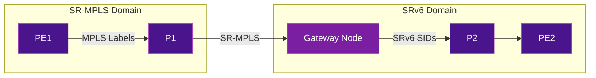

# Interworking & Migration

Most networks don't start from zero. Migrating from MPLS or SR-MPLS to SRv6 requires a clear strategy for **coexistence** during the transition. This page covers the common migration paths and interworking mechanisms.

## Migration Strategies

### Option 1: Greenfield (Clean Start)

New network built entirely on SRv6, no MPLS legacy.

```
Day 0: Deploy SRv6 from scratch
       No MPLS, no LDP, no RSVP-TE
```

**Who chose this:** Iliad (Italy), Rakuten Mobile (Japan) — both started as new operators and deployed SRv6-only networks from day one.

**Pros:** Simplest architecture, no interworking complexity
**Cons:** Only possible for new networks

### Option 2: Parallel Overlay (Ship-in-the-Night)

Run SRv6 and MPLS as two separate planes on the same physical infrastructure:

```
┌─────────────────────────────────┐
│        Physical Network          │
│                                  │
│  ┌──────────┐  ┌──────────┐    │
│  │ MPLS     │  │  SRv6    │    │
│  │ Plane    │  │  Plane   │    │
│  │ (legacy) │  │  (new)   │    │
│  └──────────┘  └──────────┘    │
└─────────────────────────────────┘
```

1. Deploy SRv6 alongside existing MPLS
2. Migrate services one by one from MPLS to SRv6
3. Decommission MPLS when all services are migrated

**Pros:** Low risk, gradual migration, rollback possible
**Cons:** Dual-stack complexity during transition

### Option 3: SR-MPLS → SRv6 uSID (Incremental)

If you already have SR-MPLS, the migration to SRv6 is simpler because both share the SR architecture:

1. **Phase 1:** Deploy SR-MPLS (replace LDP/RSVP with segment routing)
2. **Phase 2:** Upgrade nodes to support SRv6 uSID
3. **Phase 3:** Enable SRv6 on upgraded nodes, use interworking for non-upgraded
4. **Phase 4:** Complete migration, disable SR-MPLS

### Option 4: Direct MPLS → SRv6 (Skip SR-MPLS)

Some operators skip SR-MPLS entirely and go directly from traditional MPLS to SRv6 uSID. This avoids a double migration but requires more careful planning.

**Who chose this:** According to their [public announcement](https://blog.lacnic.net/en/unveiling-the-future-of-the-network-implementation-of-srv6-usid-in-telefonica-vivos-infrastructure/), Telefonica VIVO went directly to SRv6 uSID to avoid double migration costs.

## Interworking Mechanisms

### SR-MPLS ↔ SRv6 Gateway

A gateway node translates between SR-MPLS and SRv6 at the domain boundary:



#### What the Gateway Does

1. **SR-MPLS → SRv6:** Receives MPLS packet, pops labels, encapsulates with SRv6 SRH
2. **SRv6 → SR-MPLS:** Receives SRv6 packet, decapsulates, pushes MPLS labels

#### BGP Multi-Domain

BGP can signal both SR-MPLS and SRv6 SIDs for the same VPN prefix, allowing the gateway to perform the translation:

```
BGP Update for prefix 10.0.0.0/24:
  ├── SR-MPLS Label: 24001
  └── SRv6 SID: fcbb:bb01:0002::DT4
```

### Binding SID (BSID) for Cross-Domain

A **Binding SID** represents an entire SR Policy as a single SID. This enables stitching across domains:

```
Domain A (SR-MPLS): PE1 → BSID=24999 → Gateway
Domain B (SRv6):    Gateway → fcbb:bb01:0002::DT4 → PE2

The BSID at the gateway maps to the SRv6 segment list in Domain B.
```

### VPN Service Interworking

For L3VPN and EVPN services spanning both domains:

| Service | SR-MPLS Side | Gateway | SRv6 Side |
|---------|:------------:|:-------:|:---------:|
| L3VPN | VPN label + SR-MPLS transport | Label↔SID translation | End.DT4/DT6 SID |
| EVPN | EVPN label + SR-MPLS transport | Label↔SID translation | End.DX2/DT2 SID |
| TE | SR-MPLS label stack | BSID stitching | SRv6 SR Policy |

## MTU Considerations During Migration

SRv6 encapsulation adds overhead. During migration, you may have mixed MTU requirements:

| Encapsulation | Overhead |
|---------------|:--------:|
| SR-MPLS (3 labels) | 12 bytes |
| SRv6 (no SRH, uSID in DA) | 40 bytes (IPv6 header) |
| SRv6 (with SRH, 1 SID) | 64 bytes |
| SRv6 (with SRH, 3 SIDs) | 96 bytes |
| SRv6 uSID (6 hops in 1 container) | 40 bytes |

!!! tip "uSID reduces the MTU problem"
    SRv6 uSID compression means that for up to 6 hops, the overhead is just the 40-byte outer IPv6 header (no SRH needed). This makes SRv6 uSID comparable to or better than a 3-label MPLS stack.

**Recommendation:** Ensure all links in the SRv6 domain support at least **9100 bytes MTU** (jumbo frames) to accommodate SRv6 encapsulation without fragmenting inner packets with a 1500-byte MTU.

## Brownfield Coexistence Patterns

### Pattern 1: Core-First Migration

Upgrade core/backbone routers to SRv6 first, keep edge on SR-MPLS:

```
[Edge SR-MPLS] → [Core SRv6] → [Edge SR-MPLS]
                  Gateway at boundary
```

### Pattern 2: Edge-First Migration

Upgrade edge/PE routers first, keep core on SR-MPLS:

```
[Edge SRv6] → [Core SR-MPLS] → [Edge SRv6]
               Gateway at boundary
```

### Pattern 3: Region-by-Region

Migrate one region at a time:

```
[Region A: SRv6] ↔ Gateway ↔ [Region B: SR-MPLS] ↔ Gateway ↔ [Region C: SRv6]
```

## Further Reading

- :material-arrow-right: [SRv6 vs SR-MPLS](srv6-vs-sr-mpls.md) - Detailed comparison
- :material-arrow-right: [uSID / SRv6 Compression](usid-compression.md) - How uSID reduces overhead
- :material-arrow-right: [Performance & Scaling](performance-scaling.md) - MTU impact analysis
- :material-arrow-right: [Real-World Deployments](../use-cases/deployments.md) - Migration stories

## References

1. [RFC 8402 - Segment Routing Architecture](https://datatracker.ietf.org/doc/rfc8402/) - Defines the SR architecture covering both SR-MPLS and SRv6 data planes
2. [RFC 9256 - SR Policy Architecture](https://datatracker.ietf.org/doc/rfc9256/) - Defines Binding SID and multi-domain SR Policy stitching
3. [draft-ietf-spring-srv6-interop](https://datatracker.ietf.org/doc/draft-ietf-spring-srv6-interop/) - SRv6 interoperability considerations
