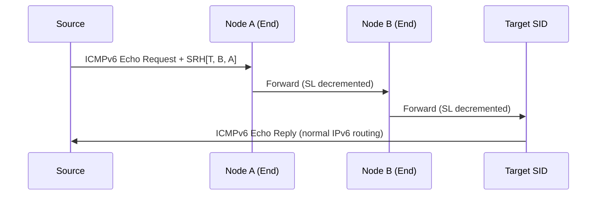

# OAM & Troubleshooting

Effective OAM (Operations, Administration, and Maintenance) is critical for operating SRv6 networks. This page covers how traditional OAM tools work in SRv6, plus SRv6-native OAM mechanisms.

## SRv6 Ping

SRv6 ping uses **ICMPv6 Echo Request/Reply** with the SRH to verify reachability along a specific SRv6 path.

### How It Works

1. Source sends ICMPv6 Echo Request with an SRH containing the desired path
2. Packet follows the segment list (same as data traffic)
3. The target SID node generates an ICMPv6 Echo Reply
4. Reply returns via normal IPv6 routing (not the reverse SRv6 path)



### Verification Commands

=== "Cisco IOS-XR"

    ```cisco
    !! Ping a specific SRv6 SID
    ping ipv6 fc00:0:2::100 source fc00:0:1::1

    !! Ping through an SRv6 path (with segment list)
    ping sr-mpls nil-fec labels fc00:0:2::1,fc00:0:3::100
    ```

=== "Linux"

    ```bash
    # Ping an SRv6 SID directly
    ping6 fc00:0:2::100

    # Ping with SRv6 encapsulation through specific path
    # (requires custom route or scapy)
    ip route add fc00:0:2::100/128 encap seg6 mode encap \
      segs fc00:0:2::1,fc00:0:3::100 dev eth0
    ping6 fc00:0:2::100
    ```

## SRv6 Traceroute

SRv6 traceroute discovers each hop along an SRv6 path by incrementing the IPv6 **Hop Limit**:

1. Send packet with Hop Limit = 1 → first hop returns ICMPv6 Time Exceeded
2. Send packet with Hop Limit = 2 → second hop returns Time Exceeded
3. Continue until the target SID responds

### Key Difference from IP Traceroute

SRv6 traceroute reveals both **SRv6-aware** and **transit** nodes:

- **Transit nodes** (non-SRv6) return Time Exceeded based on the IPv6 DA
- **SRv6 endpoint nodes** process the SID and update the DA before forwarding

This means traceroute shows the actual forwarding path, including underlay hops between SRv6 nodes.

## In-situ OAM (IOAM)

**IOAM** (RFC 9326) embeds telemetry data directly into data packets as they traverse the network — no separate OAM probes needed.

### IOAM Data Fields

| Field | Description |
|-------|-------------|
| **Pre-allocated Trace** | Each node inserts its data (timestamp, interface, buffer occupancy) into a pre-allocated space |
| **Incremental Trace** | Nodes append their data to a growing trace |
| **Proof of Transit (POT)** | Cryptographic proof that the packet visited specific nodes |
| **Edge-to-Edge (E2E)** | Sequence numbers and timestamps for E2E measurements |

### IOAM with SRv6

IOAM data is carried inside the SRH as a **TLV** (Type-Length-Value), riding along with data traffic:

```
[IPv6 Header]
[SRH]
  ├── Segment List
  └── IOAM TLV
       ├── Trace Type: Pre-allocated
       ├── Node 1: {timestamp, ingress_if, egress_if, queue_depth}
       ├── Node 2: {timestamp, ingress_if, egress_if, queue_depth}
       └── Node 3: {timestamp, ingress_if, egress_if, queue_depth}
[Payload]
```

### What IOAM Reveals

- **Per-hop latency** — timestamp at each node shows exact per-segment delay
- **Queue depth** — congestion visibility at every hop
- **Path verification** — confirm the packet actually traversed the expected nodes
- **Packet loss localization** — identify exactly where packets are dropped

## SRv6 Path Tracing

**Path Tracing** (defined in IETF drafts) is an SRv6-native mechanism that provides a complete path trace in a **single round-trip** — unlike traditional traceroute which requires N round-trips for N hops.

### How It Works

1. Source sends a probe with a special SRv6 SID requesting path information
2. Each node along the path appends its identity and metrics to the packet header
3. The egress node returns the collected trace data to the source

### Advantages over Traditional Traceroute

| Aspect | ICMP Traceroute | SRv6 Path Tracing |
|--------|:---------------:|:------------------:|
| Round trips | N (one per hop) | 1 (single probe) |
| Load balancer visibility | Unreliable (different hash per probe) | Accurate (same path for all data) |
| Per-hop metrics | None (only RTT) | Timestamp, interface, load |
| SRv6 path awareness | Partial | Full (follows segment list) |

## In-situ Performance Measurement (IPM)

IPM measures **delay** and **loss** for SRv6 paths using alternate color marking:

### How It Works

1. Packets in an SRv6 flow are alternately marked with two "colors" (bit flag in the header)
2. Ingress and egress nodes count packets of each color
3. By comparing counters, you can calculate:
   - **Packet loss** — difference between ingress and egress counts
   - **One-way delay** — timestamp comparison between ingress and egress

### Advantages

- **No probe traffic** — measures actual data plane performance
- **Per-SRv6-policy** — measure performance per SR Policy or per service chain
- **Continuous** — always-on measurement, not periodic sampling

## Common Troubleshooting Scenarios

### Packet Not Following SRv6 Path

| Check | Command (IOS-XR) | What to Look For |
|-------|-------------------|-----------------|
| SID installed? | `show segment-routing srv6 sid` | Verify the SID exists in the local SID table |
| IGP advertising locator? | `show isis segment-routing srv6 locators` | Locator must be advertised in IS-IS |
| SRH processing enabled? | `show segment-routing srv6 manager` | SRv6 must be globally enabled |
| Correct encapsulation? | `show cef ipv6 <SID> detail` | Verify the forwarding entry and outgoing interface |

### SRv6 Packets Being Dropped

| Possible Cause | How to Diagnose |
|----------------|----------------|
| **ACL blocking SRH** | Check if ACLs filter IPv6 Routing Header type 4 |
| **MTU exceeded** | SRv6 encapsulation adds 40+ bytes; check interface MTU |
| **SID not in My SID table** | The node doesn't recognize the SID as local |
| **Hop Limit expired** | Encapsulated packets start with a new Hop Limit; ensure it's sufficient |
| **Rate limiting on ICMP** | ICMPv6 errors (for ping/traceroute) may be rate-limited |

### Packet Capture with SRH

=== "tcpdump"

    ```bash
    # Capture SRv6 packets (IPv6 Routing Header)
    tcpdump -i eth0 -vv 'ip6 proto 43'

    # Capture with full SRH decode
    tcpdump -i eth0 -vvv -X 'ip6 proto 43'
    ```

=== "tshark"

    ```bash
    # Decode SRH fields
    tshark -i eth0 -O ipv6 -Y 'ipv6.routing.type == 4'

    # Show segment list
    tshark -i eth0 -T fields \
      -e ipv6.src -e ipv6.dst \
      -e ipv6.routing.srh.addr \
      -Y 'ipv6.routing.type == 4'
    ```

=== "Wireshark"

    ```
    Display filter: ipv6.routing.type == 4
    Wireshark fully decodes SRH including:
    - Segments Left
    - Segment List (all SIDs)
    - TLVs (HMAC, IOAM)
    ```

## Further Reading

- :material-arrow-right: [SRH Mechanics & Packet Walk](srh-packet-walk.md) - Detailed SRH processing
- :material-arrow-right: [Security](security.md) - HMAC and SRH authentication
- :material-arrow-right: [Telemetry & Monitoring](telemetry.md) - IPFIX, YANG models
- :material-file-document: [RFC 9259](../rfcs/rfc9259.md) - OAM in SRv6

## References

1. [RFC 9259 - OAM in SRv6](https://datatracker.ietf.org/doc/rfc9259/) - Defines SRv6-specific OAM mechanisms including ping and traceroute
2. [RFC 9326 - In-situ OAM (IOAM) Data Fields](https://datatracker.ietf.org/doc/rfc9326/) - Defines IOAM data fields for embedding telemetry in transit packets
3. [draft-ietf-ippm-ioam-srv6-options](https://datatracker.ietf.org/doc/draft-ietf-ippm-ioam-srv6-options/) - Defines how IOAM data is carried in SRv6 using the SRH
4. [draft-filsfils-spring-path-tracing](https://datatracker.ietf.org/doc/draft-filsfils-spring-path-tracing/) - SRv6 path tracing for single-probe path discovery
