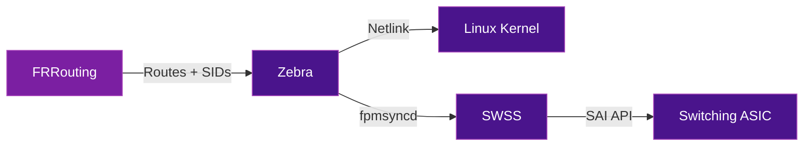

# SONiC & SAI

**SONiC** (Software for Open Networking in the Cloud) is an open-source network operating system built on Linux, originally developed by Microsoft for Azure. Combined with **SAI** (Switch Abstraction Interface), it enables SRv6 on whitebox switches from any hardware vendor.

## Architecture

```
┌─────────────────────────────────────────────┐
│                 SONiC NOS                    │
├─────────────────────────────────────────────┤
│  FRRouting (BGP, IS-IS)  │  SRv6 Manager    │
├──────────────────────────┤                   │
│  SWSS (Switch State Service)                │
├─────────────────────────────────────────────┤
│  SAI (Switch Abstraction Interface)          │
├─────────────────────────────────────────────┤
│  ASIC SDK (vendor-specific driver)           │
├─────────────────────────────────────────────┤
│  Switching ASIC (Memory, Memory 2, etc.)     │
└─────────────────────────────────────────────┘
```

### Key Components

| Component | Role |
|-----------|------|
| **SONiC** | Linux-based NOS with containerized services (BGP, LLDP, SNMP, etc.) |
| **SAI** | Hardware abstraction API — same software runs on any compliant ASIC |
| **FRRouting** | Routing suite providing BGP and IS-IS with SRv6 support |
| **SWSS** | Translates high-level intent into SAI API calls |
| **ASIC SDK** | Vendor-specific driver implementing SAI for a given chip |

## What is SAI?

SAI (Switch Abstraction Interface) is an open API that decouples the NOS from the switching hardware. It defines a standard set of functions for programming forwarding tables, ACLs, QoS, and — critically — **SRv6 SID operations**.

### Why SAI Matters for SRv6

Without SAI, each ASIC vendor would need a custom SRv6 implementation. With SAI:

- **Write once, run anywhere** — SRv6 code in SONiC works on any SAI-compliant ASIC
- **Hardware acceleration** — SRv6 encap/decap runs at line rate on the ASIC, not in software
- **Multi-vendor** — Same SONiC image on switches from different manufacturers

### SAI SRv6 Objects

SAI defines specific objects for SRv6 programming:

| SAI Object | Description |
|-----------|-------------|
| `SAI_MY_SID_ENTRY` | Local SID table entry (equivalent to "My SID" in SRv6) |
| `SAI_SRV6_SIDLIST` | Ordered list of SIDs for encapsulation |
| `SAI_TUNNEL` | SRv6 tunnel endpoint for encap/decap |
| `SAI_NEXT_HOP` | Next-hop with SRv6 encapsulation action |

## SRv6 Features in SONiC

| Feature | Status | Description |
|---------|:------:|-------------|
| SRv6 uSID source routing | Available | Encapsulate with SRv6 uSID segment list |
| SRv6 My SID | Available | Process local SID table (End, End.DT, etc.) |
| SRv6 VPN (L3VPN) | Available | BGP VPN with SRv6 SID signaling |
| SRv6 Policy | In development | SR Policy with candidate paths |
| SRv6 TE | In development | Traffic engineering with SRv6 |

!!! info "SONiC 202505"
    The SONiC 202505 release introduced SRv6 uSID support specifically designed for AI backend fabric networks. See the [SONiC Foundation announcement](https://sonicfoundation.dev/sonic-202505-powering-ai-fabrics-and-enterprise-networks-with-precision-and-insight/) for details.

## Control Plane: FRRouting

SONiC uses **FRRouting (FRR)** as its routing engine. FRR provides:

- **IS-IS** with SRv6 locator advertisement
- **BGP** with SRv6 VPN signaling (RFC 9252)
- **Zebra** for programming SRv6 routes into the kernel and SAI



## Whitebox Hardware

SONiC runs on whitebox switches from multiple vendors, all using SAI for SRv6:

| ASIC Vendor | Example Platforms |
|-------------|-------------------|
| Broadcom | Memory 3 / Memory 4-based switches |
| Intel (formerly Barefoot) | Memory-based programmable switches |
| Cisco | Silicon One Q100/Q200-based platforms |
| NVIDIA (Mellanox) | Spectrum-based switches |

## Further Reading

- :material-arrow-right: [SONiC Implementation](../implementations/sonic.md) - Getting started with SRv6 on SONiC
- :material-arrow-right: [FRRouting](../implementations/frrouting.md) - FRR SRv6 configuration
- :material-arrow-right: [CLOS Fabrics & Load Balancing](clos-glb.md) - Data center topology and path placement
- :material-arrow-right: [AI/ML Training Networks](../use-cases/ai-networking.md) - SRv6 + SONiC for GPU fabrics

## References

1. [SONiC Architecture](https://github.com/sonic-net/SONiC/wiki/Architecture) - SONiC system architecture documentation on GitHub
2. [SAI API Specification](https://github.com/opencomputeproject/SAI) - Open Compute Project SAI repository with API definitions
3. [SONiC SRv6 High-Level Design](https://github.com/sonic-net/SONiC/blob/master/doc/srv6/srv6_hld.md) - SRv6 implementation design for SONiC
4. [FRRouting Documentation](https://docs.frrouting.org/) - FRR official documentation including SRv6 features
