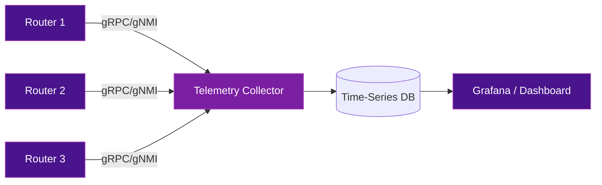

# Telemetry & Monitoring

Monitoring an SRv6 network requires visibility into SRv6-specific state: SID tables, SR Policies, locator advertisements, and per-SID traffic counters. This page covers the telemetry and monitoring tools available.

## What to Monitor in SRv6

| Category | What to Monitor | Why |
|----------|----------------|-----|
| **SID State** | Local SID table, SID counters (packets/bytes per SID) | Verify SIDs are active and processing traffic |
| **Locator Reachability** | IGP locator advertisement, BGP SRv6 SID reachability | Detect locator withdrawal or advertisement issues |
| **SR Policy State** | Active candidate path, segment list validity, BSID state | Ensure TE policies are working as intended |
| **Traffic Counters** | Per-SID, per-policy, per-VRF traffic statistics | Capacity planning and anomaly detection |
| **Path Performance** | Latency, jitter, loss per SRv6 path | SLA monitoring and TE optimization |
| **Errors** | SRH processing errors, SID not found, HMAC failures | Security and configuration issues |

## Streaming Telemetry

Modern SRv6 deployments use **model-driven streaming telemetry** instead of SNMP polling. The router pushes data to a collector at configured intervals.

### Architecture



### Protocols

| Protocol | Description |
|----------|-------------|
| **gNMI** | gRPC Network Management Interface — subscribe to YANG model paths |
| **gRPC Dial-Out** | Router initiates connection to collector |
| **NETCONF** | XML-based configuration and state retrieval |

## YANG Models for SRv6

YANG models define the structure of SRv6 operational and configuration data. Key models:

### IETF Standard Models

| Model | Scope | IETF Reference |
|-------|-------|----------------|
| `ietf-srv6-base` | SRv6 base configuration (locators, SIDs) | draft-ietf-spring-srv6-yang |
| `ietf-srv6-static` | Static SRv6 SID configuration | draft-ietf-spring-srv6-yang |
| `ietf-srv6-types` | SRv6 type definitions | draft-ietf-spring-srv6-yang |
| `ietf-segment-routing` | SR base model (shared by SR-MPLS and SRv6) | RFC 9020 |

### Key YANG Paths for SRv6 Monitoring

```yaml
# SRv6 SID table (operational state)
/segment-routing/srv6/locators/locator[name]/sids/sid

# SRv6 SID counters
/segment-routing/srv6/locators/locator[name]/sids/sid/state/counters

# IS-IS SRv6 locator advertisements
/network-instances/network-instance/protocols/protocol[isis]/
  segment-routing/srv6/locators

# BGP SRv6 VPN routes
/network-instances/network-instance/protocols/protocol[bgp]/
  bgp/rib/afi-safis/afi-safi[vpnv4-unicast]/ipv4-unicast/routes
```

## IPFIX for SRv6

**IPFIX** (IP Flow Information Export, RFC 7011) can export SRv6-specific flow data:

### SRv6 Information Elements

| IPFIX IE | Description |
|----------|-------------|
| `ipv6ExtensionHeaders` | Indicates presence of SRH |
| `srhSegmentsLeft` | Current Segments Left value |
| `srhActiveSegment` | The active SID (current IPv6 DA) |
| `srhSegmentList` | Full segment list from the SRH |

### Use Cases for IPFIX + SRv6

- **Traffic matrix** per SRv6 policy or per VRF
- **Top talkers** per SRv6 SID
- **Path utilization** across segment lists
- **Anomaly detection** — unexpected SRH patterns

## Open-Source Monitoring Stack

A practical SRv6 monitoring stack using open-source tools:

```
┌──────────────────────────────────────────┐
│  Visualization: Grafana                   │
├──────────────────────────────────────────┤
│  Storage: Prometheus / InfluxDB           │
├──────────────────────────────────────────┤
│  Collection: Telegraf / gnmic / pmacct    │
├──────────────────────────────────────────┤
│  Transport: gNMI / IPFIX / BMP           │
├──────────────────────────────────────────┤
│  Source: Routers (IOS-XR, Junos, SONiC)  │
└──────────────────────────────────────────┘
```

### Tools

| Tool | Role | SRv6 Support |
|------|------|:------------:|
| **gnmic** | gNMI collector (subscribe to YANG paths) | Full |
| **Telegraf** | Metrics collection agent | Via gNMI/SNMP plugins |
| **pmacct** | IPFIX/NetFlow collector | SRv6 IE support |
| **Prometheus** | Time-series database | Storage backend |
| **InfluxDB** | Time-series database (alternative) | Storage backend |
| **Grafana** | Dashboarding and visualization | Universal |
| **GoBGP** | BGP monitoring (BMP) | SRv6 NLRI |

## What to Alert On

| Alert | Condition | Severity |
|-------|-----------|:--------:|
| SID removed from table | SID count decreases unexpectedly | Critical |
| Locator withdrawn from IGP | IS-IS/OSPF stops advertising a locator | Critical |
| SR Policy down | No valid candidate path | High |
| SRH error counter increasing | Processing errors on a node | High |
| Per-SID traffic drop to zero | SID receiving no traffic when it should | Medium |
| MTU exceeded drops | Packets dropped due to encapsulation overhead | Medium |
| HMAC validation failures | Could indicate attack or misconfiguration | High |

## Further Reading

- :material-arrow-right: [OAM & Troubleshooting](oam-troubleshooting.md) - SRv6 ping, traceroute, IOAM
- :material-arrow-right: [Security](security.md) - HMAC monitoring and attack detection
- :material-arrow-right: [Performance & Scaling](performance-scaling.md) - Capacity metrics

## References

1. [RFC 7011 - IPFIX Protocol Specification](https://datatracker.ietf.org/doc/rfc7011/) - Defines the IPFIX protocol for exporting flow information
2. [RFC 9020 - YANG Data Model for Segment Routing](https://datatracker.ietf.org/doc/rfc9020/) - Base YANG model for segment routing configuration and state
3. [draft-ietf-spring-srv6-yang](https://datatracker.ietf.org/doc/draft-ietf-spring-srv6-yang/) - YANG data model specific to SRv6 configuration and operational state
4. [gnmic Documentation](https://gnmic.openconfig.net/) - Open-source gNMI collector for streaming telemetry
