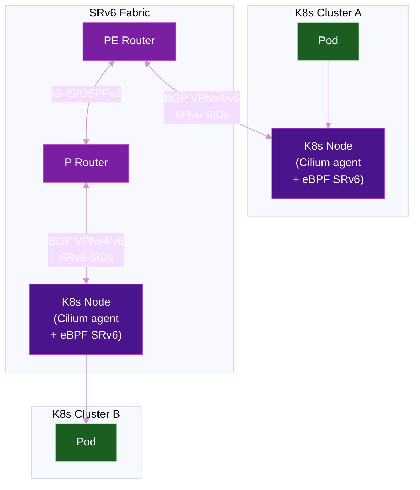
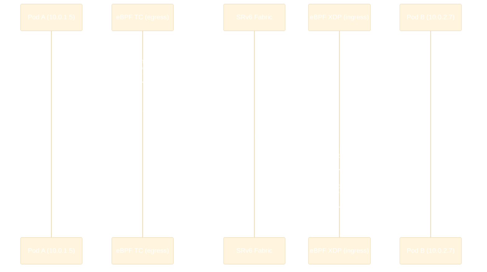

# SRv6 with Cilium (eBPF)

**Cilium** is an open-source, eBPF-based networking solution for Kubernetes that brings SRv6 into the cloud-native world. Instead of relying on the kernel's routing stack, Cilium programs eBPF maps in the kernel data path — enabling SRv6 encapsulation and decapsulation at line rate without context switching.

!!! info "Minimum version"
    SRv6 L3VPN support requires **Cilium 1.13+** (alpha). Production-ready use is recommended on **Cilium 1.15+**.

## Why Cilium + SRv6?

Traditional SRv6 implementations (Cisco, Juniper, FRRouting) live on routers. Cilium extends the SRv6 fabric **into the Kubernetes node** — each worker node becomes an SRv6 endpoint with its own locator, SIDs, and BGP session.



This makes each K8s node a first-class SRv6 PE — pod traffic is natively encapsulated into SRv6 by eBPF before it leaves the NIC, integrating seamlessly with a carrier-grade SRv6 underlay.

## Supported SRv6 Behaviors

| Behavior | Role in Cilium | Status |
|----------|---------------|:------:|
| `H.Encaps` | Egress: encapsulate pod traffic into SRv6 | :material-check-circle: 1.13+ |
| `End.DT4` | Ingress: decapsulate SRv6 → IPv4 VRF lookup | :material-check-circle: 1.13+ |
| `End.DT6` | Ingress: decapsulate SRv6 → IPv6 VRF lookup | :material-check-circle: 1.13+ |
| `H.Encaps.Red` | Reduced encapsulation (no SRH when single SID) | :material-check-circle: 1.15+ |

## Architecture

### How Cilium Implements SRv6 with eBPF

Cilium programs four eBPF maps per node that together implement the SRv6 data plane:

| eBPF Map | Key | Value | Purpose |
|----------|-----|-------|---------|
| `cilium_srv6_vrf` | Source IP + VRF ID | SRv6 locator | Maps pod traffic to a VRF |
| `cilium_srv6_policy` | Destination CIDR + VRF | Egress SID | Selects the SRv6 SID for encapsulation |
| `cilium_srv6_sid` | SRv6 SID | VRF table ID | Maps incoming SIDs to a local VRF for decapsulation |
| `cilium_srv6_state` | Flow state | — | Tracks active SRv6 flows for telemetry |

At **egress**, the eBPF TC program looks up the destination in `cilium_srv6_policy`, prepends the SRv6 outer header (`H.Encaps`), and sends the packet into the underlay.

At **ingress**, the eBPF XDP program matches the destination SID against `cilium_srv6_sid`, strips the SRv6 header, and injects the inner packet into the correct VRF (`End.DT4` / `End.DT6`).

### BGP Control Plane

Cilium uses an integrated BGP control plane (backed by **GoBGP** or **FRRouting**) to:

- Advertise the node's SRv6 **locator prefix** to PE routers
- Exchange **VPNv4/VPNv6** routes with route targets for L3VPN
- Receive remote SIDs and program them into `cilium_srv6_policy`

No external router daemon required — Cilium manages BGP sessions directly via `CiliumBGPPeeringPolicy` CRDs.

### One BGP Session — All VRFs

!!! warning "Common misconception"
    Cilium does **not** open one BGP session per VRF, nor does it use BGP EVPN (L2VPN AFI 25). It behaves exactly like a traditional PE router: **one BGP session per peer**, carrying routes for all VRFs simultaneously over the **VPNv6 address family** (AFI 2 / SAFI 128).

A single `CiliumBGPPeeringPolicy` neighbor entry covers every tenant/VRF on that node:

```
Cilium Node (worker-1)  ←──── 1 TCP session (port 179) ────→  PE Router
                                         │
                         BGP UPDATE messages contain:
                         ┌─────────────────────────────────────────┐
                         │ AFI 2 / SAFI 128 (VPNv6)               │
                         │                                         │
                         │  RD 65100:100 | RT 65000:100           │
                         │    prefix: 10.0.1.0/24                  │
                         │    next-hop SRv6 SID: fc00:0:10::dt6:100│ ← VRF Tenant-A
                         │                                         │
                         │  RD 65100:200 | RT 65000:200           │
                         │    prefix: 10.0.2.0/24                  │
                         │    next-hop SRv6 SID: fc00:0:10::dt6:200│ ← VRF Tenant-B
                         │                                         │
                         │  RD 65100:300 | RT 65000:300           │
                         │    prefix: 10.0.3.0/24                  │
                         │    next-hop SRv6 SID: fc00:0:10::dt6:300│ ← VRF Tenant-C
                         └─────────────────────────────────────────┘
```

The PE router uses the **Route Target (RT)** to import each prefix into the correct VRF — no separate BGP session needed.

### VPNv6 vs BGP EVPN — Key Differences

Both can carry L3 reachability for SRv6 tenants, but they are completely different address families:

| | **BGP VPNv6** (Cilium) | **BGP EVPN Type 5** |
|---|---|---|
| AFI / SAFI | 2 / 128 | 25 / 70 |
| NLRI type | VPNv6 prefix + RD | EVPN Route Type 5 (IP Prefix) |
| Original purpose | MPLS L3VPN (adapted for SRv6) | Data center fabric, VXLAN/SRv6 overlay |
| Next-hop encoding | SRv6 SID as BGP next-hop | SRv6 SID in PMSI / Tunnel Encap attr |
| VRF signaling | Route Target extended community | Route Target extended community |
| MAC/L2 info | ❌ None — L3 only | ✅ Carries MAC+IP (Type 2) |
| Typical use | WAN L3VPN (carrier-grade) | DC fabric, cloud-native workloads |
| Cilium uses it? | ✅ Yes | ❌ No |

!!! tip "Why not EVPN?"
    EVPN was designed for data center environments where L2 adjacency and MAC mobility matter. Cilium's SRv6 L3VPN targets carrier/WAN use cases where only IP reachability is needed — VPNv6 is simpler, more scalable, and maps directly onto the RFC 9252 model that SRv6 PE routers already implement.

## Installation

### Enable SRv6 via Helm

```bash
helm install cilium cilium/cilium \
  --namespace kube-system \
  --set bgpControlPlane.enabled=true \
  --set srv6.enabled=true \
  --set srv6.encapMode=srh        # or "reduced" for H.Encaps.Red
```

For Cilium 1.15+ with reduced encapsulation (recommended for production):

```yaml
# values.yaml
bgpControlPlane:
  enabled: true

srv6:
  enabled: true
  encapMode: reduced    # uses H.Encaps.Red — no SRH when single SID
```

```bash
helm upgrade cilium cilium/cilium -f values.yaml -n kube-system
```

## Configuration

### Step 1 — Assign a Locator to Each Node

Label each K8s node with its SRv6 locator prefix. Cilium allocates individual SIDs from this block for `End.DT4` / `End.DT6` behaviors.

```bash
kubectl label node worker-1 cilium.io/srv6-locator=fc00:0:10::/48
kubectl label node worker-2 cilium.io/srv6-locator=fc00:0:11::/48
```

### Step 2 — BGP Peering Policy

```yaml
apiVersion: cilium.io/v2alpha1
kind: CiliumBGPPeeringPolicy
metadata:
  name: srv6-peering
spec:
  nodeSelector:
    matchLabels:
      kubernetes.io/os: linux
  virtualRouters:
    - localASN: 65100
      exportPodCIDR: false          # pod CIDRs go via SRv6 L3VPN, not plain BGP
      neighbors:
        - peerAddress: "fc00:0:1::1/128"   # PE router SID/loopback
          peerASN: 65000
          families:
            - afi: ipv6
              safi: unicast
            - afi: ipv6
              safi: vpn-unicast     # VPNv6 for SRv6 L3VPN
      srv6:
        locatorPrefix: "fc00:0:10::/48"    # this node's SRv6 locator
```

### Step 3 — L3VPN (VRF) Mapping

```yaml
apiVersion: cilium.io/v2alpha1
kind: CiliumBGPAdvertisement
metadata:
  name: tenant-a-vpn
spec:
  advertisements:
    - advertisementType: "PodCIDR"
      service:
        addresses:
          - ClusterIP
      attributes:
        community:
          standard:
            - "65000:100"            # route target for Tenant A VRF
```

### Step 4 — Verify SRv6 State

```bash
# Check Cilium SRv6 is active
cilium status | grep -i srv6

# Inspect eBPF SRv6 maps
cilium bpf srv6 list

# Check BGP session state
cilium bgp peers

# Verify advertised/received SRv6 SIDs
cilium bgp routes advertised ipv6 vpn-unicast
cilium bgp routes received  ipv6 vpn-unicast
```

## Full Traffic Walk



## Comparison with Router-Based SRv6

| Aspect | Cilium (eBPF) | FRRouting | Cisco IOS-XR |
|--------|:-------------:|:---------:|:------------:|
| Data plane | eBPF (kernel bypass) | Linux kernel routing | ASIC / NPU |
| Control plane | GoBGP / FRR | FRR | IOS-XR BGP/IS-IS |
| L3VPN support | :material-check-circle: | :material-check-circle: | :material-check-circle: |
| Kubernetes-native | :material-check-circle: | :material-close-circle: | :material-close-circle: |
| CRD-driven config | :material-check-circle: | :material-close-circle: | :material-close-circle: |
| uSID support | :material-clock-outline: Roadmap | :material-check-circle: | :material-check-circle: |
| Hardware offload | :material-clock-outline: Roadmap | :material-close-circle: | :material-check-circle: |

## Observability

Cilium exports SRv6 telemetry via **Hubble** (Cilium's observability layer):

```bash
# Install Hubble CLI
hubble observe --type l3 --protocol SRv6

# Flow-level SRv6 visibility
hubble observe --namespace default \
  --output json | jq 'select(.destination.srv6_sid != null)'
```

Key Prometheus metrics exported:

| Metric | Description |
|--------|-------------|
| `cilium_srv6_encap_total` | Total SRv6 encapsulations by VRF |
| `cilium_srv6_decap_total` | Total SRv6 decapsulations by behavior |
| `cilium_srv6_drop_total` | SRv6 drops (no policy match, invalid SID) |
| `cilium_bgp_session_state` | BGP session state per peer |

## Vendor Support Matrix

| Feature | Cilium 1.13 | Cilium 1.14 | Cilium 1.15+ |
|---------|:-----------:|:-----------:|:------------:|
| SRv6 L3VPN (alpha) | :material-check-circle: | :material-check-circle: | :material-check-circle: |
| H.Encaps / End.DT4/DT6 | :material-check-circle: | :material-check-circle: | :material-check-circle: |
| H.Encaps.Red | :material-close-circle: | :material-check-circle: | :material-check-circle: |
| Hubble SRv6 visibility | :material-close-circle: | :material-check-circle: | :material-check-circle: |
| Multi-cluster SRv6 | :material-close-circle: | :material-close-circle: | :material-check-circle: |
| uSID | :material-close-circle: | :material-close-circle: | :material-clock-outline: |

## Further Reading

- :material-arrow-right: [Host-Based SRv6](../topics/host-based-srv6.md) -- How end-hosts participate in SRv6 without router involvement
- :material-arrow-right: [BGP Overlay Services](../topics/bgp-overlay-services.md) -- VPNv4/VPNv6 signaling for SRv6 L3VPN
- :material-arrow-right: [Linux Kernel](linux-kernel.md) -- SRv6 in the kernel that Cilium builds on
- :material-arrow-right: [FRRouting](frrouting.md) -- Open-source BGP/IS-IS that can peer with Cilium
- :material-arrow-right: [Cloud-Native Backbone](../use-cases/cloud-native-backbone.md) -- SRv6 in cloud and container environments

## References

1. [Cilium SRv6 L3VPN Documentation](https://docs.cilium.io/en/stable/network/srv6l3vpn/) -- Official Cilium SRv6 configuration guide
2. [RFC 8986 - SRv6 Network Programming](https://www.rfc-editor.org/rfc/rfc8986) -- Defines H.Encaps, End.DT4, End.DT6 behaviors used by Cilium
3. [RFC 9252 - BGP Overlay Services Based on SRv6](https://www.rfc-editor.org/rfc/rfc9252) -- VPNv4/VPNv6 signaling with SRv6 Next Hop
4. [Cilium GitHub — SRv6 eBPF maps](https://github.com/cilium/cilium/tree/main/pkg/maps/srv6map) -- Source code for the eBPF data structures
5. [KubeCon 2023: Cilium SRv6 L3VPN](https://www.youtube.com/watch?v=R3WnCSOHK3E) -- Talk covering the Cilium SRv6 architecture and use cases
