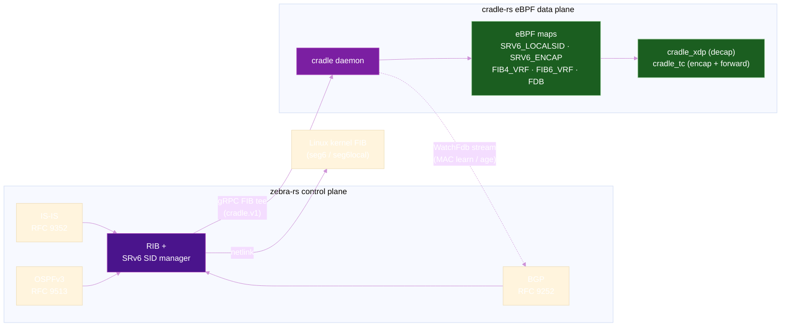
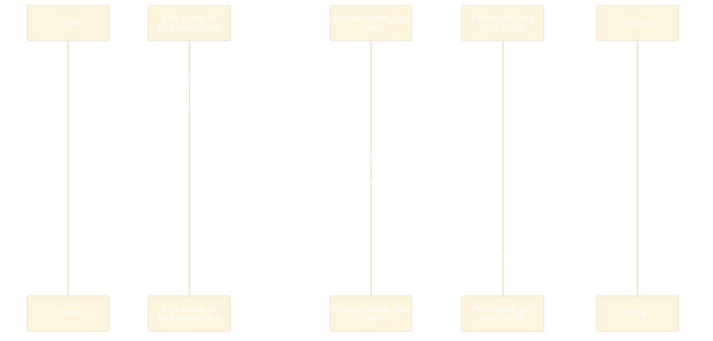

# SRv6 with zebra-rs (eBPF)

**zebra-rs** is a BGP, OSPF, and IS-IS routing stack written from scratch in Rust, with SRv6, SR-MPLS, L3VPN, and EVPN extensions. Its eBPF data plane is **cradle-rs** — an XDP/TC forwarding engine built on [aya](https://aya-rs.dev) (pure Rust, no clang/libbpf) that zebra-rs launches and programs directly from its routing state.

The combination is an open-source SRv6 router: every route the protocols compute — IS-IS SRv6 locators, BGP L3VPN service SIDs, EVPN MAC routes — is installed into eBPF maps *in addition to* the Linux kernel FIB. Several SRv6 behaviors that the mainline kernel cannot forward at all (EVPN L2 decap, REPLACE-C-SID, egress protection, P2MP replication) run only on the eBPF path.

!!! info "Versions"
    Facts on this page reflect **zebra-rs 26.7.7** with the bundled **cradle-rs 0.9.8** engine, BDD-tested on **Linux 6.8**. Both projects are AGPL-licensed: [zebra-rs](https://github.com/zebra-rs/zebra-rs) · [cradle-rs](https://github.com/zebra-rs/cradle-rs).

## Why zebra-rs + cradle-rs?

Cilium brought SRv6 to eBPF for Kubernetes, but its BGP control plane only *advertises* routes — it never installs learned routes into the data path. zebra-rs approaches it from the routing side: a full multi-protocol routing stack (IS-IS, OSPFv3, BGP with VPNv4/VPNv6/EVPN/SR Policy address families) is the source of truth, and the eBPF engine is simply its FIB.



What makes it distinctive:

- **Learned routes program eBPF.** IS-IS SRv6 locators, BGP L3VPN (VPNv4/VPNv6 with SRv6 SIDs), and BGP EVPN over SRv6 all land in the eBPF FIB through a gRPC tee — the direction Cilium's BGP control plane doesn't support.
- **The widest open-source behavior set.** The full RFC 8986 catalog including End.T, End.DX2/DX2V, End.DT2U/DT2M, End.B6.Encaps, plus **both** RFC 9800 compression flavors (NEXT-C-SID *and* REPLACE-C-SID), the PSP/USP/USD flavors, End.M egress protection, and RFC 9524 End.Replicate.
- **A reverse channel.** The data plane's MAC learning streams back up (`WatchFdb`), driving EVPN Type-2 origination and withdrawal — the eBPF data plane is a control-plane *participant*, not just a sink.
- **Rust end to end.** Control plane, user-space loader, and the eBPF programs themselves are Rust (aya); no clang or libbpf in the build.

## Supported SRv6 Behaviors

All rows marked supported are BDD-proven in the projects' test suites (feature names like `cradle_srv6`, `cradle_srv6_usid`, `isis_srv6_base`, `l3vpn_bgp_v6` run the actual daemons in network namespaces and assert forwarding).

### Headend

| Behavior | Notes | Status |
|----------|-------|:------:|
| `H.Encaps` | Multi-SID SRH imposition (TC stage) | :material-check-circle: |
| `H.Encaps.Red` | The default — single SID means no SRH on the wire | :material-check-circle: |
| `H.Encaps.L2` / `L2.Red` | MAC-in-SRv6 (next-header 143) for EVPN | :material-check-circle: |
| `H.Insert` | TI-LFA repair imposition (IPv6) | :material-check-circle: |

### Endpoint

| Behavior | Notes | Status |
|----------|-------|:------:|
| `End`, `End.X`, `End.T` | SRH walk, adjacency cross-connect, table-scoped lookup | :material-check-circle: |
| `End.DT4` / `DT6` / `DT46` | Per-VRF decap; End.DT46 is the BGP L3VPN service SID | :material-check-circle: |
| `End.DX4` / `DX6` | Decap + cross-connect to the CE adjacency | :material-check-circle: |
| `End.DX2` / `DX2V` | EVPN VPWS E-Line; DX2V demuxes the inner 802.1Q VID | :material-check-circle: |
| `End.DT2U` / `DT2M` | EVPN unicast bridge / BUM flood (eBPF only) | :material-check-circle: |
| `End.B6.Encaps` / `.Red` | Binding SID: End walk + policy push | :material-check-circle: |
| `End.M` | Mirror SID egress protection (draft-ietf-rtgwg-srv6-egress-protection) | :material-check-circle: |
| `End.Replicate` | RFC 9524 SR P2MP replication segment | :material-check-circle: |
| `End.BM`, `End.S`, `End.AN/AS/AD/AM` | Service programming out of scope | :material-close-circle: |

### Compression (RFC 9800) and Flavors

| Feature | Notes | Status |
|---------|-------|:------:|
| **NEXT-C-SID (uSID)**: `uN`, `uA`, `uA (LIB)`, `uT`, `uDT4/6/46`, `uDX4/6` | 16-bit micro-SIDs, blocks 16/32/48 | :material-check-circle: |
| **REPLACE-C-SID**: `End`, `End.X` | 32/16-bit C-SIDs — container walk + DA index argument. **eBPF only** — Linux 6.8 has no REPLACE seg6local op | :material-check-circle: |
| **PSP / USP / USD** | RFC 8986 §4.16 flavors on End / End.X / uN / uA | :material-check-circle: |
| `uB6` | | :material-close-circle: |

## Architecture

### One Routing Stack, Two FIBs

zebra-rs runs as a single tokio-based process; each protocol is an async task feeding a central RIB. Turning on the eBPF data plane is two config knobs:

```
system {
  ebpf {
    enabled true;
  }
}
interface enp0s6 {
  ebpf {
    enabled true;
  }
}
```

`system ebpf enabled true` makes zebra-rs spawn and supervise the `cradle` engine as a managed child process (crash → respawn with backoff, full FIB state **replayed** into the fresh instance) and tees every route install to it over gRPC (`cradle.v1`, default endpoint `unix:cradle/grpc`). `interface <name> ebpf enabled true` attaches the XDP + TC programs to that interface; the port follows the interface's VRF binding.

### XDP for Decap, TC for Encap

cradle-rs compiles one fully-inlined eBPF program per hook and splits SRv6 across them deliberately:

| Stage | SRv6 work | Why there |
|-------|-----------|-----------|
| **XDP** (`cradle_xdp`) | All endpoint behaviors: `End` SRH walk, `uN` shift-and-forward, `End.DT*`/`DX*` decap, `End.DT2U/DT2M` L2 decap, `End.M`, `End.B6` policy push — plus MAC-in-SRv6 L2 encap | Native XDP re-runs `eth_type_trans` after the header adjustment, so the decapsulated inner packet enters TC with a correct `skb->protocol` |
| **TC** (`cradle_tc`) | `H.Encaps` / `H.Encaps.Red` / `H.Insert` imposition, FIB forwarding, and the `End.Replicate` clone (`bpf_clone_redirect` is TC-only) | Encap egress needs an explicit L2 rewrite — `bpf_redirect_neigh` would build the L2 header from the stale inner `skb->protocol` |

A metadata channel (`CradleXdpMeta`) carries the VRF or bridge-domain from an XDP decap to the TC forwarding lookup, guarded by a per-instance random cookie so stale metadata can't cross a veth hop into a neighbor's TC stage.

### SRv6 eBPF Maps

| eBPF Map | Key | Value | Purpose |
|----------|-----|-------|---------|
| `SRV6_LOCALSID` | SID (LPM trie) | behavior, flavors, VRF, nexthop, SID structure | Local SID table, probed before the IPv6 FIB |
| `SRV6_ENCAP` | Nexthop ID | Segment list (≤6 SIDs) + encap mode | Per-nexthop `H.Encaps` / `H.Insert` state |
| `SRV6_ENCAP_SRC` | — | IPv6 address | Outer source address for imposition |
| `FIB4_VRF` / `FIB6_VRF` | VRF + prefix (LPM) | FIB entry | Inner lookup for `End.DT4/DT6/DT46` |
| `FDB` | MAC + VLAN | port or remote `End.DT2U` SID | EVPN L2: remote entries carry the peer's SID |
| `XCONNECT` / `XCONNECT_VLAN` | AC ifindex / (table, VID) | Remote `End.DX2`/`DX2V` SID | VPWS E-Line ingress |
| `REPL_SEG` / `REPL_SID` | SID / ifindex | Branch list / per-copy target | RFC 9524 replication tree, EVPN BUM slots |
| `MIRROR` | Context + prefix (LPM) | behavior, VRF | `End.M` egress-protection mirror contexts |

## Control Plane

| Producer | What it programs | Reference |
|----------|------------------|-----------|
| **IS-IS** | SRv6 Locator TLV 27 (with Algorithm for Flex-Algo), End/uN node SIDs, End.X/uA adjacency SIDs, End.T/uT for VRF-bound locators, SID Structure sub-sub-TLV | RFC 9352, RFC 9350 |
| **OSPFv3** | SRv6-Locator-LSA (`0xA02A`), End/uN + SID Structure, per-adjacency End.X/uA in the E-Router-LSA | RFC 9513 |
| **BGP L3VPN** | VPNv4/VPNv6 with a per-VRF `End.DT46` SID in the Prefix-SID attribute (SRv6 L3 Service TLV); VPN-IPv4 over an IPv6 next-hop | RFC 9252, RFC 8669, RFC 8950 |
| **BGP EVPN** | Type-2 → `End.DT2U`, Type-3 → `End.DT2M` + BUM replication slots, Type-5 → per-VRF `End.DT46`, VPWS Type-1 → `End.DX2`; MAC mobility sequencing fed by the `WatchFdb` learn/age stream | RFC 9252, RFC 8214, RFC 9136 |
| **BGP SR Policy** | Binding SID (SAFI 73) → `End.B6.Encaps`, color-based steering to a BSID | RFC 9256, RFC 9830 |
| **TI-LFA** | Repair segment lists as `H.Insert`/`H.Encaps` backups, per-Flex-Algo TI-LFA, PSP on the repair carrier | RFC 9855 |
| **Egress protection** | Mirror SID (`End.M`) advertised in IS-IS; live L3VPN failover on egress PE death | draft-ietf-rtgwg-srv6-egress-protection |

One deliberate design detail: the per-VRF BGP service-SID functions are allocated from a band (`0x0040`–`0xDFFF`) kept below the IS-IS End.X/uA range (`0xE000+`), following the IOS-XR uSID GIB/LIB convention — so BGP and IS-IS share a single locator without collisions.

!!! note "eBPF-only behaviors"
    zebra-rs installs the classic behaviors (`End`, `End.X`, `uN`, `uA`, `End.T`, `End.DT4/6/46`, `End.DX4/6`, `End.B6.Encaps`, `H.Encaps`) into the kernel as `seg6`/`seg6local` routes *and* the eBPF engine. But `End.DT2U`/`DT2M` (EVPN L2), `End.DX2`/`DX2V` (VPWS), `End.M`, `End.Replicate`, `uT`, and the REPLACE-C-SID behaviors have **no mainline-kernel equivalent** — for those, cradle-rs is the only data plane. EVPN over SRv6 on Linux effectively requires it.

## Installation

Prebuilt `.deb` packages exist for Ubuntu 22.04 / 24.04 / 26.04 (x86_64 and ARM64):

```bash
curl -fsSL https://zebra.rs/install.sh | bash
```

The `cradle-rs` engine ships as a separate Debian package that zebra-rs recommends and pulls in automatically; zebra-rs finds it at `/usr/bin/cradle` with no further setup. Building cradle-rs from source needs a nightly Rust toolchain with `rust-src` and `bpf-linker` — no clang or libbpf.

## Configuration

Configuration is YANG-modeled with a candidate/running commit model, and the same tree can be expressed as Cisco-style CLI, YAML, JSON, or `set` commands (`vtyctl apply -f zebra.yaml`). The snippets below come from the project's book and BDD suite — they are validated, running configurations.

### Step 1 — Define an SRv6 Locator

```
segment-routing {
  locator LOC1 {
    prefix fcbb:bbbb:1::/48;
    behavior usid;
  }
}
```

`behavior usid` selects RFC 9800 NEXT-C-SID (micro-SID) format; `behavior replace` selects REPLACE-C-SID; omitting it gives classic full-length RFC 8986 SIDs. Optional per-locator `flavor {psp|usp|usd}` and `vrf <name>` (which turns the node SID into `End.T`/`uT`) are supported.

### Step 2 — Advertise it in the IGP

```
router {
  isis {
    net 49.0000.0000.0000.0001.00;
    is-type level-2-only;
    segment-routing {
      srv6 {
        locator LOC1;
      }
    }
    interface enp0s6 {
      circuit-type level-2-only;
      ipv6 {
        enabled true;
      }
      network-type point-to-point;
    }
  }
}
```

(OSPFv3 is analogous: `router ospfv3 { segment-routing { srv6 { locator LOC1; } } }`. OSPFv2 cannot carry SRv6 — it is IPv6-only on the wire.)

### Step 3 — BGP L3VPN over SRv6

```
router bgp {
  global {
    as 65000;
  }
  segment-routing {
    srv6 {
      locator LOC1;
    }
  }
  vrf vrf1 {
    rd 65000:1;
    encapsulation srv6;
    neighbor 10.100.0.2 {
      remote-as 65001;
    }
    afi-safi ipv4 {
      network 192.168.5.0/24;
    }
    afi-safi ipv6 {
      network 2001:db8:5::/64;
    }
  }
}

vrf vrf1 {
  ipv4 {
    route-target {
      import 65000:1;
      export 65000:1;
    }
  }
  ipv6 {
    route-target {
      import 65000:1;
      export 65000:1;
    }
  }
}
```

`encapsulation srv6` switches the VRF from MPLS labels to a per-VRF `End.DT46` SID — one SID serves both VPNv4 and VPNv6. EVPN L2 uses the same pattern (`afi-safi evpn` + `encapsulation srv6`) to advertise `End.DT2U`/`End.DT2M` SIDs.

### Step 4 — Enable the eBPF Data Plane

```
system {
  ebpf {
    enabled true;
  }
}
interface enp0s6 {
  ebpf {
    enabled true;
  }
}
```

### Step 5 — Verify

```
zebra> show ebpf
eBPF data plane
  System ebpf:     enabled
  FIB tee:         enabled
  Engine:          managed (pid 168157), up 42s
  Engine restarts: 1
  ...

zebra> show ebpf srv6        # SRv6 local SIDs and transit encaps
zebra> show ebpf ipv6 vrf vrf1
zebra> show ebpf stats       # datapath counters, per-behavior
```

Every `show ebpf` command takes a trailing `json` for machine-readable output.

## Full Traffic Walk

An L3VPN packet through a uSID fabric — ingress imposition in TC, everything else in XDP:



## Comparison with Other Open-Source SRv6 Implementations

| Aspect | zebra-rs + cradle-rs | Cilium | FRRouting + kernel |
|--------|:--------------------:|:------:|:------------------:|
| Data plane | eBPF XDP + TC (aya, Rust) | eBPF | Linux kernel seg6 |
| Control plane | Integrated IS-IS / OSPFv3 / BGP | GoBGP-based (advertise-only) | FRR daemons |
| Learned routes → eBPF | :material-check-circle: | :material-close-circle: | n/a (kernel) |
| L3VPN over SRv6 | :material-check-circle: End.DT46 | :material-check-circle: End.DT4/DT6 | :material-check-circle: |
| EVPN L2 over SRv6 | :material-check-circle: DT2U/DT2M/DX2 | :material-close-circle: | :material-close-circle: (no kernel behavior) |
| uSID (NEXT-C-SID) | :material-check-circle: | :material-clock-outline: Roadmap | :material-close-circle: |
| REPLACE-C-SID | :material-check-circle: | :material-close-circle: | :material-close-circle: |
| TI-LFA / Flex-Algo | :material-check-circle: | :material-close-circle: | :material-progress-clock: Partial |
| Kubernetes CNI | :material-check-circle: (kube-proxy replacement, Cilium-API compatible) | :material-check-circle: | :material-close-circle: |

Performance context: cradle-rs's DIR-24-8 FIB engine sustains **~51 ns lookups at 1M routes** (measured via `BPF_PROG_TEST_RUN` on the full TC program); SRv6 forwarding itself is validated functionally by the BDD suites rather than benchmarked separately.

## Observability & AI Integration

- **`show ebpf stats`** exposes per-behavior datapath counters (SRv6 encap/decap, End, uSID shift, PSP/USP/USD, REPLACE, B6, End.M, replicate, drops), also as JSON.
- **Hubble compatibility**: cradle-rs serves the Hubble Observer/Peer gRPC API from an eBPF flow ringbuf — the stock `hubble` CLI, `hubble-relay`, and `hubble-ui` work against a cradle node.
- **MCP server**: zebra-rs is the first routing daemon to ship a native [Model Context Protocol](https://modelcontextprotocol.io) server. AI agents inspect the same RIB, BGP, and IS-IS state an operator sees:

```json
{ "mcpServers": { "zebra-rs": { "command": "vtyctl", "args": ["mcp"] } } }
```

## Further Reading

- :material-arrow-right: [uSID Compression](../topics/usid-compression.md) -- NEXT-C-SID and REPLACE-C-SID, both of which this stack implements
- :material-arrow-right: [Network Programming](../topics/network-programming.md) -- The RFC 8986 behavior catalog
- :material-arrow-right: [TI-LFA](../topics/ti-lfa.md) -- Fast reroute, implemented here over SRv6 with PSP repair
- :material-arrow-right: [Cilium (eBPF)](cilium.md) -- The other eBPF SRv6 implementation, from the Kubernetes side
- :material-arrow-right: [Linux Kernel](linux-kernel.md) -- The seg6 data plane zebra-rs programs in parallel

## References

1. [zebra-rs on GitHub](https://github.com/zebra-rs/zebra-rs) -- The routing stack: BGP, OSPF, IS-IS with SRv6/SR-MPLS/L3VPN/EVPN
2. [cradle-rs on GitHub](https://github.com/zebra-rs/cradle-rs) -- The eBPF L2–L7 data plane and Kubernetes CNI
3. [zebra.rs documentation](https://zebra.rs/docs.html) -- Install, configuration model, and per-protocol guides
4. [RFC 9252 - BGP Overlay Services Based on SRv6](https://www.rfc-editor.org/rfc/rfc9252) -- L3VPN and EVPN service SID signaling implemented by zebra-rs
5. [RFC 9800 - SRv6 Segment List Compression](https://www.rfc-editor.org/rfc/rfc9800) -- NEXT-C-SID and REPLACE-C-SID, both supported in the eBPF data plane
6. [RFC 9524 - SR Replication Segments for P2MP](https://www.rfc-editor.org/rfc/rfc9524) -- End.Replicate, used for EVPN BUM over SRv6 P2MP
7. [aya](https://aya-rs.dev) -- The pure-Rust eBPF library the data plane is built on
