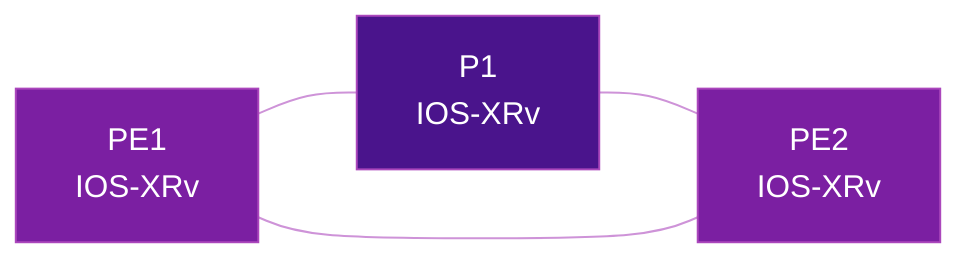

# SRv6 Lab with GNS3

GNS3 allows you to emulate real vendor router images, making it ideal for testing SRv6 on Cisco IOS-XR, Juniper vMX, and other commercial platforms.

## Prerequisites

- GNS3 installed (server + client)
- Vendor router images (IOS-XRv, vMX, etc.)
- Sufficient RAM (8GB+ recommended)

## Topology Design

A minimal SRv6 lab requires at least 3 routers:

## Tips

!!! tip "Resource optimization"
    - Use IOS-XRv 9000 for the lightest IOS-XR experience
    - Assign only 3-4 GB RAM per XRv node
    - Use GNS3 VM on a separate host for better performance

## Further Reading

- :material-arrow-right: [Cisco IOS-XR config](../implementations/cisco-ios-xr.md)
- :material-arrow-right: [Juniper config](../implementations/juniper.md)
- :material-web: [GNS3 Documentation](https://docs.gns3.com)

## References

1. [GNS3 Documentation](https://docs.gns3.com/docs/) - Official GNS3 getting started guide and reference documentation
2. [Cisco IOS XRv 9000 - GNS3 Marketplace](https://www.gns3.com/marketplace/appliances/cisco-ios-xrv-9000) - GNS3 appliance page for downloading and configuring IOS XRv 9000 images
3. [Cisco IOS XRv - GNS3 Marketplace](https://gns3.com/marketplace/appliances/cisco-ios-xrv) - GNS3 appliance page for the standard IOS XRv image
4. [Install an Appliance from the GNS3 Marketplace](https://docs.gns3.com/docs/using-gns3/beginners/install-from-marketplace/) - Step-by-step guide for importing vendor appliances into GNS3
