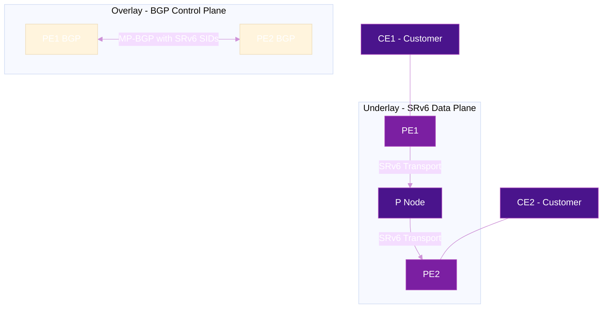

# BGP Overlay Services over SRv6

SRv6 provides a clean, unified underlay for delivering **L3VPN** and **L2VPN (EVPN)** services using BGP — without MPLS, without LDP, without RSVP-TE. Just IPv6 + BGP.

## Architecture Overview



**Key principle:** BGP carries service information (VPN prefixes, EVPN routes) with SRv6 SIDs instead of MPLS labels. The SRv6 SID tells the remote PE exactly what to do with the packet (decap to which VRF, cross-connect to which interface, etc.).

## L3VPN over SRv6

### How It Works

1. **PE1** learns customer prefix `10.1.0.0/24` from CE1 in VRF `CUSTOMER-A`
2. **PE1** advertises via MP-BGP VPNv4/VPNv6 with an **SRv6 SID** instead of a VPN label:
    - Prefix: `10.1.0.0/24`
    - Next-Hop: `PE1 IPv6 address`
    - SRv6 Service SID: `fcbb:bb01:0001::DT4` (End.DT4 behavior)
3. **PE2** receives the BGP update, installs the route
4. When PE2 receives traffic for `10.1.0.0/24`, it encapsulates with:
    - IPv6 DA = `fcbb:bb01:0001::DT4`
    - Inner packet = original IPv4
5. **PE1** receives, matches End.DT4 SID, decapsulates, looks up in VRF `CUSTOMER-A`

### SRv6 SID Allocation Modes

| Mode | Description | SID per... |
|------|-------------|------------|
| **Per-VRF** | One SID shared by all prefixes in a VRF | VRF |
| **Per-CE** | One SID per CE neighbor | CE |
| **Per-Prefix** | Unique SID for each prefix | Prefix |

!!! tip "Per-VRF is most common"
    Per-VRF allocation (`End.DT4` / `End.DT6`) is the default and most scalable option. The SID says "decap and lookup in this VRF table."

### Configuration

=== "Cisco IOS-XR"

    ```cisco
    !! VRF definition
    vrf CUSTOMER-A
     address-family ipv4 unicast
      import route-target 100:1
      export route-target 100:1
     !
    !

    !! BGP with SRv6
    router bgp 65000
     address-family vpnv4 unicast
      segment-routing srv6
       locator MAIN
      !
     !
     vrf CUSTOMER-A
      rd 100:1
      address-family ipv4 unicast
       segment-routing srv6
        locator MAIN
        alloc mode per-vrf
       !
      !
     !
    !
    ```

=== "Juniper"

    ```junos
    set routing-instances CUSTOMER-A instance-type vrf
    set routing-instances CUSTOMER-A route-distinguisher 100:1
    set routing-instances CUSTOMER-A vrf-target target:100:1
    set routing-instances CUSTOMER-A protocols bgp source-packet-routing srv6 locator myloc
    ```

## EVPN over SRv6

EVPN (Ethernet VPN) provides L2 services (E-Line, E-LAN, E-Tree) and integrated L2/L3 services over SRv6 transport.

### EVPN Route Types with SRv6

| Route Type | Name | SRv6 Behavior |
|:----------:|------|---------------|
| **Type 2** | MAC/IP Advertisement | `End.DX2` or `End.DT2` |
| **Type 3** | Inclusive Multicast | BUM traffic handling |
| **Type 5** | IP Prefix Route | `End.DT4` / `End.DT6` (IP-VRF) |

### EVPN-VPWS (E-Line) with SRv6

Point-to-point L2 service using `End.DX2` behavior:

```
CE1 ──[L2 Frame]──► PE1 ──[IPv6(DA=PE2::DX2)][SRH][L2 Frame]──► PE2 ──[L2 Frame]──► CE2
```

The `End.DX2` SID tells PE2: "decapsulate and cross-connect this L2 frame to the specified attachment circuit."

### EVPN-VXLAN vs EVPN-SRv6

| Aspect | EVPN-VXLAN | EVPN-SRv6 |
|--------|:----------:|:---------:|
| Encapsulation | VXLAN (UDP) | SRv6 (IPv6 + SRH) |
| Underlay | IPv4 or IPv6 | IPv6 native |
| TE capability | Limited | Full SR Policy support |
| Network programming | None | Rich (service chaining, slicing) |
| MTU overhead | 50 bytes | 40 bytes (no SRH) to 56+ bytes (with SRH) |

## BGP SRv6 Service TLV (RFC 9252)

RFC 9252 defines how SRv6 SID information is carried in BGP updates using the **SRv6 Services TLVs** within the BGP Prefix-SID attribute:

```
BGP Update Message:
  ├── NLRI: 10.1.0.0/24 (VPNv4)
  ├── Next-Hop: 2001:db8::1
  ├── Extended Community: RT 100:1
  └── BGP Prefix-SID Attribute:
      └── SRv6 L3 Service TLV:
          ├── SRv6 SID: fcbb:bb01:0001::DT4
          ├── SRv6 SID Behavior: End.DT4 (19)
          └── SRv6 SID Structure:
              ├── Locator Block Length: 32
              ├── Locator Node Length: 16
              ├── Function Length: 16
              └── Argument Length: 0
```

### SID Transposition

To save space in BGP updates, the **function** part of the SID can be transposed into (encoded within) the VPN prefix itself, rather than carrying the full 128-bit SID. This is an optimization defined in RFC 9252.

## Verification

=== "Cisco IOS-XR"

    ```cisco
    !! Show VPNv4 routes with SRv6 SIDs
    show bgp vpnv4 unicast vrf CUSTOMER-A

    !! Show SRv6 SID details
    show segment-routing srv6 sid

    !! Show EVPN routes
    show bgp l2vpn evpn
    ```

=== "Linux (FRR)"

    ```bash
    vtysh -c "show bgp ipv4 vpn"
    vtysh -c "show bgp l2vpn evpn"
    vtysh -c "show segment-routing srv6 locator"
    ```

## Further Reading

- :material-arrow-right: [VPN Services](../use-cases/vpn-services.md) - Use case details
- :material-arrow-right: [Network Programming](network-programming.md) - End.DT4, End.DX2, and other behaviors
- :material-arrow-right: [SRH Mechanics](srh-packet-walk.md) - Packet-level details
- :material-file-document: [RFC 9252](../rfcs/rfc9252.md) - BGP Overlay Services Based on SRv6
- :material-file-document: [RFC 8986](../rfcs/rfc8986.md) - SRv6 Network Programming

## References

1. [RFC 9252 - BGP Overlay Services Based on SRv6](https://datatracker.ietf.org/doc/rfc9252/) - Defines SRv6 Service TLVs in BGP for L3VPN, EVPN, and Internet services over SRv6
2. [RFC 8986 - SRv6 Network Programming](https://datatracker.ietf.org/doc/rfc8986/) - Defines End.DT4, End.DT6, End.DX2, and other service endpoint behaviors
3. [RFC 7432 - BGP MPLS-Based Ethernet VPN](https://datatracker.ietf.org/doc/html/rfc7432) - Foundational EVPN specification defining route types and MAC learning in the control plane
4. [Cisco XRdocs: Implementing EVPN ELAN over SRv6 Transport](https://xrdocs.io/ncs5500/tutorials/srv6-transport-on-ncs-part-6) - Step-by-step tutorial for configuring EVPN multipoint L2 service over SRv6 uSID
5. [Cisco XRdocs: SRv6 Transport on NCS5500 - Part 1](https://xrdocs.io/ncs5500/tutorials/srv6-transport-on-ncs-part-1) - Tutorial covering SRv6 transport fundamentals and L3VPN configuration on NCS 5500
