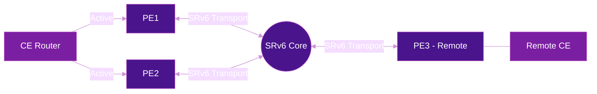

# EVPN Multihoming

EVPN-based All-Active Multihoming enables a CE (Customer Edge) device to connect to **multiple PE (Provider Edge) routers simultaneously**, with all links forwarding traffic at the same time. Combined with SRv6 transport, this delivers resilient, high-bandwidth L3VPN services without the complexity of traditional MLAG or MC-LAG solutions.

!!! info "Standards reference"
    This capability is defined in [draft-ietf-bess-evpn-l3mh-proto](https://datatracker.ietf.org/doc/draft-ietf-bess-evpn-l3mh-proto/) — EVPN Layer-3 Multihoming.

## Why Multihoming Matters

Traditional single-homed CE connections create a single point of failure. With All-Active multihoming, traffic flows across all PE links simultaneously:

| Model | Behavior |
|-------|----------|
| **Single-homed** | One PE, one link — failover requires reconvergence |
| **Active-Standby** | Two PEs, only one forwards — wastes bandwidth |
| **All-Active** | Two or more PEs, all forward simultaneously — full bandwidth, sub-second failover |

## Key Concepts

### Ethernet Segment (ES)

An Ethernet Segment identifies a CE link bundle connected to multiple PEs. All PEs sharing the same ES coordinate through EVPN signaling:

- **ES Identifier (ESI)** — a unique 10-byte value configured on all PEs attached to the same CE
- **Designated Forwarder (DF) election** — determines which PE forwards BUM (Broadcast, Unknown unicast, Multicast) traffic per VLAN/subnet to avoid duplication

### EVPN Route Types for Multihoming

| Route Type | Name | Role in Multihoming |
|-----------|------|---------------------|
| **Type 1** | Ethernet Auto-Discovery | Advertises ES membership; enables mass withdrawal on failure |
| **Type 4** | Ethernet Segment | DF election among MH peers |
| **Type 2** | MAC/IP Advertisement | Syncs MAC and IP bindings across MH peers |
| **Type 5** | IP Prefix | Advertises L3VPN prefixes with SRv6 SIDs |

### ARP/ND Synchronization

When a CE sends an ARP request or IPv6 Neighbor Discovery, the receiving PE must sync this information to its multihoming peers. EVPN Type-2 routes carry MAC/IP bindings between MH-PEs, ensuring:

- All PEs can answer ARP/ND on behalf of the CE
- Traffic from remote PEs can reach the CE via any MH-PE
- Failover is seamless — the remote PE already knows the MAC/IP mapping

## L3VPN Multihoming with SRv6

The `draft-ietf-bess-evpn-l3mh-proto` specification defines how EVPN multihoming works specifically for **Layer 3 VPN** services:

### How it works

1. **CE connects** to PE1 and PE2 via an Ethernet Segment (same ESI on both PEs)
2. **PEs discover each other** via EVPN Type-4 (ES) routes and elect the DF
3. **ARP/ND entries** are synced between MH peers using EVPN Type-2 routes
4. **L3VPN prefixes** are advertised to remote PEs using EVPN Type-5 routes with SRv6 SIDs
5. **Remote PEs** can send traffic to any MH-PE — ECMP across the Ethernet Segment
6. **On PE failure**, EVPN Type-1 mass withdrawal triggers fast reconvergence at remote PEs

### SRv6 behaviors

The multihoming PEs advertise SRv6 VPN SIDs in their BGP updates:

| SID Function | Usage |
|-------------|-------|
| **End.DT4 / End.DT6** | Decapsulate and route into the L3VPN VRF |
| **End.DX4 / End.DX6** | Decapsulate and forward to a specific CE interface |

Remote PEs encapsulate traffic with the SRv6 SID of the destination MH-PE. With All-Active multihoming, remote PEs can ECMP across both MH-PEs' SIDs.

## Capabilities

| Feature | Supported |
|---------|-----------|
| All-Active forwarding on all MH links | :material-check: |
| Multiple subnets on the same Ethernet Segment | :material-check: |
| ARP/ND sync between MH peers via EVPN | :material-check: |
| Multicast sync and IGP adjacency between CE & MH-PEs | :material-check: |
| SRv6 transport | :material-check: |
| SR-MPLS transport | :material-check: |
| VxLAN underlay | :material-check: |

!!! note "Interoperability"
    EVPN L3 Multihoming has been demonstrated in multi-vendor interoperability tests (EANTC) with Cisco and Nokia using both SRv6 and SR-MPLS underlay.

## Comparison with L2 Multihoming

EVPN multihoming was originally designed for Layer 2 (VXLAN/MPLS EVPN). The L3MH extension adapts these mechanisms specifically for L3VPN:

| Aspect | L2 Multihoming (EVPN) | L3 Multihoming (EVPN L3MH) |
|--------|----------------------|---------------------------|
| **Service type** | L2VPN / bridging | L3VPN / routing |
| **CE attachment** | Bridge domain | VRF / routed interface |
| **MAC learning** | Required | Not required (IP only) |
| **Split-horizon** | Per ES (prevents loops) | Not needed (L3) |
| **Prefix advertisement** | Type-2 (MAC/IP) | Type-5 (IP Prefix) + Type-2 (ARP/ND sync) |
| **Transport** | VXLAN, MPLS, SRv6 | SRv6, SR-MPLS, VXLAN |

## Further Reading

- :material-arrow-right: [BGP Overlay Services](bgp-overlay-services.md) — L3VPN and L2VPN fundamentals over SRv6
- :material-arrow-right: [VPN Services](../use-cases/vpn-services.md) — SRv6 VPN use cases
- :material-arrow-right: [TI-LFA](ti-lfa.md) — Fast reroute for sub-50ms failover in the SRv6 underlay
- :material-arrow-right: [RFC 9252](../rfcs/rfc9252.md) — BGP Overlay Services Based on SRv6

## References

1. [draft-ietf-bess-evpn-l3mh-proto](https://datatracker.ietf.org/doc/draft-ietf-bess-evpn-l3mh-proto/) — EVPN Layer-3 Multihoming Protocol
2. [RFC 7432](https://datatracker.ietf.org/doc/rfc7432/) — BGP MPLS-Based Ethernet VPN (EVPN base specification)
3. [RFC 8365](https://datatracker.ietf.org/doc/rfc8365/) — A Network Virtualization Overlay Solution Using EVPN
4. [EANTC Multi-Vendor Interoperability Tests](https://eantc.de/events/) — Industry interoperability demonstrations including EVPN multihoming
