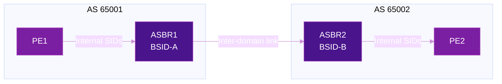
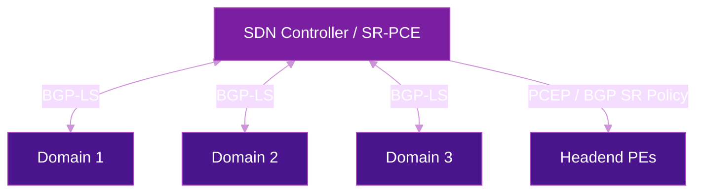

# Inter-Domain SRv6

Large-scale networks span multiple IGP domains or autonomous systems. Inter-domain SRv6 provides mechanisms to extend segment routing across these boundaries while preserving domain abstraction and operational independence.

## Why Inter-Domain Matters

Most production SRv6 deployments involve multiple domains:

- **Multiple IGP areas/levels** — IS-IS L1/L2, OSPF areas within a single AS
- **Multiple autonomous systems** — acquisitions, peering, wholesale/retail models
- **Cloud interconnect** — enterprise to cloud provider with distinct SRv6 domains
- **Regulatory boundaries** — geographic or jurisdictional separation requirements

The core challenge: how to provide **end-to-end SRv6 services** (VPN, TE, slicing) across domains without exposing internal topology.

## Inter-Domain Design Patterns

### Pattern 1: Single IGP Domain

All routers participate in one IS-IS instance. Simplest — no inter-domain complexity.

| Pros | Cons |
|------|------|
| Zero boundary complexity | IGP scalability limit (~2000 nodes) |
| End-to-end SID visibility | Single failure domain |
| Simple operations | Cannot hide topology |

### Pattern 2: Multi-Area / Multi-Level IGP

IS-IS Level-1/Level-2 or OSPF multi-area. SRv6 locators are redistributed or leaked between areas.

| Pros | Cons |
|------|------|
| Scales to 5000+ nodes | Locator redistribution needed |
| Partial topology hiding | Same AS — limited admin boundary |
| Well-understood operations | Shared control plane |

### Pattern 3: Binding SID Stitching

Separate IGP domains with **Binding SID (BSID)** at boundaries. Each domain's ASBR advertises a BSID that abstracts the internal path. Remote domains reference the BSID without knowing the internal topology.



**Segment list at PE1:** `[ASBR1::1, BSID-B, PE2::DT4]`

At ASBR1, `BSID-B` is resolved to the internal segment list of AS 65002 — PE1 never knows AS 65002's topology.

For BSID mechanics, see [SR Policy](sr-policy.md). For BSID in migration scenarios, see [Interworking & Migration](interworking-migration.md).

### Pattern 4: BGP-LS + SDN Controller

Each domain exports its topology to a centralized controller via **BGP-LS** (RFC 9514). The controller computes end-to-end paths and installs them via PCEP or BGP SR Policy.



| Pros | Cons |
|------|------|
| Global path optimization | Controller is a single point of failure |
| Constraint-aware computation | Topology freshness depends on BGP-LS updates |
| End-to-end TE without domain knowledge on PEs | Complexity of controller deployment |

## SID Allocation Across Domains

### Block Planning

Each domain must own a **unique locator block** to prevent SID collisions:

| Domain | Locator Block | Purpose |
|--------|--------------|---------|
| Core (AS 65001) | `fc00:1::/32` | Backbone transport |
| Metro (AS 65002) | `fc00:2::/32` | Metro aggregation |
| DC (AS 65003) | `fc00:3::/32` | Data center fabric |
| Peering | `fc00:ff::/32` | Inter-domain BSIDs |

### Filtering at Domain Boundaries

!!! warning "Security: filter SIDs at boundaries"
    Without filtering, a remote domain could inject arbitrary SIDs targeting internal nodes. Always filter at ASBRs.

- **Inbound:** only accept SRv6 packets with destination SID in the local domain's locator block or explicitly negotiated inter-domain SIDs
- **Outbound:** only advertise locators and BSIDs that remote domains need
- **iACLs on ASBRs:** drop packets with unexpected SRH or SIDs

For detailed security practices, see [Security](security.md).

## Domain Boundary Options

Three options for interconnecting SRv6 domains, analogous to MPLS inter-AS options:

### Option A: Per-VRF Peering

Separate BGP session per VRF at the domain boundary. No SRv6 SIDs cross the boundary — traffic is decapsulated and re-encapsulated at each ASBR.

### Option B: Binding SID Gateway

ASBRs exchange labeled (SID) routes via MP-BGP. Each ASBR allocates a BSID for reachability into its domain. This is the **most common** approach for SRv6.

### Option C: End-to-End SRv6 (Seamless)

Remote SRv6 SIDs are installed directly in the local FIB via BGP. Traffic traverses domains without re-encapsulation. Best performance but requires trust between domains.

| Aspect | Option A | Option B | Option C |
|--------|:--------:|:--------:|:--------:|
| **Scalability** | Low (per-VRF session) | High | High |
| **Abstraction** | Full (no SID leaking) | Medium (BSID only) | None (full SID visibility) |
| **TE granularity** | Per-VRF only | Per-policy (BSID) | Per-SID (finest) |
| **Complexity** | Low | Medium | High |
| **Trust required** | None | Moderate | Full |
| **Common use** | Enterprise peering | SP multi-domain | Single-operator multi-domain |

## End-to-End TE Across Domains

### Hierarchical SR Policies

BSIDs chain SR Policies across domains. The ingress PE's segment list references BSIDs that each domain expands independently:

```
Ingress segment list:  [BSID_Domain1, BSID_Domain2, PE-Remote::DT4]

Domain 1 ASBR expands BSID_Domain1 → [P1::1, P3::1, ASBR1::1]
Domain 2 ASBR expands BSID_Domain2 → [P5::1, PE-Remote::1]
```

This provides end-to-end TE without any domain knowing the others' topology.

### Controller-Based End-to-End Path Computation

A multi-domain controller (SR-PCE hierarchy or single controller with BGP-LS from all domains):

1. Collects topology from each domain via BGP-LS
2. Computes a constrained end-to-end path (latency, bandwidth, disjointness)
3. Installs the path on the headend via PCEP, using BSIDs at domain boundaries
4. Reoptimizes when topology changes are detected

## Configuration

=== "Cisco IOS-XR"

    ```cisco
    !! ASBR Binding SID for inter-domain policy
    segment-routing
     traffic-eng
      policy TO-DOMAIN2
       binding-sid srv6 dynamic behavior ub6-insert-reduced
       color 500 end-point ipv6 2001:db8:2::1
       candidate-paths
        preference 100
         explicit segment-list VIA-ASBR2
        !
       !
      !
     !
    !

    !! BGP-LS export to controller
    router bgp 65001
     address-family link-state link-state
     !
     neighbor 2001:db8:ffff::1
      address-family link-state link-state
      !
     !
    !

    !! SID filtering at ASBR
    ipv6 access-list SRV6-BOUNDARY-FILTER
     10 permit ipv6 any fc00:1::/32
     20 permit ipv6 any fc00:ff::/32
     30 deny ipv6 any any
    !
    interface GigabitEthernet0/0/0/0
     ipv6 access-group SRV6-BOUNDARY-FILTER ingress
    !
    ```

=== "Juniper"

    ```junos
    # BGP-LS export
    set protocols bgp group CONTROLLER family traffic-engineering
    set protocols bgp group CONTROLLER neighbor 2001:db8:ffff::1

    # BSID policy
    set protocols source-packet-routing sr-policy TO-DOMAIN2 binding-sid fc00:ff:1::500
    set protocols source-packet-routing sr-policy TO-DOMAIN2 color 500
    set protocols source-packet-routing sr-policy TO-DOMAIN2 end-point 2001:db8:2::1

    # SID filtering
    set firewall family inet6 filter SRV6-BOUNDARY term ALLOW-LOCAL match destination-address fc00:1::/32
    set firewall family inet6 filter SRV6-BOUNDARY term ALLOW-INTER-DOMAIN match destination-address fc00:ff::/32
    set firewall family inet6 filter SRV6-BOUNDARY term DENY-REST then discard
    ```

## Verification

=== "Cisco IOS-XR"

    ```cisco
    !! Verify BSID allocation
    show segment-routing traffic-eng binding-sid

    !! Verify BGP-LS export
    show bgp link-state link-state summary

    !! Verify inter-domain policy
    show segment-routing traffic-eng policy color 500

    !! Verify SID filtering
    show ipv6 access-list SRV6-BOUNDARY-FILTER
    ```

## Security Considerations

Inter-domain SRv6 introduces unique security requirements:

| Threat | Mitigation |
|--------|-----------|
| **Unauthorized SRH injection** | Filter SRH at domain boundaries; only accept known SIDs |
| **SID spoofing** | iACLs on ASBRs matching locator blocks |
| **Topology leaking** | Use BSID abstraction (Option B) to hide internal paths |
| **Amplification via replication** | Rate-limit inter-domain traffic with unexpected SRH depth |

For the full SRv6 security framework, see [Security](security.md).

## Further Reading

- :material-arrow-right: [SR Policy](sr-policy.md) — Binding SID, color steering, PCE integration
- :material-arrow-right: [Interworking & Migration](interworking-migration.md) — BSID gateway for SR-MPLS/SRv6 migration
- :material-arrow-right: [Security](security.md) — SRv6 security best practices including boundary filtering
- :material-arrow-right: [Flex-Algorithm](flex-algorithm.md) — Per-domain Flex-Algo with inter-domain color steering
- :material-file-document: [RFC 9514](../rfcs/rfc9514.md) — BGP-LS Extensions for SRv6

## References

1. [RFC 9256 - SR Policy Architecture](https://datatracker.ietf.org/doc/rfc9256/) - Defines Binding SID, candidate paths, and color steering used for inter-domain TE
2. [RFC 9514 - BGP-LS Extensions for SRv6](https://datatracker.ietf.org/doc/rfc9514/) - BGP-LS for exporting SRv6 topology to multi-domain controllers
3. [RFC 8402 - Segment Routing Architecture](https://datatracker.ietf.org/doc/rfc8402/) - Foundational SR architecture including inter-domain considerations
4. [draft-ietf-idr-sr-policy-safi](https://datatracker.ietf.org/doc/draft-ietf-idr-sr-policy-safi/) - BGP SR Policy SAFI for distributing policies across domains
5. [Cisco IOS-XR: Configure Inter-AS SR-TE](https://www.cisco.com/c/en/us/td/docs/iosxr/cisco8000/segment-routing/24xx/configuration/guide/b-segment-routing-cg-cisco8000-24xx/configuring-sr-te-policies.html) - Configuration guide for inter-domain SR-TE with BSID and PCE
