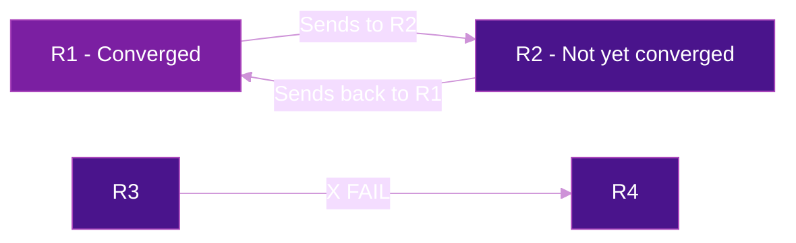

# Micro-Loop Avoidance

After a link or node failure, IGP routers recompute their forwarding tables at different times. During this convergence window (200ms-2s), routers may temporarily disagree on the best path — creating **transient forwarding loops** called micro-loops.

## What Are Micro-Loops?

### The Problem

When a topology change occurs, each router independently runs SPF and updates its FIB. Routers closer to the failure detect and converge faster than distant routers. This temporal mismatch creates loops:



**Timeline of a micro-loop:**

1. **T=0ms:** Link R3-R4 fails
2. **T=10ms:** R3 detects failure, reconverges, now forwards via R1
3. **T=10-500ms:** R1 has **not yet reconverged** — still points to R2 for the destination
4. **R1 → R2 → R1 → R2...** — packets loop until R1 and R2 both converge
5. **T=500ms-2s:** All routers converge, loop stops

### Impact

| Effect | Description |
|--------|-------------|
| **Packet loss** | TTL expiry after 64-255 hops in the loop |
| **Bandwidth waste** | Looping packets consume link capacity |
| **Jitter** | Surviving traffic experiences delay spikes |
| **CPU load** | High packet rate from loops stresses forwarding engines |

## TI-LFA vs Micro-Loop Avoidance

TI-LFA and micro-loop avoidance solve **different phases** of convergence:


| Aspect | TI-LFA | Micro-Loop Avoidance |
|--------|--------|---------------------|
| **Purpose** | Instant backup path at failure-adjacent node | Prevent loops during network-wide convergence |
| **Coverage window** | 0-50ms (detection + switchover) | 50ms-2s (IGP convergence) |
| **Scope** | Local to the detecting router | Network-wide coordination |
| **Prerequisite** | SRv6 SIDs | TI-LFA (to carry traffic during delay) |

!!! warning "Without TI-LFA, micro-loop avoidance causes blackholes"
    Micro-loop avoidance works by **delaying FIB updates**. Without TI-LFA providing a backup path during that delay, traffic would be blackholed. Always enable TI-LFA first.

## Solution 1: Local Delay (Recommended)

The simplest and most widely deployed approach. Each router **delays its FIB update** by a configurable timer after receiving a topology change notification. TI-LFA carries traffic during the delay.

### How It Works

1. Router receives LSP/LSA indicating topology change
2. Router runs SPF and computes new paths, but **does not update FIB yet**
3. TI-LFA backup path carries traffic (installed at failure detection time)
4. After the delay timer expires (e.g., 5000ms), FIB is updated
5. By this time, all routers have converged — no loop

### Why SRv6 Makes This Work

In traditional IP/LDP networks, delaying the FIB update means traffic is **blackholed** because there's no backup path. With SRv6 + TI-LFA:

- TI-LFA pre-computes a loop-free backup path using SRv6 SIDs
- Traffic switches to the backup in <50ms
- The backup carries traffic for the entire delay window
- When FIB updates, traffic moves to the new primary path seamlessly

### Configuration

=== "Cisco IOS-XR"

    ```cisco
    !! Enable micro-loop avoidance with segment-routing
    router isis CORE
     address-family ipv6 unicast
      microloop avoidance segment-routing
      microloop avoidance rib-update-delay 5000
     !
    !
    ```

=== "Juniper"

    ```junos
    set protocols isis spf-options microloop-avoidance post-convergence-path delay 5000
    ```

## Solution 2: Explicit Post-Convergence Path

Instead of delaying the FIB update, the router **immediately installs the new path** but encodes it as an **explicit SRv6 segment list** that is loop-free by construction (source-routed paths cannot loop).

### How It Works

1. Router computes the post-convergence shortest path
2. Encodes the path as an SRv6 segment list (node SIDs of intermediate hops)
3. Installs this explicit path immediately — no delay needed
4. After all routers converge, switches to the native shortest path (removes explicit segments)

### Advantage

No delay timer needed — convergence is immediate and loop-free. The trade-off is slightly more SRH overhead during the convergence window.

=== "Cisco IOS-XR"

    ```cisco
    router isis CORE
     address-family ipv6 unicast
      microloop avoidance segment-routing
     !
    !
    ```

## Solution 3: Ordered FIB (oFIB)

Routers update their FIBs in a **coordinated order** based on their distance from the failure. Routers farther from the failure update first, then progressively closer routers update.

| Pros | Cons |
|------|------|
| No SRv6 dependency | Slower convergence (ordered updates) |
| Works with any forwarding plane | Complex to implement correctly |
| No additional header overhead | Not widely deployed |

!!! info "oFIB is rarely used in practice"
    Most SRv6 deployments use **local delay** (Solution 1) because it is simpler and TI-LFA is already required for fast reroute.

## Comparison

| Approach | Convergence Speed | Complexity | SRv6 Required | Header Overhead |
|----------|:-----------------:|:----------:|:--------------:|:---------------:|
| **Local Delay** | Delayed (configurable) | Low | Yes (TI-LFA) | None |
| **Explicit Path** | Immediate | Medium | Yes (SIDs) | Temporary SRH |
| **Ordered FIB** | Slow (ordered) | High | No | None |

## Verification

=== "Cisco IOS-XR"

    ```cisco
    !! Verify micro-loop avoidance is enabled
    show isis microloop-avoidance status

    !! Show active micro-loop avoidance events
    show isis microloop-avoidance

    !! Verify TI-LFA is protecting during delay
    show isis fast-reroute ipv6 summary

    !! Monitor convergence with timestamps
    show isis convergence
    ```

=== "Juniper"

    ```junos
    show isis spf log
    show isis overview | match microloop
    ```

## Deployment Recommendations

1. **Enable TI-LFA first** — micro-loop avoidance depends on TI-LFA for traffic protection during the delay window
2. **Start with local delay** — simplest approach, 5000-10000ms is a safe default
3. **Tune the delay timer** — measure your network's worst-case convergence time; set the delay to 2x that value
4. **Test with controlled failures** — shut a link and verify no packet loss during the micro-loop window
5. **Monitor with telemetry** — track convergence events and micro-loop avoidance activations

## Further Reading

- :material-arrow-right: [TI-LFA](ti-lfa.md) — Sub-50ms fast reroute (prerequisite for micro-loop avoidance)
- :material-arrow-right: [Performance & Scaling](performance-scaling.md) — Convergence benchmarks
- :material-arrow-right: [Telemetry](telemetry.md) — Monitoring convergence events
- :material-file-document: [RFC 9855](../rfcs/rfc9855.md) — TI-LFA Using Segment Routing

## References

1. [RFC 9855 - Topology Independent Fast Reroute Using Segment Routing](https://datatracker.ietf.org/doc/rfc9855/) - TI-LFA standard that enables micro-loop avoidance in SRv6 networks
2. [RFC 8333 - Micro-loop Prevention by Introducing a Local Convergence Delay](https://datatracker.ietf.org/doc/rfc8333/) - Defines the local delay mechanism for micro-loop prevention
3. [Cisco IOS-XR: Configure Microloop Avoidance](https://www.cisco.com/c/en/us/td/docs/iosxr/cisco8000/segment-routing/24xx/configuration/guide/b-segment-routing-cg-cisco8000-24xx/configuring-topology-independent-loop-free-alternate.html) - IOS-XR configuration guide for micro-loop avoidance with segment routing
