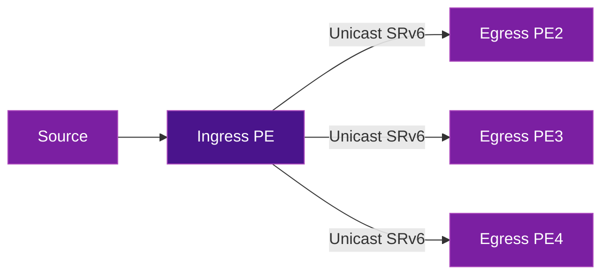
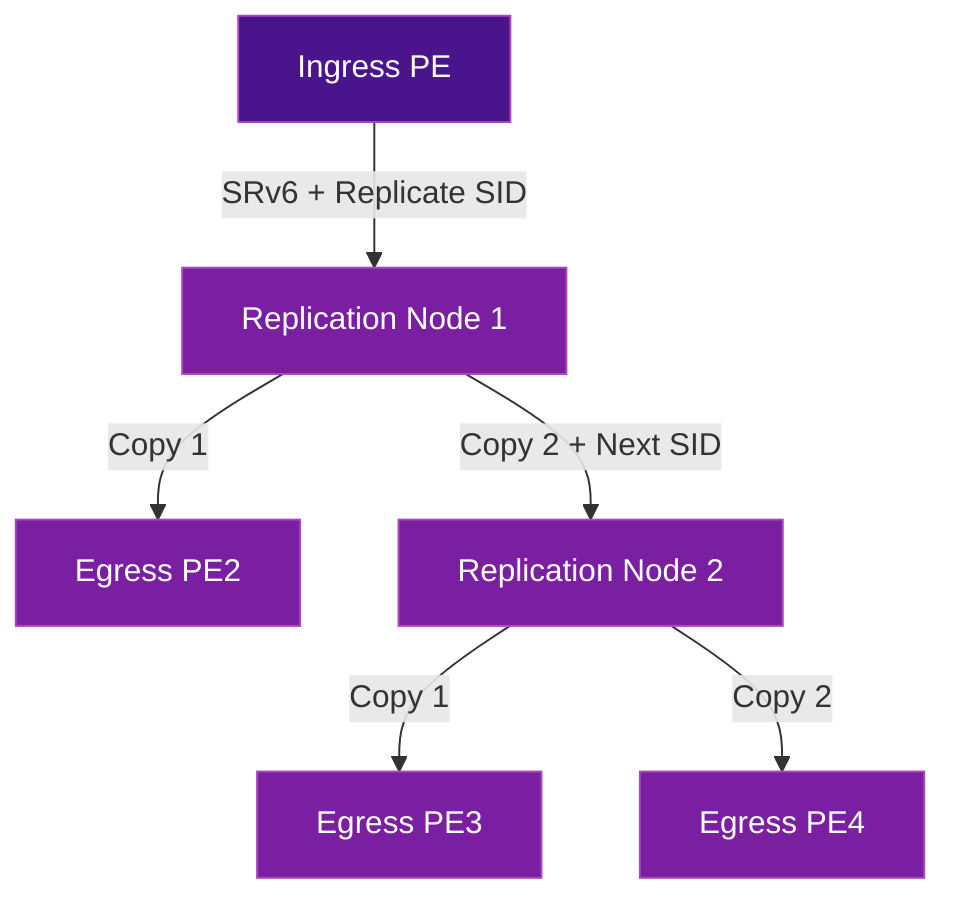
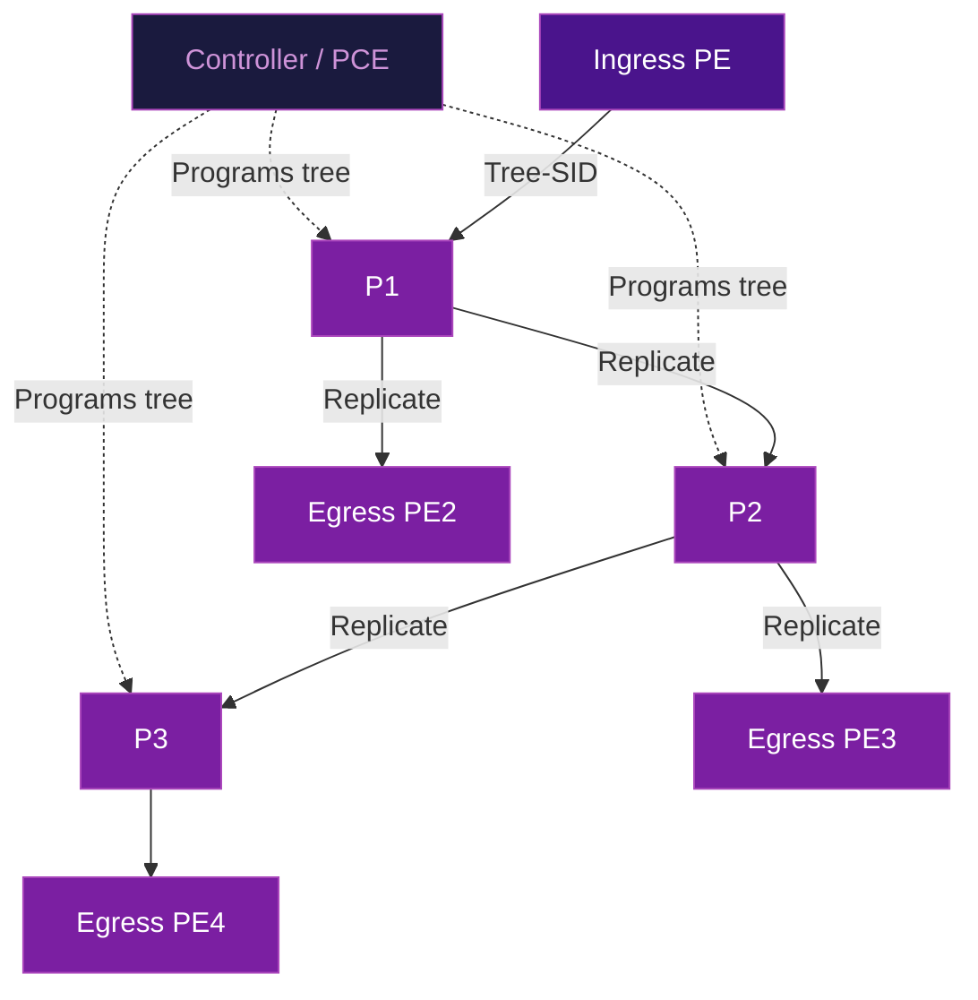

# Multicast & Broadcast

SRv6 is inherently a unicast transport — packets follow a segment list from source to destination. Delivering multicast and broadcast traffic over an SRv6 network requires additional mechanisms to replicate packets to multiple receivers without reverting to traditional PIM/mLDP trees.

Several approaches have emerged, each with different trade-offs.

## The Challenge

Traditional IP multicast relies on per-group state at every router in the path (PIM, mLDP, IGMP). This creates:

- **State explosion** — every (S,G) or (*,G) entry on every transit router
- **Convergence complexity** — tree recomputation on any topology change
- **Operational burden** — debugging multicast is notoriously difficult

SRv6's source-routing model pushes complexity to the edges, which conflicts with multicast's distributed replication model. The solutions below bridge this gap.

## Approach 1: Ingress Replication (Head-End)

The simplest approach — the ingress PE replicates the packet and sends a **separate unicast SRv6 copy** to each egress PE.



| Pros | Cons |
|------|------|
| Zero state on transit nodes | Bandwidth wasteful — N copies on ingress uplink |
| Works today on any SRv6 network | Does not scale for large receiver sets |
| Simple to implement and debug | Ingress PE becomes bottleneck |

### When to use

- Small number of receivers (< 10-20)
- EVPN BUM (Broadcast, Unknown unicast, Multicast) in L2VPN
- Control plane traffic (e.g., ARP/ND flooding in EVPN)

## Approach 2: SRv6 Replication Segments (End.Replicate)

The IETF has defined **replication segments** that enable packet replication at intermediate nodes along the SRv6 path.

### How it works

1. The ingress PE builds a segment list that includes **replication SIDs** at strategic nodes
2. When a node processes a replication SID, it:
   - Forwards a copy to the next segment in the list
   - Sends a replicated copy to a local egress or another replication branch
3. This creates an **overlay replication tree** encoded entirely in the SRH



| Pros | Cons |
|------|------|
| Efficient bandwidth — replication happens in-network | Requires replication-capable nodes |
| No PIM/mLDP state on transit nodes | Segment list grows with tree complexity |
| Tree is source-routed (stateless transit) | Still evolving in standardization |

### SRv6 SID behaviors

| Behavior | Description |
|----------|-------------|
| **End.Replicate** | Replicate packet to a set of next-hops while continuing SID processing |

!!! info "Standards reference"
    Replication segments are defined in [draft-ietf-spring-sr-replication-segment](https://datatracker.ietf.org/doc/draft-ietf-spring-sr-replication-segment/).

## Approach 3: Tree-SID

Tree-SID pre-computes a multicast distribution tree and assigns a single **Tree-SID** identifier that represents the entire tree. The ingress PE only needs to push one SID.

### How it works

1. A controller (e.g., PCE) computes the optimal multicast tree
2. Each node on the tree is programmed with forwarding state for the Tree-SID
3. The ingress PE encapsulates with just the Tree-SID — transit nodes replicate based on their local state



| Pros | Cons |
|------|------|
| Single SID for entire tree — minimal SRH overhead | Requires centralized controller (PCE) |
| Optimized replication at each branch point | Per-tree state on transit nodes |
| Supports P2MP and MP2MP | Less dynamic than ingress replication |

!!! info "Standards reference"
    Tree-SID is defined in [draft-ietf-pce-sr-p2mp-policy](https://datatracker.ietf.org/doc/draft-ietf-pce-sr-p2mp-policy/).

## Approach 4: BIER with SRv6

**BIER (Bit Index Explicit Replication)** encodes the set of egress routers as a **bitmask** in the packet header. Each bit represents a specific egress PE. Transit nodes use the bitmask to determine where to replicate — no per-group multicast state needed.

### BIER + SRv6 integration

SRv6 can carry BIER information in the SRH, combining SRv6's source routing with BIER's stateless replication:

```
IPv6 Header → SRH [SRv6 SIDs] → BIER Header [Bitmask] → Payload
```

| Pros | Cons |
|------|------|
| Zero per-group state on transit nodes | Bitmask size limits receiver count (256-4096 per set) |
| No tree computation needed | Requires BIER-capable hardware |
| Works with any multicast source model | Additional header overhead |
| Scales linearly with egress PEs | Newer technology, less deployed |

!!! info "Standards reference"
    BIER is defined in [RFC 8279](https://datatracker.ietf.org/doc/rfc8279/). The SRv6 integration is being developed in [draft-ietf-bier-srv6-requirements](https://datatracker.ietf.org/doc/draft-ietf-bier-srv6-requirements/).

## Broadcast in SRv6

Broadcast is typically an L2 concept. In SRv6 networks, broadcast handling depends on the service type:

### EVPN L2VPN (bridging)

Broadcast, Unknown unicast, and Multicast (BUM) traffic is handled via:

- **Ingress replication** — the PE sends a copy to every remote PE in the EVPN instance
- **EVPN Type-3 routes** — advertise the inclusive multicast Ethernet tag, signaling which PEs need BUM traffic

### L3VPN (routing)

Broadcast is not applicable in L3VPN — ARP/ND is handled via EVPN proxy (suppressing broadcast) or standard ARP resolution within the VRF.

## Comparison of Approaches

| Approach | Transit State | Bandwidth Efficiency | Scalability | Maturity |
|----------|--------------|---------------------|-------------|----------|
| **Ingress Replication** | None | Low (N copies at ingress) | Small scale | Production |
| **Replication Segments** | None (stateless) | Medium | Medium | Draft |
| **Tree-SID** | Per-tree | High (optimal tree) | Large scale | Draft |
| **BIER** | BIER tables (no per-group) | High | Very large | Early deployment |

## Further Reading

- :material-arrow-right: [BGP Overlay Services](bgp-overlay-services.md) — EVPN and L3VPN including BUM handling
- :material-arrow-right: [EVPN Multihoming](evpn-multihoming.md) — All-Active multihoming with BUM traffic considerations
- :material-arrow-right: [Network Programming](network-programming.md) — SRv6 behaviors including replication
- :material-arrow-right: [5G Transport](../use-cases/5g-transport.md) — Multicast requirements for mobile networks

## References

1. [draft-ietf-spring-sr-replication-segment](https://datatracker.ietf.org/doc/draft-ietf-spring-sr-replication-segment/) — Segment Routing Replication Segment
2. [draft-ietf-pce-sr-p2mp-policy](https://datatracker.ietf.org/doc/draft-ietf-pce-sr-p2mp-policy/) — SR P2MP Policy via PCE
3. [RFC 8279](https://datatracker.ietf.org/doc/rfc8279/) — Multicast Using Bit Index Explicit Replication (BIER)
4. [RFC 9252](https://datatracker.ietf.org/doc/rfc9252/) — BGP Overlay Services Based on SRv6
5. [draft-ietf-bier-srv6-requirements](https://datatracker.ietf.org/doc/draft-ietf-bier-srv6-requirements/) — BIER in SRv6 Requirements
