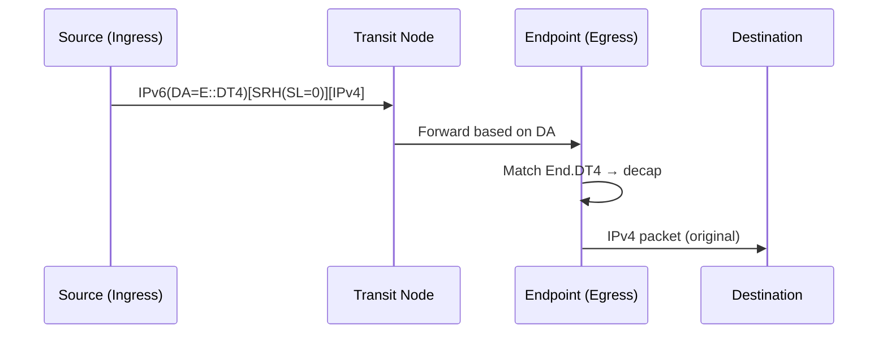

# Network Programming

SRv6 Network Programming (defined in RFC 8986) allows network operators to define custom packet processing behaviors using **SRv6 functions** encoded in SIDs.

## Core Behaviors

### Transit Behaviors

Transit nodes forward packets based on the IPv6 destination address without inspecting the SRH.

| Behavior | Description |
|----------|-------------|
| `T` | Transit - basic IPv6 forwarding |
| `T.Insert` | Insert an SRH into the packet |
| `T.Encaps` | Encapsulate in a new IPv6 header with SRH |
| `T.Encaps.Red` | Reduced encapsulation (omit last SID from SRH) |

### Endpoint Behaviors

Endpoint nodes process the active SID in the SRH.

| Behavior | Description |
|----------|-------------|
| `End` | Endpoint - update SL, copy next SID to DA |
| `End.X` | Endpoint with Layer-3 cross-connect |
| `End.T` | Endpoint with specific table lookup |
| `End.DX4` | Decap and cross-connect to IPv4 adjacency |
| `End.DX6` | Decap and cross-connect to IPv6 adjacency |
| `End.DT4` | Decap and lookup in IPv4 table |
| `End.DT6` | Decap and lookup in IPv6 table |
| `End.DT46` | Decap and lookup in IPv4 or IPv6 table |
| `End.B6.Encaps` | Endpoint bound to an SRv6 policy with encap |

!!! info "Behaviors are extensible"
    New behaviors can be defined and allocated from the IANA SRv6 Endpoint Behaviors registry, making SRv6 future-proof.

## Packet Walk: End.DT4

## Further Reading

- :material-file-document: [RFC 8986](../rfcs/rfc8986.md) - SRv6 Network Programming
- :material-arrow-right: [SID Structure](sid-structure.md) - How SIDs encode behaviors

## References

1. [RFC 8986 - SRv6 Network Programming](https://datatracker.ietf.org/doc/rfc8986/) - Defines the SRv6 Network Programming framework and all base endpoint behaviors
2. [RFC 8754 - IPv6 Segment Routing Header (SRH)](https://www.rfc-editor.org/rfc/rfc8754.html) - Specifies the SRH that carries the ordered list of SRv6 segments
3. [IANA Segment Routing Parameters - SRv6 Endpoint Behaviors](https://www.iana.org/assignments/segment-routing/segment-routing.xhtml) - Official IANA registry of SRv6 endpoint behavior codepoints
