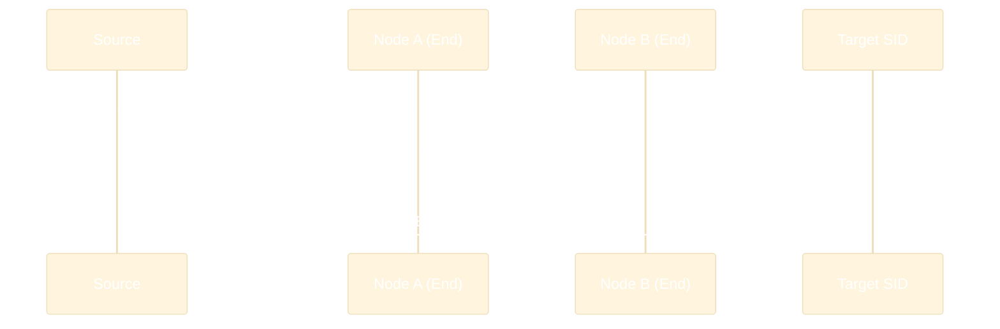
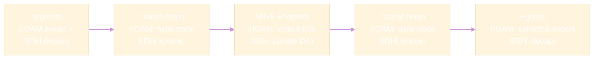
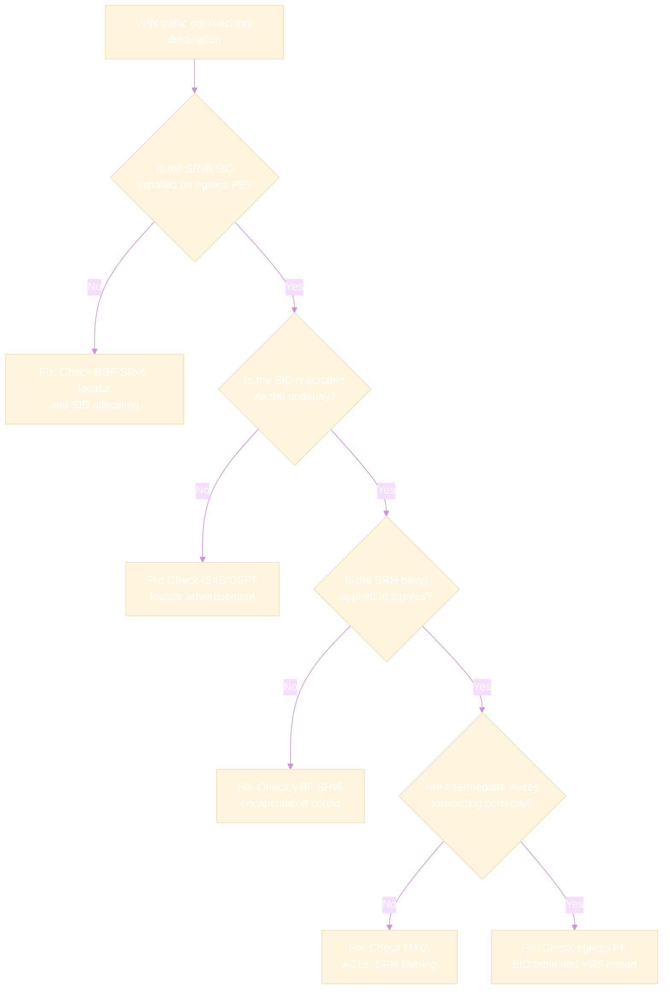

# OAM & Troubleshooting

Effective OAM (Operations, Administration, and Maintenance) is critical for operating SRv6 networks. This page covers how traditional OAM tools work in SRv6, plus SRv6-native OAM mechanisms.

## SRv6 Ping

SRv6 ping uses **ICMPv6 Echo Request/Reply** with the SRH to verify reachability along a specific SRv6 path.

### How It Works

1. Source sends ICMPv6 Echo Request with an SRH containing the desired path
2. Packet follows the segment list (same as data traffic)
3. The target SID node generates an ICMPv6 Echo Reply
4. Reply returns via normal IPv6 routing (not the reverse SRv6 path)



### Verification Commands

=== "Cisco IOS-XR"

    ```cisco
    !! Ping a specific SRv6 SID
    ping ipv6 fc00:0:2::100 source fc00:0:1::1

    !! Ping through an SRv6 path (with segment list)
    ping sr-mpls nil-fec labels fc00:0:2::1,fc00:0:3::100
    ```

=== "Linux"

    ```bash
    # Ping an SRv6 SID directly
    ping6 fc00:0:2::100

    # Ping with SRv6 encapsulation through specific path
    # (requires custom route or scapy)
    ip route add fc00:0:2::100/128 encap seg6 mode encap \
      segs fc00:0:2::1,fc00:0:3::100 dev eth0
    ping6 fc00:0:2::100
    ```

## SRv6 Traceroute

SRv6 traceroute discovers each hop along an SRv6 path by incrementing the IPv6 **Hop Limit**:

1. Send packet with Hop Limit = 1 → first hop returns ICMPv6 Time Exceeded
2. Send packet with Hop Limit = 2 → second hop returns Time Exceeded
3. Continue until the target SID responds

### Key Difference from IP Traceroute

SRv6 traceroute reveals both **SRv6-aware** and **transit** nodes:

- **Transit nodes** (non-SRv6) return Time Exceeded based on the IPv6 DA
- **SRv6 endpoint nodes** process the SID and update the DA before forwarding

This means traceroute shows the actual forwarding path, including underlay hops between SRv6 nodes.

## IOAM Deep Dive (RFC 9326)

**In-situ OAM (IOAM)** embeds telemetry data directly into live data packets as they traverse the network. Unlike traditional OAM that sends separate probe packets, IOAM instruments the *actual* traffic, providing accurate measurements that reflect real forwarding behavior including load-balanced paths.

!!! info "Key Principle"
    IOAM data travels **inside** the data packet itself. Every IOAM-capable node along the path can read and/or write telemetry fields. At the egress, the collected data is extracted and exported to a collector.

### IOAM Option Types

RFC 9326 defines four IOAM option types, each designed for different telemetry use cases:

#### Type 0: Pre-allocated Trace

The ingress node allocates a **fixed-size** trace buffer with empty slots for each expected hop. As the packet transits the network, each IOAM-capable node fills in its designated slot.

```
 Ingress allocates N slots         Each transit node fills its slot
 ┌──────┬──────┬──────┬──────┐     ┌──────┬──────┬──────┬──────┐
 │ Empty│ Empty│ Empty│ Empty│ --> │Node 4│Node 3│Node 2│Node 1│
 └──────┴──────┴──────┴──────┘     └──────┴──────┴──────┴──────┘
  Slot 0  Slot 1 Slot 2 Slot 3     Filled right-to-left (LIFO)
```

| Attribute | Detail |
|-----------|--------|
| **Format** | Fixed-length header; `RemainingLen` field decremented by each node as it writes its data |
| **Use case** | Paths with a known, predictable hop count (e.g., deterministic SR policies) |
| **Overhead** | Fixed: `N * node_data_size` bytes allocated at ingress regardless of actual hops traversed |
| **Limitations** | Wasted space if fewer nodes than expected are traversed; requires advance knowledge of path length |

#### Type 1: Incremental Trace

Each IOAM-capable node **appends** its telemetry data to the header. The packet grows at each hop.

```
 Ingress (minimal header)      After Node 1          After Node 2
 ┌─────────┐                ┌─────────┬──────┐   ┌─────────┬──────┬──────┐
 │ IOAM Hdr│       -->      │ IOAM Hdr│Node 1│-->│ IOAM Hdr│Node 1│Node 2│
 └─────────┘                └─────────┴──────┘   └─────────┴──────┴──────┘
```

| Attribute | Detail |
|-----------|--------|
| **Format** | Variable-length; the header carries a `MaxLength` field to cap the maximum growth |
| **Use case** | Paths where hop count is unknown or variable (e.g., ECMP, dynamic routing) |
| **Overhead** | Grows per hop (`node_data_size` bytes added at each node); more efficient when fewer hops than max |
| **Limitations** | Intermediate nodes must be able to modify the IPv6 extension header length; MTU issues if path is long |

#### Type 2: Proof of Transit (POT)

Provides a **cryptographic proof** that a packet has traversed a specific set of nodes. Each node updates a cumulative value using a shared secret and a polynomial-based scheme (Shamir's Secret Sharing).

```
 Ingress sets            Node 1 updates        Node 2 updates       Egress verifies
 initial CML value       CML with its share     CML with its share   CML == expected
 ┌─────┐                ┌─────┐               ┌─────┐              ┌─────┐
 │CML=0│      -->       │CML=a│     -->       │CML=b│    -->       │CML=S│ ✓
 └─────┘                └─────┘               └─────┘              └─────┘
```

| Attribute | Detail |
|-----------|--------|
| **Format** | Carries `CML` (cumulative) and `RND` (random) fields; 8 or 16 bytes depending on profile |
| **Use case** | Security-sensitive paths: verify packets were not rerouted through unauthorized nodes |
| **Overhead** | Constant per-packet (8-16 bytes); no per-hop growth |
| **Limitations** | Requires pre-shared secrets across all participating nodes; not suitable for performance telemetry; computationally more expensive |

#### Type 3: Edge-to-Edge (E2E)

Carries data that is written by the **ingress** node and read by the **egress** node. No intermediate node modifies E2E data.

| Attribute | Detail |
|-----------|--------|
| **Format** | Sequence number (64-bit) and/or timestamp set at ingress |
| **Use case** | End-to-end delay measurement, packet reordering detection, and loss calculation |
| **Overhead** | Constant per-packet (16-24 bytes); no per-hop growth |
| **Limitations** | Provides only edge-to-edge visibility; no per-hop detail |

### IOAM Option Types Summary

| Option Type | Per-Hop Growth | Hop-by-Hop Processing | Primary Purpose |
|:-----------:|:--------------:|:--------------------:|:---------------:|
| **Pre-allocated Trace (0)** | None (pre-allocated) | Yes - each node fills a slot | Per-hop telemetry (known path length) |
| **Incremental Trace (1)** | ~24 bytes/hop | Yes - each node appends | Per-hop telemetry (unknown path length) |
| **Proof of Transit (2)** | None | Yes - each node updates CML | Path verification / security |
| **Edge-to-Edge (3)** | None | No - ingress write, egress read | E2E delay, loss, reordering |

### IOAM Data Fields

Each trace node data entry (used by Type 0 and Type 1) can include any combination of the following fields, selected via a 24-bit **IOAM-Trace-Type** bitmask:

| Bit | Field | Size | Description |
|:---:|-------|:----:|-------------|
| 0 | `hop_lim` + `node_id` | 4 B | Remaining hop limit (8-bit) and node identifier (24-bit) |
| 1 | `ingress_if_id` + `egress_if_id` | 4 B | Ingress interface ID (16-bit) and egress interface ID (16-bit) |
| 2 | `timestamp_seconds` | 4 B | Seconds portion of the timestamp (PTP or NTP epoch) |
| 3 | `timestamp_fraction` | 4 B | Fractional portion of the timestamp (nanosecond precision) |
| 4 | `transit_delay` | 4 B | Time spent inside the node (nanoseconds) |
| 5 | `namespace_data` | 4 B | Namespace-specific metadata (defined per deployment) |
| 6 | `queue_depth` | 4 B | Current queue depth at the egress interface (bytes) |
| 7 | `checksum_complement` | 4 B | Used to maintain transport checksum neutrality after IOAM insertion |
| 8 | `hop_lim` + `node_id` (wide) | 8 B | Wide format: hop limit (8-bit) + node ID (56-bit) for large networks |
| 9 | `ingress_if_id` + `egress_if_id` (wide) | 8 B | Wide format: 32-bit interface IDs for platforms with >65K interfaces |
| 10 | `namespace_data` (wide) | 8 B | Wide-format namespace-specific metadata |
| 11 | `buffer_occupancy` | 4 B | Buffer/memory utilization at the node |
| 22 | `opaque_state_snapshot` | Variable | Vendor-specific opaque data (length specified in header) |

!!! tip "Selecting IOAM Fields"
    For most SRv6 deployments, enabling bits 0-4 and 6 provides a good balance of per-hop path visibility and latency measurement at ~24 bytes per node. Adding wide fields (bits 8-9) is only necessary in very large-scale networks with more than 16 million node IDs or 65K interfaces per node.

### IOAM Namespaces

IOAM uses **namespaces** (16-bit Namespace-ID) to isolate IOAM domains and allow multiple independent IOAM deployments within the same network.

```
 ┌─────────────────────────────────────────────────────┐
 │                  Physical Network                    │
 │                                                      │
 │  ┌──────────────────────┐  ┌──────────────────────┐ │
 │  │  Namespace 100       │  │  Namespace 200        │ │
 │  │  (Production SLA)    │  │  (Lab/Testing)        │ │
 │  │                      │  │                       │ │
 │  │  IOAM fields:        │  │  IOAM fields:         │ │
 │  │  - node_id           │  │  - node_id            │ │
 │  │  - timestamp          │  │  - queue_depth        │ │
 │  │  - transit_delay      │  │  - buffer_occupancy   │ │
 │  └──────────────────────┘  └──────────────────────┘ │
 └─────────────────────────────────────────────────────┘
```

Key namespace behaviors:

- A node that does **not** recognize the Namespace-ID in an IOAM header **must not** modify the IOAM data fields -- it forwards the packet unchanged
- Different namespaces can request different sets of data fields (e.g., namespace 100 requests timestamps, namespace 200 requests queue depth)
- Namespace `0x0000` is the **default** namespace -- all IOAM-capable nodes must support it
- Namespaces enable multi-tenant IOAM: each VPN or service can have its own telemetry domain

## IOAM in SRv6 (draft-ietf-ippm-ioam-srv6-options)

!!! warning "Common Misconception"
    IOAM data in SRv6 is **NOT** carried inside the SRH as a TLV. Instead, IOAM uses standard **IPv6 Hop-by-Hop Options** or **Destination Options** extension headers that are *separate* from the SRH. This is defined in `draft-ietf-ippm-ioam-srv6-options`.

### How IOAM Is Encapsulated in SRv6

There are two encapsulation options:

**Option A: IPv6 Hop-by-Hop Options Header (most common for trace types)**

Used for IOAM Pre-allocated Trace, Incremental Trace, and Proof of Transit, because these require processing at **every hop**.

**Option B: IPv6 Destination Options Header**

Used for IOAM Edge-to-Edge data, because E2E data is only read at the **destination** (egress) node.

### Packet Structure

```
 ┌─────────────────────────────────────────────────────────────┐
 │                     IPv6 Header                              │
 │  Next Header = Hop-by-Hop (0)                               │
 │  SA = Encapsulating node     DA = Active SID                │
 ├─────────────────────────────────────────────────────────────┤
 │              Hop-by-Hop Options Header                       │
 │  Next Header = Routing (43)                                 │
 │  ┌─────────────────────────────────────────────────────┐    │
 │  │  IOAM Trace Option (Type 0 or 1)                    │    │
 │  │  ┌─────────────────────────────────────────────┐    │    │
 │  │  │ Namespace-ID │ NodeLen │ Flags │ IOAM-Trace │    │    │
 │  │  │ RemainingLen │ Type    │       │ Data [...] │    │    │
 │  │  └─────────────────────────────────────────────┘    │    │
 │  └─────────────────────────────────────────────────────┘    │
 ├─────────────────────────────────────────────────────────────┤
 │              Segment Routing Header (SRH)                    │
 │  Segments Left = N                                          │
 │  Segment List [SID_0, SID_1, ..., SID_N]                   │
 ├─────────────────────────────────────────────────────────────┤
 │                     Payload                                  │
 └─────────────────────────────────────────────────────────────┘
```

!!! note "Extension Header Ordering"
    Per RFC 8200, the Hop-by-Hop Options header (if present) **must** appear immediately after the IPv6 header, before any other extension headers including the SRH. This means the IOAM data is always in the correct position for hop-by-hop processing.

### IOAM vs SRH Processing at Each Node

The following table clarifies what happens at each type of node:

| Node Type | IOAM (HbH) Processing | SRH Processing |
|-----------|:---------------------:|:--------------:|
| **Transit node** (non-SRv6 endpoint) | Reads/writes IOAM trace fields | Ignores SRH (just forwards) |
| **SRv6 endpoint** (SID in segment list) | Reads/writes IOAM trace fields | Decrements SL, updates DA to next SID |
| **Egress / Decapsulating node** | Extracts IOAM data, exports to collector | Processes final SID, removes SRH |



### Configuration Example

=== "Cisco IOS-XR"

    ```cisco
    !! Enable IOAM on an SRv6 policy
    segment-routing
     traffic-eng
      policy POLICY1
       ioam
        trace pre-allocated
         namespace 100
         node-data timestamp ingress-if egress-if transit-delay
        !
       !
      !
    !

    !! Verify IOAM state
    show ioam trace profile
    show ioam namespace
    ```

=== "Linux (with IOAM support)"

    ```bash
    # Enable IOAM pre-allocated trace on an interface
    # (requires kernel 5.15+ with IOAM support)
    ip ioam namespace add 100
    ip ioam schema add 1 "Production"

    # Attach IOAM to an SRv6 route
    ip -6 route add fc00:0:3::/48 encap seg6 mode encap \
      segs fc00:0:2::1,fc00:0:3::1 \
      encap ioam6 trace prealloc type 0x920000 ns 100 size 96 \
      dev eth0

    # View IOAM data in captured packets
    ip ioam namespace show
    ```

### What IOAM Reveals

- **Per-hop latency** -- timestamp at each node shows exact per-segment delay
- **Queue depth** -- congestion visibility at every hop
- **Path verification** -- confirm the packet actually traversed the expected nodes
- **Packet loss localization** -- identify exactly where packets are dropped
- **Transit delay** -- time spent *inside* each node (processing + queuing)
- **Buffer occupancy** -- memory pressure per node for capacity planning

## SRv6 Path Tracing Deep Dive

**Path Tracing** (`draft-filsfils-spring-path-tracing`) is an SRv6-native mechanism that provides a complete path trace in a **single round-trip**, unlike traditional traceroute which requires N round-trips for N hops, and unlike IOAM which adds significant per-hop overhead.

### How Path Tracing Differs from IOAM

Path Tracing was designed as a **lightweight alternative** to IOAM, optimized for production networks where header overhead is a concern:

| Characteristic | IOAM Trace | SRv6 Path Tracing |
|:---------------|:----------:|:-----------------:|
| **Per-hop data size** | 24+ bytes (configurable) | **2 bytes** (fixed) |
| **Header location** | IPv6 Hop-by-Hop Options | SRH TLV |
| **Processing model** | Every node reads HbH header | Every node writes to SRH TLV |
| **Data richness** | Full telemetry (timestamps, queues, buffers) | Compressed interface + timestamp |
| **MTU impact** | High (can add hundreds of bytes) | Low (2 bytes per hop) |
| **Deployment complexity** | Requires HbH processing at all transit nodes | Only SRv6-aware nodes participate |

!!! tip "When to Use Which"
    Use **IOAM** when you need rich per-hop telemetry (queue depth, buffer occupancy, precise timestamps) for deep performance analysis. Use **Path Tracing** for always-on path discovery in production where overhead must be minimal.

### MidPoint Compressed (MPC) Format

Path Tracing uses the **MidPoint Compressed (MPC)** format to pack per-hop information into just **2 bytes (16 bits)** per node:

```
    16 bits per hop
 ┌────────────────────┐
 │ IF_ID  │ IF_LOAD   │
 │ (12b)  │ (4b)      │
 └────────────────────┘
```

| Subfield | Bits | Description |
|----------|:----:|-------------|
| `IF_ID` | 12 | Egress interface identifier (up to 4096 interfaces per node) |
| `IF_LOAD` | 4 | Interface load / timestamp indicator (16 levels, or compressed delay) |

The 12-bit interface ID is a **locally significant** compressed identifier mapped from the platform's actual interface index. The 4-bit load/timestamp field encodes either the interface utilization level or a compressed transit timestamp, depending on the deployment configuration.

### Single-Probe Advantage

Traditional ICMP traceroute has a fundamental flaw in networks with ECMP: each probe (with a different hop limit) may take a **different path** through the network, because the hash inputs change. The result is a "stitched" path that no real packet ever followed.

Path Tracing solves this by using a **single probe packet** that follows the exact same path as data traffic:

```
 Traditional Traceroute (3 probes, 3 different ECMP paths):
 Probe 1 (TTL=1): S ──▶ A ──✗ (Time Exceeded)
 Probe 2 (TTL=2): S ──▶ B ──▶ C ──✗         ← different ECMP path!
 Probe 3 (TTL=3): S ──▶ A ──▶ D ──▶ T       ← yet another path!
 Reported path: S → A → C → T               ← WRONG! This path never existed.

 Path Tracing (1 probe, real path):
 Probe 1: S ──▶ A ──▶ D ──▶ T
          │     │      │     │
          └─────┴──────┴─────┘
          MPC: [A:IF3:Load2] [D:IF1:Load0] [T:IF2:Load1]
 Reported path: S → A → D → T               ← Correct actual path.
```

### Implementation: SRH TLV

Path Tracing data is carried in a **TLV within the SRH** (not in a Hop-by-Hop Options header like IOAM). Each SRv6-aware node along the path writes its 2-byte MPC entry into the TLV:

```
 ┌──────────────────────────────────────────────────┐
 │                  IPv6 Header                      │
 ├──────────────────────────────────────────────────┤
 │           Segment Routing Header (SRH)            │
 │  Segments Left = N                                │
 │  Segment List [SID_0, SID_1, ..., SID_N]         │
 │                                                   │
 │  TLV: Path Tracing                               │
 │  ┌──────────┬──────────┬──────────┬──────────┐   │
 │  │ MPC Hop 1│ MPC Hop 2│ MPC Hop 3│  (empty) │   │
 │  │  2 bytes │  2 bytes │  2 bytes │  2 bytes │   │
 │  └──────────┴──────────┴──────────┴──────────┘   │
 ├──────────────────────────────────────────────────┤
 │                    Payload                        │
 └──────────────────────────────────────────────────┘
```

### Comprehensive Comparison: Traceroute vs IOAM vs Path Tracing

| Feature | ICMP Traceroute | IOAM (RFC 9326) | SRv6 Path Tracing |
|:--------|:---------------:|:---------------:|:-----------------:|
| **Round trips needed** | N (one per hop) | 1 | 1 |
| **Per-hop overhead** | 0 (no data in packet) | 24+ bytes | 2 bytes |
| **ECMP accuracy** | Poor (path stitching) | Accurate | Accurate |
| **Per-hop metrics** | RTT only | Timestamp, delay, queue, buffer | Interface ID, load |
| **Header location** | N/A (separate probes) | IPv6 HbH Options | SRH TLV |
| **Transit node support needed** | ICMPv6 Time Exceeded | HbH header processing | SRv6 awareness |
| **Always-on capable** | No (active probing) | Yes (in data packets) | Yes (in data packets) |
| **Production overhead risk** | Low (separate probes) | High (large headers) | Very low |
| **Standardization** | RFC 4443 | RFC 9326 | draft-filsfils-spring-path-tracing |
| **Best for** | Basic reachability | Deep performance analysis | Lightweight path discovery |

## In-situ Performance Measurement (IPM)

IPM measures **delay** and **loss** for SRv6 paths using alternate color marking:

### How It Works

1. Packets in an SRv6 flow are alternately marked with two "colors" (bit flag in the header)
2. Ingress and egress nodes count packets of each color
3. By comparing counters, you can calculate:
   - **Packet loss** — difference between ingress and egress counts
   - **One-way delay** — timestamp comparison between ingress and egress

### Advantages

- **No probe traffic** — measures actual data plane performance
- **Per-SRv6-policy** — measure performance per SR Policy or per service chain
- **Continuous** — always-on measurement, not periodic sampling

## Common Troubleshooting Scenarios

### Packet Not Following SRv6 Path

| Check | Command (IOS-XR) | What to Look For |
|-------|-------------------|-----------------|
| SID installed? | `show segment-routing srv6 sid` | Verify the SID exists in the local SID table |
| IGP advertising locator? | `show isis segment-routing srv6 locators` | Locator must be advertised in IS-IS |
| SRH processing enabled? | `show segment-routing srv6 manager` | SRv6 must be globally enabled |
| Correct encapsulation? | `show cef ipv6 <SID> detail` | Verify the forwarding entry and outgoing interface |

### SRv6 Packets Being Dropped

| Possible Cause | How to Diagnose |
|----------------|----------------|
| **ACL blocking SRH** | Check if ACLs filter IPv6 Routing Header type 4 |
| **MTU exceeded** | SRv6 encapsulation adds 40+ bytes; check interface MTU |
| **SID not in My SID table** | The node doesn't recognize the SID as local |
| **Hop Limit expired** | Encapsulated packets start with a new Hop Limit; ensure it's sufficient |
| **Rate limiting on ICMP** | ICMPv6 errors (for ping/traceroute) may be rate-limited |

### Packet Capture with SRH

=== "tcpdump"

    ```bash
    # Capture SRv6 packets (IPv6 Routing Header)
    tcpdump -i eth0 -vv 'ip6 proto 43'

    # Capture with full SRH decode
    tcpdump -i eth0 -vvv -X 'ip6 proto 43'
    ```

=== "tshark"

    ```bash
    # Decode SRH fields
    tshark -i eth0 -O ipv6 -Y 'ipv6.routing.type == 4'

    # Show segment list
    tshark -i eth0 -T fields \
      -e ipv6.src -e ipv6.dst \
      -e ipv6.routing.srh.addr \
      -Y 'ipv6.routing.type == 4'
    ```

=== "Wireshark"

    ```
    Display filter: ipv6.routing.type == 4
    Wireshark fully decodes SRH including:
    - Segments Left
    - Segment List (all SIDs)
    - TLVs (HMAC, IOAM)
    ```

## Troubleshooting Playbook

The following scenarios cover the most common SRv6 operational issues with step-by-step diagnostic procedures.

### Scenario 1: SRv6 VPN Traffic Not Reaching Destination

**Symptoms:** Customer VPN traffic (L3VPN or EVPN over SRv6) enters the ingress PE but never arrives at the egress PE. No ICMP errors are returned to the source.

**Diagnostic Flow:**



=== "Cisco IOS-XR"

    ```cisco
    !! Step 1: Verify the SRv6 SID exists on the egress PE
    show segment-routing srv6 sid

    !! Step 2: Check that the locator is advertised in IGP
    show isis segment-routing srv6 locators
    show route ipv6 fc00:0:2::/48

    !! Step 3: Verify the VRF is configured for SRv6 encapsulation
    show vrf CUSTOMER-A detail
    show bgp vpnv4 unicast vrf CUSTOMER-A

    !! Step 4: Check CEF for the SRv6 path
    show cef ipv6 fc00:0:2::100 detail

    !! Step 5: Verify the packet is being encapsulated with SRH
    show policy-map interface GigabitEthernet0/0/0/0 input
    debug segment-routing srv6 forwarding

    !! Step 6: Check for drops on intermediate nodes
    show interfaces counter drops
    show cef drops
    ```

=== "Linux"

    ```bash
    # Step 1: Verify the SRv6 SID is in the local SID table
    ip -6 route show table localsid

    # Step 2: Check underlay reachability to the egress PE locator
    ip -6 route get fc00:0:2::100
    ping6 -c 3 fc00:0:2::1

    # Step 3: Verify the SRv6 encapsulation route exists
    ip -6 route show encap seg6
    ip -6 rule show

    # Step 4: Capture traffic to confirm SRH is present
    tcpdump -i eth0 -vvv 'ip6 proto 43' -c 5

    # Step 5: Check for drops
    ip -s link show eth0
    cat /proc/net/snmp6 | grep -i drop
    nstat -z | grep -i drop
    ```

**Root Cause Checklist:**

| Root Cause | Indicator |
|------------|-----------|
| SID not allocated on egress PE | `show segment-routing srv6 sid` shows no SID for the VPN |
| Locator not advertised in IGP | `show isis database detail` missing SRv6 locator TLV |
| VRF missing `segment-routing srv6` config | `show vrf detail` missing SRv6 encapsulation |
| BGP next-hop not resolving via SRv6 | `show bgp vpnv4 unicast` next-hop unreachable |

---

### Scenario 2: Asymmetric Path / Return Traffic Takes Different Path

**Symptoms:** Forward traffic follows the SRv6 policy path as expected, but return traffic takes a different (often suboptimal) path. One-way delay measurements show asymmetry. In some cases, RPF (Reverse Path Forwarding) checks cause drops.

=== "Cisco IOS-XR"

    ```cisco
    !! Step 1: Verify the forward SR Policy path
    show segment-routing traffic-eng policy name POLICY-FWD detail

    !! Step 2: Check what path return traffic is using
    !! (from the remote PE perspective)
    show cef ipv6 fc00:0:1::/48
    show segment-routing traffic-eng policy color 100 endpoint fc00:0:1::1

    !! Step 3: Check for RPF drops
    show cef rpf drops
    show interface accounting

    !! Step 4: Use IOAM or Path Tracing to see the actual return path
    show ioam trace cache

    !! Step 5: Verify symmetric SR Policies exist
    show segment-routing traffic-eng policy summary
    ```

=== "Linux"

    ```bash
    # Step 1: Verify forward path encapsulation
    ip -6 route show encap seg6

    # Step 2: Check reverse path from remote node
    # (run on remote node)
    ip -6 route get fc00:0:1::1

    # Step 3: Check RPF settings
    sysctl net.ipv6.conf.all.rp_filter
    cat /proc/net/snmp6 | grep Ip6InAddrErrors

    # Step 4: Trace both directions
    traceroute6 fc00:0:2::1
    # (and from remote): traceroute6 fc00:0:1::1
    ```

**Root Cause & Fix:**

- **Missing reverse SR Policy:** The return path uses default IGP routing instead of an SR Policy. Fix: configure a symmetric SR Policy on the remote PE, or use a bidirectional SR Policy.
- **RPF check failure:** If strict uRPF is enabled and return traffic arrives on a different interface than the one used to reach the source, packets are dropped. Fix: use loose-mode RPF (`rpf-mode loose`) or configure appropriate RPF allow lists.
- **Different ECMP hash on return:** Even without SR Policies, ECMP may select different paths in each direction. Fix: use SR-TE policies to enforce symmetric paths for latency-sensitive traffic.

---

### Scenario 3: MTU Issues Causing Silent Drops

**Symptoms:** Large packets (jumbo frames, or packets near the MTU limit) are silently dropped when SRv6 encapsulation is applied. Small packets (e.g., pings) work fine. TCP sessions stall after the initial handshake (because SYN/ACK is small, but data segments are large).

!!! danger "SRv6 MTU Overhead"
    SRv6 encapsulation adds at minimum **40 bytes** (outer IPv6 header) plus **8 + 16*N bytes** for an SRH with N SIDs. A 3-SID policy adds **40 + 8 + 48 = 96 bytes** of overhead. With IOAM, overhead can exceed **200 bytes**.

=== "Cisco IOS-XR"

    ```cisco
    !! Step 1: Check interface MTU values
    show interfaces GigabitEthernet0/0/0/0 | include MTU

    !! Step 2: Look for MTU-exceeded drops
    show interfaces counter errors
    show cef drops | include MTU

    !! Step 3: Check PMTUD (Path MTU Discovery) status
    show tcp statistics | include MTU
    show icmpv6 statistics | include "too big"

    !! Step 4: Verify ICMPv6 Packet Too Big is NOT being filtered
    show access-list | include icmpv6

    !! Step 5: Test with specific packet sizes
    ping ipv6 fc00:0:2::100 size 1400 count 5
    ping ipv6 fc00:0:2::100 size 1500 count 5
    ping ipv6 fc00:0:2::100 size 8900 count 5

    !! Fix: Increase MTU on all transit links
    interface GigabitEthernet0/0/0/0
     mtu 9216
    !
    ```

=== "Linux"

    ```bash
    # Step 1: Check interface MTU
    ip link show eth0 | grep mtu

    # Step 2: Look for fragmentation-needed / Packet Too Big
    ip -s -6 route get fc00:0:2::100
    cat /proc/net/snmp6 | grep -E "Frag|TooBig"

    # Step 3: Test with different sizes using ping
    ping6 -s 1400 -c 3 -M do fc00:0:2::100  # do = don't fragment
    ping6 -s 1500 -c 3 -M do fc00:0:2::100
    ping6 -s 8000 -c 3 -M do fc00:0:2::100

    # Step 4: Check if ICMPv6 PTB messages are reaching the source
    tcpdump -i eth0 'icmp6 and ip6[40] == 2' -c 5

    # Fix: Increase MTU on transit interfaces
    ip link set dev eth0 mtu 9216

    # Fix: Or adjust TCP MSS clamping
    ip6tables -t mangle -A FORWARD -p tcp --tcp-flags SYN,RST SYN \
      -j TCPMSS --set-mss 1300
    ```

**MTU Planning Guide:**

| SRv6 Configuration | Overhead | Min Transit MTU (for 1500B payload) |
|:------------------:|:--------:|:-----------------------------------:|
| H.Encaps with 1 SID | 56 B | 1556 |
| H.Encaps with 3 SIDs | 96 B | 1596 |
| H.Encaps with 6 SIDs | 144 B | 1644 |
| H.Encaps with 3 SIDs + IOAM (6 hops) | 240 B | 1740 |
| H.Encaps with 3 SIDs + Path Tracing | 108 B | 1608 |

!!! tip "Best Practice"
    Configure all transit links with **9216-byte MTU** (jumbo frames) to accommodate SRv6 encapsulation overhead. If jumbo frames are not available, configure TCP MSS clamping at the ingress PE to reduce the effective MSS for customer traffic.

---

### Scenario 4: SRv6 SID Not Being Programmed in Hardware

**Symptoms:** SRv6 SID appears in the software routing table but is not installed in the hardware forwarding table (FIB/TCAM). Traffic forwarded in software experiences high CPU utilization and significantly increased latency. In some cases, the router drops packets when the CPU punt queue overflows.

=== "Cisco IOS-XR"

    ```cisco
    !! Step 1: Check if the SID is in the software table
    show segment-routing srv6 sid
    show cef ipv6 fc00:0:1::100 detail

    !! Step 2: Check if the SID is in the hardware FIB
    show cef ipv6 fc00:0:1::100 hardware egress detail
    show controllers npu resources all

    !! Step 3: Look for hardware programming errors
    show cef ipv6 unresolved
    show health resource-utilization

    !! Step 4: Check if the platform supports the SID behavior
    show segment-routing srv6 manager
    show platform | include SRv6

    !! Step 5: Check for TCAM exhaustion
    show controllers npu resources tcam
    show controllers npu resources lem

    !! Fix: If TCAM is full, reduce prefix scale or use uSID
    !! uSID uses fewer TCAM entries than classic SRv6 SIDs
    segment-routing
     srv6
      locators
       locator MAIN
        micro-segment behavior unode psp-usd
       !
      !
    !
    ```

=== "Linux"

    ```bash
    # Step 1: Check if the SID is in the kernel routing table
    ip -6 route show table localsid

    # Step 2: Check if hardware offload is active (switchdev / ASIC)
    ip -6 route show table localsid | grep offload
    # "offload" flag indicates hardware programming

    # Step 3: Monitor CPU utilization from software forwarding
    top -bn1 | head -20
    cat /proc/net/softnet_stat

    # Step 4: Check for hardware resource errors (platform-specific)
    dmesg | grep -i -E "tcam|fib|overflow|resource"
    ethtool -S eth0 | grep -i drop

    # Step 5: Check offload statistics
    ip -s -6 route show table localsid
    tc -s filter show dev eth0 ingress
    ```

**Root Cause & Fix:**

| Root Cause | How to Detect | Fix |
|------------|--------------|-----|
| **TCAM full** | `show controllers npu resources tcam` shows >95% usage | Reduce prefix scale; migrate to uSID for fewer entries |
| **Unsupported SID behavior** | `show cef` shows "unsupported" or "punt" | Verify platform supports the SID function (End, End.DT4, etc.) |
| **Line card reboot needed** | Hardware FIB stale after config change | Perform `clear cef ipv6 table` or LC reload |
| **Exceeded max SID depth** | SRH with too many SIDs for hardware | Reduce segment list depth or use binding SIDs |
| **Software bug** | SID in RIB but not in FIB with no resource error | Upgrade to a software version with the fix; check vendor release notes |

!!! warning "Software Forwarding Detection"
    If SRv6 traffic is being punted to the CPU for software forwarding, you will see high CPU utilization on the `fib_mgr` or `ip_input` processes. On IOS-XR, check with `show processes cpu | include fib`. On Linux, check `softirq` rates in `/proc/interrupts`. Always verify hardware offload is active for production SRv6 SIDs.

## Further Reading

- :material-arrow-right: [SRH Mechanics & Packet Walk](srh-packet-walk.md) - Detailed SRH processing
- :material-arrow-right: [Security](security.md) - HMAC and SRH authentication
- :material-arrow-right: [Telemetry & Monitoring](telemetry.md) - IPFIX, YANG models
- :material-file-document: [RFC 9259](../rfcs/rfc9259.md) - OAM in SRv6

## References

1. [RFC 9259 - OAM in SRv6](https://datatracker.ietf.org/doc/rfc9259/) - Defines SRv6-specific OAM mechanisms including ping and traceroute
2. [RFC 9326 - In-situ OAM (IOAM) Data Fields](https://datatracker.ietf.org/doc/rfc9326/) - Defines IOAM option types (Pre-allocated Trace, Incremental Trace, Proof of Transit, Edge-to-Edge), data fields, and namespace semantics
3. [RFC 8200 - IPv6 Specification](https://datatracker.ietf.org/doc/rfc8200/) - IPv6 base specification including extension header ordering (relevant for IOAM Hop-by-Hop placement)
4. [draft-ietf-ippm-ioam-srv6-options](https://datatracker.ietf.org/doc/draft-ietf-ippm-ioam-srv6-options/) - Defines how IOAM data is carried in SRv6 using IPv6 Hop-by-Hop and Destination Options headers (NOT SRH TLVs)
5. [draft-filsfils-spring-path-tracing](https://datatracker.ietf.org/doc/draft-filsfils-spring-path-tracing/) - SRv6 Path Tracing with MidPoint Compressed (MPC) format for lightweight single-probe path discovery
