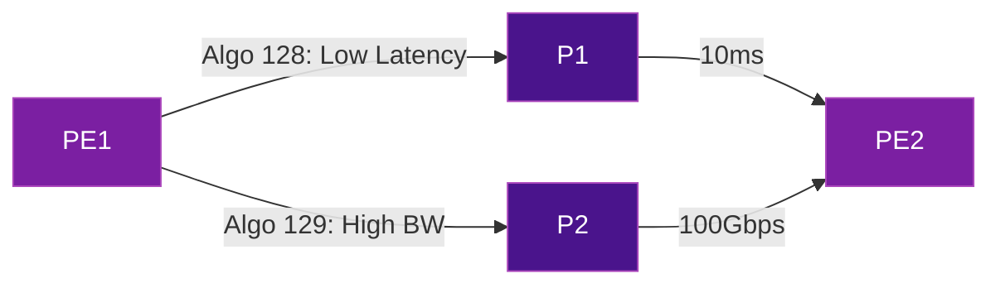

# QoS & Traffic Classification

SRv6 inherits IPv6's native QoS capabilities and extends them with segment routing-specific mechanisms. Together, they provide end-to-end traffic differentiation without the complexity of MPLS EXP bits, QoS-to-label mappings, or per-hop behavior configurations at every transit node.

## IPv6 Traffic Class Field

Every SRv6 packet carries QoS information in the IPv6 header's **Traffic Class** (TC) field — an 8-bit field composed of:

```
  0   1   2   3   4   5   6   7
+---+---+---+---+---+---+---+---+
|        DSCP (6 bits)      |ECN|
+---+---+---+---+---+---+---+---+
```

| Component | Bits | Purpose |
|-----------|------|---------|
| **DSCP** | 6 | Differentiated Services Code Point — determines per-hop behavior (PHB) |
| **ECN** | 2 | Explicit Congestion Notification |

### Key advantage over MPLS

In MPLS, QoS relies on the 3-bit EXP field (8 possible values). SRv6 uses the full 6-bit DSCP (64 possible values), eliminating the need for complex EXP-to-DSCP remapping at domain boundaries.

| Feature | MPLS | SRv6 |
|---------|------|------|
| QoS bits available | 3 (EXP) | 6 (DSCP) |
| Possible classes | 8 | 64 |
| Remapping at boundaries | Required | Not needed |
| End-to-end consistency | Difficult | Native |

## DSCP Preservation

When a PE encapsulates a packet into SRv6, the original DSCP value can be:

1. **Copied** from the inner packet to the outer IPv6 header (uniform mode)
2. **Set explicitly** based on policy (pipe mode)
3. **Mapped** from inner DSCP to a different outer DSCP

### Uniform mode

The inner packet's DSCP is copied to the outer SRv6 header. Transit nodes apply QoS based on the outer header. At decapsulation, the inner DSCP is preserved.

```
Inner packet:  DSCP = AF41
                ↓ copy
Outer SRv6:    TC = AF41 → transit nodes honor AF41
                ↓ decap
Egress:        DSCP = AF41 (preserved)
```

### Pipe mode

The outer DSCP is set independently of the inner packet. This allows the SRv6 domain to apply its own QoS policy without affecting the customer's markings.

## Flex-Algorithm for QoS-Aware Paths

[Flex-Algorithm](flex-algorithm.md) enables **constraint-based path computation** that directly serves QoS objectives:

| Flex-Algo ID | Constraint | QoS Use Case |
|-------------|------------|--------------|
| 128 | Minimum latency | Real-time voice, gaming |
| 129 | Maximum bandwidth | Video streaming, bulk transfers |
| 130 | Avoid specific links | Regulatory, compliance |
| 131 | Latency + bandwidth | Premium SLA services |

### How it works

1. Links are annotated with metrics (latency, bandwidth, affinity) via IS-IS/OSPF
2. Each Flex-Algo defines a constraint (e.g., "minimize latency")
3. Nodes compute a separate topology per Flex-Algo
4. SRv6 SIDs are allocated per Flex-Algo — traffic steered to the appropriate SID automatically follows the constrained path



This replaces traditional RSVP-TE bandwidth reservations with a simpler, IGP-based approach.

## SR Policy QoS

[SR Policies](../use-cases/traffic-engineering.md) (SRv6-TE) can enforce QoS at the policy level:

### Per-policy DSCP marking

An SR Policy can set or remark the DSCP of traffic entering the policy:

| Policy | Color | DSCP Action |
|--------|-------|-------------|
| Gold SLA | 100 | Mark EF |
| Silver SLA | 200 | Mark AF31 |
| Best Effort | 300 | Mark BE |

### Weighted ECMP across candidate paths

An SR Policy can have multiple candidate paths with different weights, enabling proportional traffic distribution:

```
SR Policy to PE2:
  Candidate Path 1 (low-latency):  weight 30%
  Candidate Path 2 (high-capacity): weight 70%
```

## Network Slicing with QoS

SRv6 network slicing combines Flex-Algo with QoS to create isolated virtual networks, each with guaranteed performance characteristics:

| Slice | Flex-Algo | DSCP Range | SLA |
|-------|-----------|------------|-----|
| **5G URLLC** | 128 | EF, AF41 | < 1ms latency |
| **5G eMBB** | 129 | AF21-AF23 | > 1 Gbps throughput |
| **Enterprise VPN** | 130 | AF31-AF33 | 99.99% availability |
| **Best Effort** | 0 (default) | BE | No guarantees |

Each slice operates on its own topology with dedicated SRv6 SIDs, ensuring **hard isolation** between traffic classes.

## QoS at SRv6 Endpoints

### End.DT4 / End.DT6 (VPN decapsulation)

At the egress PE, the SRv6 endpoint behavior decapsulates the packet and routes it into the VRF. The inner packet's DSCP is preserved, ensuring end-to-end QoS consistency.

### End.B6.Encaps (binding SID)

When a binding SID triggers re-encapsulation, the QoS policy can dictate how the new outer header's TC field is set — enabling QoS policy changes at domain boundaries without touching the inner packet.

## Comparison with MPLS QoS

| Aspect | MPLS QoS | SRv6 QoS |
|--------|----------|----------|
| **Classification bits** | 3-bit EXP (8 classes) | 6-bit DSCP (64 classes) |
| **Boundary remapping** | EXP ↔ DSCP at every boundary | Not needed — DSCP is native |
| **Path constraints** | RSVP-TE bandwidth reservations | Flex-Algo (IGP-based, no signaling) |
| **Per-hop config** | Required at every P node | Only at PE (transit is implicit) |
| **Network slicing** | Complex (VRF + TE tunnel per slice) | Native (Flex-Algo + SID per slice) |
| **Scalability** | TE tunnels = state at every hop | Stateless (source-routed) |

## Further Reading

- :material-arrow-right: [Flex-Algorithm](flex-algorithm.md) — Constraint-based path computation
- :material-arrow-right: [Traffic Engineering](../use-cases/traffic-engineering.md) — SR Policies and path control
- :material-arrow-right: [5G Transport](../use-cases/5g-transport.md) — Network slicing for mobile
- :material-arrow-right: [Performance & Scaling](performance-scaling.md) — MTU and encapsulation overhead
- :material-arrow-right: [SRv6 vs SR-MPLS](srv6-vs-sr-mpls.md) — Comparison including QoS differences

## References

1. [RFC 2474](https://datatracker.ietf.org/doc/rfc2474/) — Definition of the Differentiated Services Field in the IPv4 and IPv6 Headers
2. [RFC 8986](https://datatracker.ietf.org/doc/rfc8986/) — SRv6 Network Programming
3. [RFC 9256](https://datatracker.ietf.org/doc/rfc9256/) — Segment Routing Policy Architecture
4. [RFC 9350](https://datatracker.ietf.org/doc/rfc9350/) — IGP Flexible Algorithm
