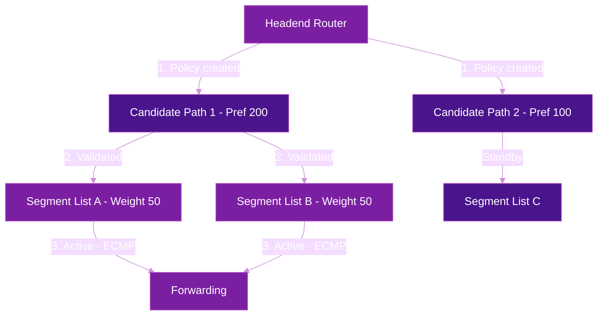
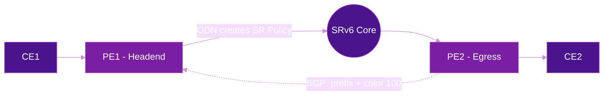

# SR Policy

**SR Policy** is the framework for expressing traffic engineering intent in Segment Routing networks (RFC 9256). Instead of hop-by-hop RSVP-TE signaling, an SR Policy encodes the entire path as a segment list at the headend — no per-flow state on transit nodes.

## The Problem

RSVP-TE provides path control but requires:

- **Per-tunnel state on every transit router** — signaling messages, path maintenance, bandwidth reservations
- **Multiple protocols** — RSVP for tunnels, IGP for routing, PCEP for computation
- **Scalability limits** — thousands of tunnels degrade control plane performance
- **Slow convergence** — path recomputation and re-signaling on failure

SR Policy eliminates distributed state by encoding the path in the packet header itself.

## SR Policy Architecture (RFC 9256)

An SR Policy is identified by a tuple of **(headend, color, endpoint)**:

| Component | Description | Example |
|-----------|-------------|---------|
| **Headend** | Router originating the policy | PE1 (`2001:db8::1`) |
| **Color** | Numeric intent identifier (community) | `100` (low-latency) |
| **Endpoint** | Destination of the policy | PE2 (`2001:db8::2`) |

### Candidate Paths

Each SR Policy contains one or more **candidate paths**, ordered by preference. Only the highest-preference valid path is active.

```
SR Policy (headend=PE1, color=100, endpoint=PE2)
  ├── Candidate Path (preference 200, PCE-computed)
  │     └── Segment List: [P1::1, P3::1, PE2::1]
  ├── Candidate Path (preference 150, BGP SR Policy)
  │     └── Segment List: [P2::1, PE2::1]
  └── Candidate Path (preference 100, local config)
        └── Segment List: [PE2::1]
```

Each candidate path can contain multiple **segment lists** with weights for weighted ECMP load balancing.

### SR Policy Lifecycle



## Policy Instantiation Methods

SR Policies can be created through three mechanisms, each with a default preference:

| Method | Default Preference | Source | Use Case |
|--------|:-----------------:|--------|----------|
| **Local configuration** | 100 | CLI / YANG | Static TE, fallback paths |
| **BGP SR Policy (SAFI 73)** | 100-200 | Controller / RR | Multi-domain, centralized TE |
| **PCEP** | 200 | SR-PCE | Dynamic computation, bandwidth-aware |

### Local Configuration

Explicit segment lists defined on the headend. Simple, static, and useful as a fallback.

=== "Cisco IOS-XR"

    ```cisco
    segment-routing
     traffic-eng
      policy LOW-LATENCY-TO-PE2
       color 100 end-point ipv6 2001:db8::2
       candidate-paths
        preference 100
         explicit segment-list VIA-P1-P3
        !
       !
      !
      segment-list VIA-P1-P3
       index 10 srv6 sid fc00:0:1::
       index 20 srv6 sid fc00:0:3::
       index 30 srv6 sid fc00:0:2::
      !
     !
    !
    ```

=== "Juniper"

    ```junos
    set protocols source-packet-routing segment-list VIA-P1-P3 srv6 hop1 sid fc00:0:1::
    set protocols source-packet-routing segment-list VIA-P1-P3 srv6 hop2 sid fc00:0:3::
    set protocols source-packet-routing segment-list VIA-P1-P3 srv6 hop3 sid fc00:0:2::
    set protocols source-packet-routing sr-policy LOW-LATENCY-TO-PE2 color 100
    set protocols source-packet-routing sr-policy LOW-LATENCY-TO-PE2 end-point 2001:db8::2
    set protocols source-packet-routing sr-policy LOW-LATENCY-TO-PE2 segment-list VIA-P1-P3
    ```

### BGP SR Policy (SAFI 73)

A controller or route reflector distributes SR Policies via BGP using the SR Policy SAFI. This enables centralized traffic engineering across multiple domains.

The BGP update carries:

- **Distinguisher + Policy Color + Endpoint** as NLRI
- **Tunnel Encapsulation attribute** with segment lists, preference, binding SID

### PCE-Initiated Policies

An SR-PCE (Path Computation Element) computes constrained paths using topology learned via BGP-LS (RFC 9514) and installs them on headends via PCEP.


=== "Cisco IOS-XR"

    ```cisco
    !! PCE configuration on headend
    segment-routing
     traffic-eng
      pcc
       source-address ipv6 2001:db8::1
       pce address ipv6 2001:db8:ffff::1
        precedence 10
       !
      !
     !
    !
    ```

## On-Demand Nexthop (ODN)

ODN dynamically creates SR Policies when a BGP prefix with a **color community** is received, without any pre-provisioned policy on the headend. This is the most operationally scalable approach.

### How ODN Works

1. Remote PE advertises a VPN prefix with a **color extended community** (e.g., color 100)
2. Local PE receives the prefix and matches it against an **ODN template** for that color
3. If no SR Policy exists for that (color, endpoint), the headend **automatically** creates one
4. The policy is computed locally or delegated to PCE based on template configuration



### ODN Configuration

=== "Cisco IOS-XR"

    ```cisco
    !! ODN template for color 100 (low-latency)
    segment-routing
     traffic-eng
      on-demand color 100
       dynamic
        metric type latency
       !
       srv6
        locator MAIN
       !
      !
     !
    !

    !! ODN with PCE delegation
    segment-routing
     traffic-eng
      on-demand color 200
       dynamic
        pcep
        !
        metric type te
       !
      !
     !
    !
    ```

=== "Juniper"

    ```junos
    set protocols source-packet-routing sr-preference-override color 100 routing-policy LOW-LATENCY
    set policy-options policy-statement LOW-LATENCY term 1 then install-nexthop lsp-regex ".*"
    ```

## Binding SID (BSID)

A Binding SID is a **single SID that represents an entire SR Policy**. Any packet arriving with a BSID as the active segment is steered into the associated policy's segment list.

### Key Properties

| Property | Description |
|----------|-------------|
| **Abstraction** | Hides the internal path — remote domains only see one SID |
| **Scalability** | Reduces segment list depth for multi-domain paths |
| **Stitching** | Chains policies across domains: `[BSID-Domain1, BSID-Domain2]` |
| **Dynamic** | BSID can be allocated dynamically and signaled via BGP or PCEP |

### Multi-Domain BSID Chaining

```
Ingress segment list:  [BSID_AS1, BSID_AS2, PE-Remote::DT4]

At AS1 border:  BSID_AS1 expands to [P1::1, ASBR1::1]
At AS2 border:  BSID_AS2 expands to [P5::1, PE-Remote::1]
```

=== "Cisco IOS-XR"

    ```cisco
    segment-routing
     traffic-eng
      policy TO-AS2
       binding-sid srv6 dynamic behavior ub6-insert-reduced
       color 500 end-point ipv6 2001:db8:2::1
       candidate-paths
        preference 100
         explicit segment-list VIA-ASBR
        !
       !
      !
     !
    !
    ```

!!! tip "BSID and inter-domain TE"
    For a deep dive into Binding SID for multi-domain traffic engineering, see [Inter-Domain SRv6](inter-domain.md). For BSID in the context of SR-MPLS/SRv6 migration, see [Interworking & Migration](interworking-migration.md).

## Color Steering

BGP color extended communities map **service intent** to SR Policies. When a VPN prefix carries a color, the headend PE automatically steers traffic into the matching SR Policy.

| Color | Intent | Mechanism |
|:-----:|--------|-----------|
| 100 | Low latency | Flex-Algo 128 or SR Policy with latency metric |
| 200 | High bandwidth | Flex-Algo 129 or SR Policy with bandwidth constraint |
| 300 | Disjoint paths | Pair of SR Policies with disjointness constraint |
| 400 | Cost-optimized | Default IGP metric (best-cost path) |

### How Color Steering Works

1. Customer VRF route is received via BGP with `color:100` extended community
2. Headend PE looks up SR Policy with `(color=100, endpoint=BGP-next-hop)`
3. If found → traffic is steered into the policy
4. If not found + ODN enabled → policy is created on demand

!!! warning "Color values are locally significant"
    Color values have no global meaning — operators define their own mapping between color values and intent. Consistent color assignment across the network is an operational requirement.

## Dynamic Path Computation

SR Policies can be computed dynamically based on **optimization objectives** and **constraints**:

### Optimization Objectives

| Objective | Description |
|-----------|-------------|
| **TE metric** | Minimize traffic engineering metric (admin-defined) |
| **Latency** | Minimize end-to-end delay |
| **Hop count** | Minimize number of nodes traversed |
| **IGP metric** | Minimize standard IGP cost |

### Constraints

| Constraint | Description |
|------------|-------------|
| **Affinity (include/exclude)** | Links must match color/admin-group requirements |
| **SRLG** | Path must avoid specific shared risk link groups |
| **Bandwidth** | Path must have minimum available bandwidth |
| **Disjointness** | Two policies must not share links/nodes/SRLGs |

### Reoptimization

Dynamic policies can be reoptimized when:

- Topology changes (link up/down, metric change)
- Periodic timer expires
- Bandwidth threshold crossed
- Manual trigger

## Verification

=== "Cisco IOS-XR"

    ```cisco
    !! Show all SR Policies
    show segment-routing traffic-eng policy summary

    !! Show specific policy details
    show segment-routing traffic-eng policy color 100 endpoint ipv6 2001:db8::2

    !! Show ODN policies
    show segment-routing traffic-eng policy on-demand

    !! Show BSID allocation
    show segment-routing traffic-eng binding-sid

    !! Show PCE-delegated policies
    show segment-routing traffic-eng pcc
    ```

=== "Juniper"

    ```junos
    show spring-traffic-engineering lsp
    show spring-traffic-engineering lsp detail
    show spring-traffic-engineering lsp color 100
    ```

## SR Policy vs RSVP-TE

| Aspect | RSVP-TE | SR Policy |
|--------|---------|-----------|
| **Transit state** | Per-tunnel on every hop | None — path in packet header |
| **Signaling** | RSVP PATH/RESV per tunnel | BGP / PCEP / local config |
| **Scalability** | 10K tunnels typical limit | 100K+ policies (headend only) |
| **FRR** | Facility backup (manual) | TI-LFA (automatic, 100% coverage) |
| **Bandwidth** | RSVP admission control | PCE-based or Flex-Algo |
| **Multi-domain** | Complex (inter-AS RSVP) | BSID stitching (simple) |
| **Automation** | Limited | ODN + color steering (intent-based) |

## Further Reading

- :material-arrow-right: [Traffic Engineering](../use-cases/traffic-engineering.md) — TE use cases and segment list examples
- :material-arrow-right: [Flex-Algorithm](flex-algorithm.md) — Constraint-based topology slicing
- :material-arrow-right: [TI-LFA](ti-lfa.md) — Fast reroute for SR Policies
- :material-arrow-right: [Inter-Domain SRv6](inter-domain.md) — Multi-domain TE with BSID
- :material-arrow-right: [Interworking & Migration](interworking-migration.md) — BSID in migration scenarios
- :material-file-document: [RFC 9256](../rfcs/rfc9256.md) — SR Policy Architecture

## References

1. [RFC 9256 - Segment Routing Policy Architecture](https://datatracker.ietf.org/doc/rfc9256/) - Defines the SR Policy framework including candidate paths, segment lists, BSID, and color steering
2. [RFC 9514 - BGP-LS Extensions for SRv6](https://datatracker.ietf.org/doc/rfc9514/) - BGP-LS for exporting SRv6 topology to controllers and PCE
3. [draft-ietf-idr-sr-policy-safi](https://datatracker.ietf.org/doc/draft-ietf-idr-sr-policy-safi/) - BGP SR Policy SAFI for distributing SR Policies via BGP
4. [draft-ietf-pce-segment-routing-policy-cp](https://datatracker.ietf.org/doc/draft-ietf-pce-segment-routing-policy-cp/) - PCEP extensions for SR Policy candidate paths
5. [Cisco IOS-XR: Configure SR-TE Policies](https://www.cisco.com/c/en/us/td/docs/iosxr/cisco8000/segment-routing/24xx/configuration/guide/b-segment-routing-cg-cisco8000-24xx/configuring-sr-te-policies.html) - Configuration guide for SR Policies including ODN, PCE, and BSID
