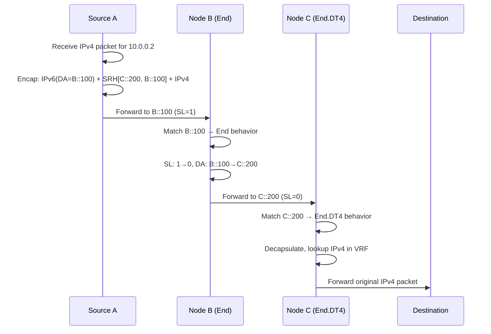

# SRH Mechanics & Packet Walk

Understanding how the Segment Routing Header (SRH) works at the packet level is essential for troubleshooting and designing SRv6 networks. This page walks through the mechanics step by step.

## SRH Format (RFC 8754)

The SRH is an IPv6 Routing Header with **Routing Type = 4**.

```
 0                   1                   2                   3
 0 1 2 3 4 5 6 7 8 9 0 1 2 3 4 5 6 7 8 9 0 1 2 3 4 5 6 7 8 9 0 1
+-+-+-+-+-+-+-+-+-+-+-+-+-+-+-+-+-+-+-+-+-+-+-+-+-+-+-+-+-+-+-+-+
|  Next Header  |  Hdr Ext Len  |  Routing Type | Segments Left |
|               |               |     (= 4)     |     (SL)      |
+-+-+-+-+-+-+-+-+-+-+-+-+-+-+-+-+-+-+-+-+-+-+-+-+-+-+-+-+-+-+-+-+
|  Last Entry   |    Flags      |              Tag              |
+-+-+-+-+-+-+-+-+-+-+-+-+-+-+-+-+-+-+-+-+-+-+-+-+-+-+-+-+-+-+-+-+
|                                                               |
|            Segment List[0] (128-bit IPv6 address)             |
|                        (Last SID)                             |
|                                                               |
+-+-+-+-+-+-+-+-+-+-+-+-+-+-+-+-+-+-+-+-+-+-+-+-+-+-+-+-+-+-+-+-+
|                                                               |
|            Segment List[1] (128-bit IPv6 address)             |
|                                                               |
|                                                               |
+-+-+-+-+-+-+-+-+-+-+-+-+-+-+-+-+-+-+-+-+-+-+-+-+-+-+-+-+-+-+-+-+
|                            ...                                |
+-+-+-+-+-+-+-+-+-+-+-+-+-+-+-+-+-+-+-+-+-+-+-+-+-+-+-+-+-+-+-+-+
|                                                               |
|            Segment List[n] (128-bit IPv6 address)             |
|                       (First SID)                             |
|                                                               |
+-+-+-+-+-+-+-+-+-+-+-+-+-+-+-+-+-+-+-+-+-+-+-+-+-+-+-+-+-+-+-+-+
|                                                               |
|                  Optional TLV objects                         |
|                                                               |
+-+-+-+-+-+-+-+-+-+-+-+-+-+-+-+-+-+-+-+-+-+-+-+-+-+-+-+-+-+-+-+-+
```

### Key Fields

| Field | Size | Description |
|-------|:----:|-------------|
| **Next Header** | 8 bits | Type of the next header (e.g., 41 = IPv6, 4 = IPv4) |
| **Hdr Ext Len** | 8 bits | Length of SRH in 8-octet units, not including first 8 octets |
| **Routing Type** | 8 bits | Always **4** for SRH |
| **Segments Left (SL)** | 8 bits | Index into the segment list pointing to the **current active** segment |
| **Last Entry** | 8 bits | Index of the last element in the segment list (0-based) |
| **Flags** | 8 bits | Currently unused (reserved) |
| **Tag** | 16 bits | Packet grouping / marking |
| **Segment List** | 128 bits each | Ordered list of SIDs in **reverse order** |

!!! warning "Reverse order!"
    The segment list is encoded in **reverse order**: `Segment List[0]` is the **last** SID to be processed, and `Segment List[n]` is the **first**. The `Segments Left` pointer starts at `n` and decrements toward 0.

## Complete Packet Walk

Let's trace a packet through a 3-node SRv6 network:

```
Source (A) → Node B → Node C → Destination (D)

SRv6 SIDs:
  B::100  = End behavior on Node B
  C::200  = End.DT4 behavior on Node C (decap to IPv4)
```

### Step 1: Ingress (Source A)

Source A receives an IPv4 packet destined to `10.0.0.2` and needs to steer it through B then C.

```
Original packet:
  [IPv4: 10.0.0.1 → 10.0.0.2][Payload]

After SRv6 encapsulation:
  ┌──────────────────────────────────────────┐
  │ Outer IPv6 Header                         │
  │   Source:      A::1                       │
  │   Destination: B::100  ← Active SID      │
  │   Next Header: 43 (Routing)               │
  ├──────────────────────────────────────────┤
  │ SRH                                       │
  │   Segments Left: 1                        │
  │   Last Entry:    1                        │
  │   Segment List[0]: C::200  (last SID)     │
  │   Segment List[1]: B::100  (first SID)    │
  ├──────────────────────────────────────────┤
  │ Inner IPv4 Header                         │
  │   10.0.0.1 → 10.0.0.2                    │
  ├──────────────────────────────────────────┤
  │ Payload                                   │
  └──────────────────────────────────────────┘
```

!!! info "DA = Active SID"
    The IPv6 Destination Address always equals the currently active SID (`Segment List[Segments Left]`).

### Step 2: Transit (Node B — End Behavior)

Node B receives the packet. The DA matches its local SID `B::100` with **End** behavior:

1. Decrement `Segments Left`: 1 → **0**
2. Copy `Segment List[0]` to IPv6 DA: DA = **C::200**
3. Forward based on new DA

```
After Node B processing:
  ┌──────────────────────────────────────────┐
  │ Outer IPv6 Header                         │
  │   Source:      A::1                       │
  │   Destination: C::200  ← Updated!        │
  ├──────────────────────────────────────────┤
  │ SRH                                       │
  │   Segments Left: 0     ← Decremented!    │
  │   Last Entry:    1                        │
  │   Segment List[0]: C::200                 │
  │   Segment List[1]: B::100                 │
  ├──────────────────────────────────────────┤
  │ Inner IPv4: 10.0.0.1 → 10.0.0.2          │
  ├──────────────────────────────────────────┤
  │ Payload                                   │
  └──────────────────────────────────────────┘
```

### Step 3: Egress (Node C — End.DT4 Behavior)

Node C receives the packet. The DA matches its local SID `C::200` with **End.DT4** behavior:

1. SL = 0, so this is the last segment
2. **Decapsulate**: remove outer IPv6 + SRH
3. **Lookup** the inner IPv4 DA in the specified VRF table
4. **Forward** the original IPv4 packet

```
After Node C processing:
  [IPv4: 10.0.0.1 → 10.0.0.2][Payload]  ← Original packet restored!
```

### Step 4: Delivery

The original IPv4 packet is delivered to destination `10.0.0.2` as if SRv6 was never involved.

## Packet Walk Sequence Diagram



## PSP, USP, and USD Flavors

SRv6 endpoints can support different processing **flavors** that optimize how the SRH is handled:

| Flavor | Full Name | Description |
|--------|-----------|-------------|
| **PSP** | Penultimate Segment Pop | The penultimate node (SL=1) removes the SRH before forwarding to the last segment. Reduces overhead on the egress node. |
| **USP** | Ultimate Segment Pop | The ultimate (last) node removes the SRH itself. |
| **USD** | Ultimate Segment Decap | The ultimate node decapsulates the entire outer IPv6 header + SRH. Used with End.DT4/DT6. |

!!! tip "PSP is the most common"
    PSP is widely deployed because it offloads SRH removal from the egress PE, improving efficiency. Most modern implementations advertise `End with PSP` or `End with PSP-USP-USD`.

## SRH with TLVs

The SRH can carry optional TLV (Type-Length-Value) objects after the segment list:

| TLV | Description |
|-----|-------------|
| **HMAC TLV** | Cryptographic authentication of the SRH |
| **Padding TLV** | Alignment padding |
| **NSH Carrier TLV** | Carries NSH metadata for service chaining |

## Reduced Encapsulation

**T.Encaps.Red** (Reduced Encapsulation) optimizes the SRH by omitting the last SID from the segment list, since it's already in the IPv6 DA. This saves 16 bytes per packet.

```
Normal:     SRH contains [SID-3, SID-2, SID-1], DA = SID-3
Reduced:    SRH contains [SID-2, SID-1], DA = SID-3  ← SID-3 not in SRH
```

## Verification Commands

=== "Linux"

    ```bash
    # Capture SRv6 packets (Routing Header type 43)
    tcpdump -i eth0 -vv 'ip6 proto 43'

    # Show local SID table
    ip -6 route show | grep seg6local

    # Decode with tshark
    tshark -i eth0 -O ipv6 -Y 'ipv6.routing.type == 4'
    ```

=== "Cisco IOS-XR"

    ```cisco
    show segment-routing srv6 sid
    show cef ipv6 <SID> detail
    debug segment-routing srv6 dataplane
    ```

=== "Juniper"

    ```junos
    show route table inet6.0 protocol srv6
    show spring-traffic-engineering srv6-sid
    ```

## Further Reading

- :material-arrow-right: [SID Structure](sid-structure.md) - How the 128-bit SID is composed
- :material-arrow-right: [Network Programming](network-programming.md) - All SRv6 behaviors
- :material-arrow-right: [uSID / SRv6 Compression](usid-compression.md) - Micro-SID optimization
- :material-file-document: [RFC 8754](../rfcs/rfc8754.md) - SRH specification
- :material-file-document: [RFC 8986](../rfcs/rfc8986.md) - SRv6 Network Programming

## References

1. [RFC 8754 - IPv6 Segment Routing Header (SRH)](https://www.rfc-editor.org/rfc/rfc8754.html) - Full specification of the SRH format, fields, and packet processing rules
2. [RFC 8986 - SRv6 Network Programming](https://datatracker.ietf.org/doc/rfc8986/) - Defines SRv6 endpoint behaviors including End, End.X, End.DT4, PSP, USP, and USD flavors
3. [SRv6 Linux Kernel Implementation](https://segment-routing.org/index.php/implementation/configuration) - Configuration guide for seg6 and seg6local lightweight tunnels in the Linux kernel
4. [Cisco IOS-XR: Configure Segment Routing over IPv6 (SRv6)](https://www.cisco.com/c/en/us/td/docs/iosxr/ncs5500/segment-routing/72x/b-segment-routing-cg-ncs5500-72x/configure-segment-routing-over-ipv6.html) - Cisco IOS-XR SRv6 configuration guide for NCS 5500 routers
