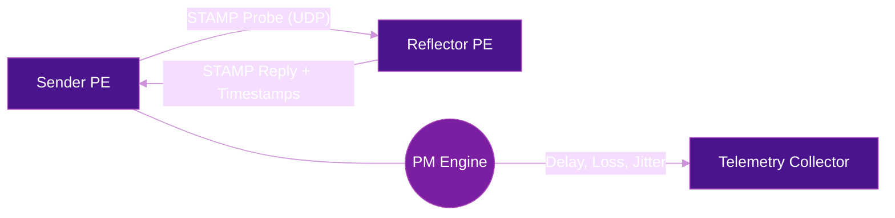
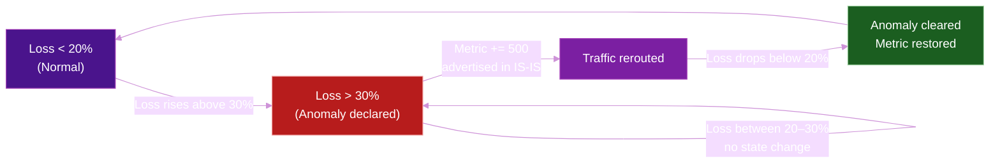

# Performance Measurement (SRPM)

**Segment Routing Performance Measurement (SRPM)** provides real-time visibility into network path quality across SRv6 domains. By measuring delay, loss, and jitter on a per-path or per-flow basis, operators can enforce SLAs, optimize traffic engineering decisions, and detect degradation before it impacts services.

## Why Performance Measurement Matters

In SRv6 networks, traffic follows explicit segment lists through the fabric. Knowing **how well** each path performs is critical for:

- **SLA assurance** -- Proving that contracted delay/loss targets are met
- **TE optimization** -- Feeding real-time metrics into SR Policy path selection
- **Fault detection** -- Identifying degraded links before they cause outages
- **Capacity planning** -- Understanding utilization patterns per path

## Key Metrics

| Metric | Description | Typical Granularity |
|--------|-------------|---------------------|
| :material-timer-outline: **One-way Delay** | Time for a packet to traverse a path from ingress to egress | Per-path, per-color |
| :material-swap-horizontal: **Round-trip Delay** | Total time for a probe and its reply | Per-probe session |
| :material-close-circle-outline: **Packet Loss** | Percentage of packets dropped along a path | Per-interval (e.g., 10s) |
| :material-sine-wave: **Jitter** | Variation in delay between consecutive packets | Per-flow |
| :material-speedometer: **Throughput** | Effective data rate achieved on a path | Per-interface or per-policy |

## How SRPM Works

### STAMP (RFC 8762)

**Simple Two-Way Active Measurement Protocol** is the modern standard for active probing in SRv6 networks. It replaces older TWAMP with a simpler, stateless design.



How it works:

1. **Sender** generates UDP probe packets with timestamps embedded in the SRv6 path
2. **Reflector** receives the probe, adds its own timestamps, and returns a reply
3. **PM Engine** computes one-way delay, round-trip delay, and loss from timestamp differences
4. Results are streamed to a telemetry collector for visualization and alerting

!!! info "STAMP vs TWAMP"
    STAMP eliminates the control channel required by TWAMP, making it simpler to deploy at scale. The reflector is stateless -- it does not need to maintain session state, reducing overhead on transit nodes.

### Alternate-Marking (RFC 9341 / RFC 9342)

Alternate-marking is a **passive** measurement technique that avoids injecting probe traffic entirely. Instead, it marks production packets with alternating color bits and counts them at ingress and egress.

| Phase | Ingress Action | Egress Action |
|-------|---------------|---------------|
| **Block A** (e.g., 10s) | Mark packets with color 0 | Count color-0 packets received |
| **Block B** (next 10s) | Mark packets with color 1 | Count color-1 packets received |

By comparing ingress and egress counters for each color block, the system calculates **exact packet loss** without any probe overhead.

!!! tip "When to use alternate-marking"
    Use alternate-marking when you need **loss measurement on production traffic** without adding probe overhead. It is especially useful for high-throughput paths where active probing would consume bandwidth.

### Color-Aware PM

SRv6 SR Policies can carry a **color** attribute that maps to an SLA class. Performance measurement sessions can be bound to specific colors, enabling per-SLA monitoring:

- **Color 10** -- Low-latency path (delay < 5ms)
- **Color 20** -- Best-effort path
- **Color 30** -- High-bandwidth path

This allows operators to measure whether each SLA class is meeting its target independently.

## Measurement Approaches Compared

| Approach | Type | Measures | Overhead | Accuracy |
|----------|------|----------|----------|----------|
| **STAMP** | Active probing | Delay, loss, jitter | Low (probe packets) | High |
| **Alternate-Marking** | Passive (production traffic) | Loss, delay | None (uses existing traffic) | Exact for loss |
| **IOAM (In-situ OAM)** | In-band | Hop-by-hop delay, path trace | Per-packet header overhead | Very high |
| **TWAMP (legacy)** | Active probing | Delay, loss, jitter | Medium (stateful sessions) | High |

## SRv6 PM Integration

### PM with SR Policies

Performance measurement integrates directly with SR Policies. Each candidate path in an SR Policy can have PM enabled:

```
segment-routing
 traffic-eng
  policy POLICY-1
   color 10 end-point fc00:0:2::1
   candidate-paths
    preference 100
     explicit segment-list SL-LOW-LATENCY
    !
   performance-measurement
    liveness-detection
    delay-measurement
    loss-measurement
   !
```

!!! note "Liveness detection"
    PM liveness probes can trigger **fast path protection**. If a probe fails, the SR Policy switches to an alternate candidate path within milliseconds, complementing [TI-LFA](ti-lfa.md) for end-to-end protection.

### Anomaly Thresholds and Metric Fallback

When a PM session detects degradation, the router can **advertise an anomaly** and automatically raise the IS-IS metric on the affected interface to steer traffic away. The key to doing this without flapping is the **hysteresis band** — a pair of thresholds that separate the "enter anomaly" and "exit anomaly" conditions.

```
performance-measurement
 delay-profile interfaces default
  advertisement
   anomaly-loss
    upper-bound 30      ← anomaly declared when loss exceeds 30%
    lower-bound 20      ← anomaly cleared only when loss drops below 20%
   !
  !
 !

router isis 1
 interface GigabitEthernet0/2/0/1
  point-to-point
  address-family ipv4 unicast
   metric fallback anomaly loss increment 500
  !
  address-family ipv6 unicast
   metric fallback anomaly loss increment 500
  !
 !
```

**How the hysteresis band works:**



The gap between `upper-bound` and `lower-bound` is the **dead band** (also called **hysteresis zone**). Loss oscillating in that range — say between 21% and 29% — does not trigger any state change, preventing metric flapping. Without hysteresis, a link hovering at exactly the threshold would cause the IS-IS metric to oscillate continuously.

| Threshold | Role | Tuning guidance |
|-----------|------|----------------|
| `upper-bound` | Declares anomaly — triggers metric increment | Set above your worst acceptable loss for the SLA class |
| `lower-bound` | Clears anomaly — restores original metric | Set far enough below `upper-bound` to absorb normal measurement variance |
| `increment` | How much to raise the IS-IS metric | Must exceed existing metric differences between paths to actually reroute traffic |

!!! tip "Fine-tuning the band"
    A wider band (e.g., 20/40 instead of 20/30) reduces false positives at the cost of slower recovery detection. A narrower band (e.g., 25/30) reacts faster but risks flapping on lossy links with high variance. Start with a 10-point spread and adjust based on observed measurement jitter.

!!! note "Relationship to SRPM"
    This mechanism is part of Cisco's **SRPM anomaly advertisement** feature. The `performance-measurement` block configures the PM thresholds; the `metric fallback anomaly` in IS-IS configures the reaction. Together they close the loop: PM detects the problem, IS-IS redistributes around it.

### Streaming PM Data

PM results are exported via streaming telemetry for real-time dashboards and alerting. See [Telemetry & Monitoring](telemetry.md) for collector setup.

Key YANG paths for PM data:

| Platform | YANG Model Path |
|----------|----------------|
| Cisco IOS-XR | `Cisco-IOS-XR-perf-meas-oper:performance-measurement` |
| Juniper | `junos-rpc-performance-monitoring` |

## Vendor Support

| Capability | Cisco IOS-XR | Juniper | Huawei |
|-----------|:------------:|:-------:|:------:|
| STAMP (RFC 8762) | 7.5.1+ | 22.2+ | V800R021+ |
| Alternate-Marking | 7.7.1+ | -- | V800R022+ |
| Per-SR Policy PM | 7.3.1+ | 22.4+ | V800R021+ |
| Color-Aware PM | 7.5.1+ | 23.1+ | V800R022+ |
| Liveness Detection | 7.0.1+ | 21.4+ | V800R019+ |
| gRPC Telemetry Export | 7.0.1+ | 21.1+ | V800R019+ |

## Benefits

| Benefit | Description |
|---------|-------------|
| :material-shield-check: **SLA Assurance** | Continuously verify that delay and loss targets are met per path and per SLA class |
| :material-lightning-bolt: **Fast Reroute Trigger** | Liveness probes detect failures and trigger path switchover in milliseconds |
| :material-chart-line: **TE Optimization** | Feed real-time delay/loss into SR Policy path computation for dynamic optimization |
| :material-eye: **End-to-End Visibility** | Measure performance across the entire SRv6 domain, not just individual links |
| :material-leaf: **Low Overhead** | STAMP is stateless; alternate-marking uses zero additional bandwidth |

## Further Reading

- :material-arrow-right: [OAM & Troubleshooting](oam-troubleshooting.md) -- Ping, traceroute, and OAM tools for SRv6
- :material-arrow-right: [Telemetry & Monitoring](telemetry.md) -- Streaming telemetry and dashboards for SRv6
- :material-arrow-right: [Traffic Engineering](../use-cases/traffic-engineering.md) -- How PM feeds into SR Policy optimization
- :material-arrow-right: [Flex-Algorithm](flex-algorithm.md) -- Constraint-based path computation using PM metrics
- :material-arrow-right: [TI-LFA](ti-lfa.md) -- Fast reroute protection complementing PM liveness detection

## References

1. [RFC 8762 - Simple Two-Way Active Measurement Protocol (STAMP)](https://www.rfc-editor.org/rfc/rfc8762) -- Defines the STAMP protocol for active delay and loss measurement
2. [RFC 8972 - STAMP Optional Extensions](https://www.rfc-editor.org/rfc/rfc8972) -- Extensions to STAMP for additional measurement capabilities
3. [RFC 9341 - Alternate-Marking Method](https://www.rfc-editor.org/rfc/rfc9341) -- Defines the alternate-marking technique for passive loss measurement
4. [RFC 9342 - Clustered Alternate-Marking Method](https://www.rfc-editor.org/rfc/rfc9342) -- Extends alternate-marking for clustered deployments
5. [RFC 9256 - SR Policy Architecture](https://www.rfc-editor.org/rfc/rfc9256) -- SR Policy framework that integrates with PM
