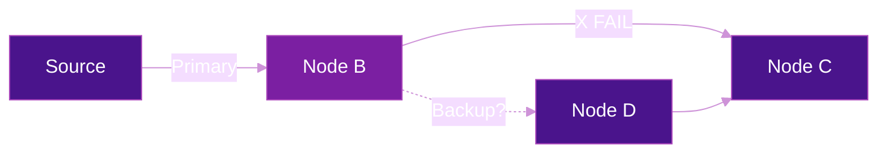
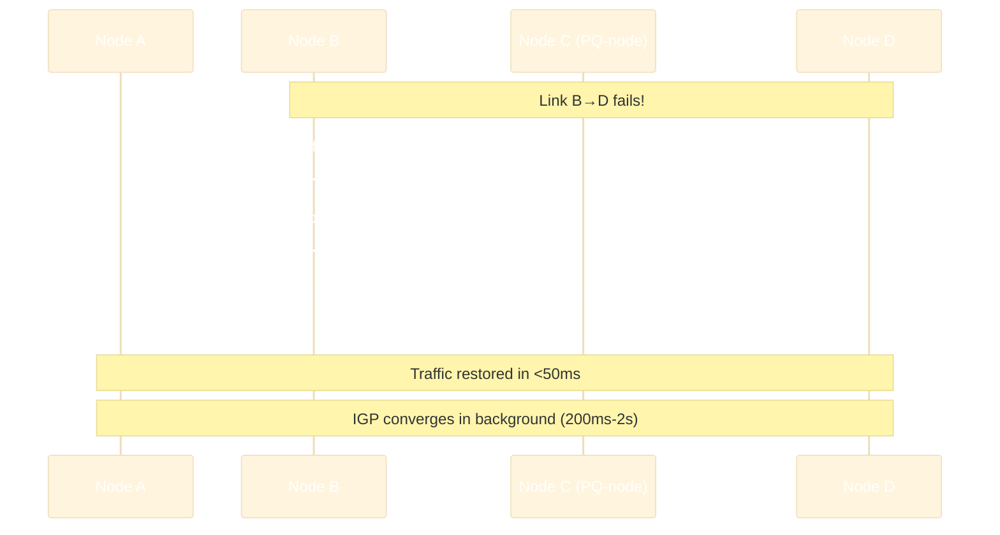

# TI-LFA (Topology Independent Loop-Free Alternate)

**TI-LFA** provides **sub-50ms failover** for SRv6 networks by pre-computing backup paths for every destination. Unlike traditional IP FRR mechanisms, TI-LFA works in **any topology** — no constraints on network design.

## The Problem

When a link or node fails, the IGP needs time to converge (detect failure, flood LSPs, recompute SPF). During this convergence window (typically 200ms-2s), traffic is blackholed.



Traditional LFA (RFC 5286) only works if a neighbor has a loop-free path — which depends on topology. In many real-world topologies, LFA coverage is only 40-80%.

## The Solution: TI-LFA

TI-LFA achieves **100% coverage** in any topology by using **Segment Routing** to construct backup paths. It pre-computes a repair segment list that steers traffic around the failure.

### How It Works

1. **Pre-computation:** For every primary next-hop, the IGP computes the post-convergence shortest path (the path the network would use *after* the failure)
2. **Backup path:** The difference between the pre-convergence and post-convergence path is encoded as a **segment list** (repair segments)
3. **Fast switch:** When a failure is detected (e.g., BFD down in 3ms), traffic is immediately switched to the backup path using the pre-computed segment list
4. **IGP converges:** In the background, the IGP re-converges and installs the new primary path

### Repair Segment Types

TI-LFA uses up to 3 types of segments for backup paths:

| Segment Type | Description | When Used |
|:------------:|-------------|-----------|
| **Node SID** | Route to a specific node (PQ-node) | When the PQ-node is on the post-convergence path |
| **Adjacency SID** | Route over a specific link | When a specific link must be used to avoid the failure |
| **Prefix SID** | Route to a prefix | For multi-homed prefix protection |

### Example: Link Protection

```
Topology:
           10          10
    A ──────────► B ──────────► D
    │                           ▲
    │ 10                    10  │
    └────────► C ───────────────┘

Primary path A→D: A → B → D (cost 20)
```

If link B→D fails:

```
Post-convergence path: A → C → D (cost 20)

TI-LFA backup (pre-computed on B):
  Repair segments: [C::1]  ← Node SID for C
  B detects failure → immediately sends to C via segment list
  C forwards to D via its shortest path
```



## Protection Types

TI-LFA supports three levels of protection:

| Protection | Protects Against | Description |
|:----------:|:----------------:|-------------|
| **Link** | Link failure | Backup avoids the protected link |
| **Node** | Node failure | Backup avoids the protected node entirely |
| **SRLG** | Shared risk failure | Backup avoids all links in the same SRLG |

## TI-LFA with SRv6

In SRv6 networks, TI-LFA repair segments are SRv6 SIDs:

```
Primary path:    DA = PE2::100 (via Link1)
Backup path:     Push SRH [PQ-node::1, PE2::100] (via Link2, avoids Link1)
```

With **uSID**, the backup segments can be packed efficiently:

```
Backup with uSID: DA = fcbb:bbbb:PQ:PE2:0000:: (2 micro-instructions, zero SRH needed!)
```

## Configuration

=== "Cisco IOS-XR"

    ```cisco
    !! Enable TI-LFA in IS-IS
    router isis CORE
     interface GigabitEthernet0/0/0/0
      address-family ipv6 unicast
       fast-reroute per-prefix
       fast-reroute per-prefix ti-lfa
      !
     !
    !

    !! Enable node protection (optional, stronger)
    router isis CORE
     interface GigabitEthernet0/0/0/0
      address-family ipv6 unicast
       fast-reroute per-prefix ti-lfa
       fast-reroute per-prefix tiebreaker node-protecting index 100
      !
     !
    !
    ```

=== "Juniper"

    ```junos
    set protocols isis interface ge-0/0/0 level 2 post-convergence-lfa
    set protocols isis backup-spf-options use-post-convergence-lfa
    ```

## Verification

=== "Cisco IOS-XR"

    ```cisco
    !! Show TI-LFA backup paths
    show isis fast-reroute ipv6 summary
    show isis fast-reroute ipv6 <prefix> detail

    !! Show backup SRv6 SID list
    show cef ipv6 <prefix> detail

    !! Verify protection coverage
    show isis fast-reroute ipv6 summary | include Coverage
    ```

## TI-LFA vs Other FRR Mechanisms

| Mechanism | Topology Coverage | Segments Needed | Complexity |
|-----------|:-----------------:|:---------------:|:----------:|
| **LFA (RFC 5286)** | 40-80% | 0 | Low |
| **Remote LFA** | 90-95% | 1 (tunnel) | Medium |
| **TI-LFA** | **100%** | 0-2 (SRv6 SIDs) | Low (automatic) |
| **RSVP FRR** | 100% | N/A (full tunnel) | High (state per path) |

!!! tip "Zero configuration overhead"
    TI-LFA with SRv6 requires **no additional tunnels, no RSVP, no pre-established backup LSPs**. The IGP computes everything automatically using the segment routing SID infrastructure that's already in place.

## Further Reading

- :material-arrow-right: [SRH Mechanics & Packet Walk](srh-packet-walk.md) - How backup segments are processed
- :material-arrow-right: [uSID / SRv6 Compression](usid-compression.md) - Efficient backup segment encoding
- :material-arrow-right: [Traffic Engineering](../use-cases/traffic-engineering.md) - SR Policies for explicit paths
- :material-file-document: [RFC 9352](../rfcs/rfc9352.md) - IS-IS Extensions for SRv6

## References

1. [RFC 9855 - Topology Independent Fast Reroute Using Segment Routing](https://datatracker.ietf.org/doc/rfc9855/) - Standards track RFC defining TI-LFA FRR for node and adjacency segment protection within the SR framework
2. [draft-ietf-rtgwg-segment-routing-ti-lfa](https://datatracker.ietf.org/doc/draft-ietf-rtgwg-segment-routing-ti-lfa/) - IETF draft (now RFC 9855) detailing TI-LFA algorithms and repair segment computation
3. [Cisco IOS-XR: Configure TI-LFA](https://www.cisco.com/c/en/us/td/docs/iosxr/cisco8000/segment-routing/24xx/configuration/guide/b-segment-routing-cg-cisco8000-24xx/configuring-topology-independent-loop-free-alternate.html) - Cisco IOS-XR configuration guide for TI-LFA link, node, and SRLG protection on Cisco 8000 routers
