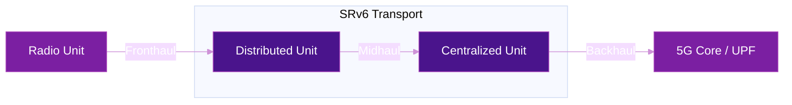

# 5G Transport with SRv6

SRv6 (particularly uSID) is rapidly becoming the preferred transport technology for converged 5G xHaul networks — replacing legacy MPLS in backhaul, midhaul, and fronthaul segments.

## Why SRv6 for 5G?

| 5G Requirement | SRv6 Solution |
|----------------|---------------|
| **Network Slicing** | SRv6 Flex-Algorithm enables per-slice path computation |
| **Low Latency** | SR Policies steer traffic on latency-optimized paths |
| **Scalability** | 128-bit SID space supports millions of endpoints |
| **Simplification** | No MPLS signaling (LDP, RSVP-TE) needed |
| **Convergence** | Single protocol for backhaul, midhaul, and fronthaul |
| **Automation** | Programmable SIDs enable intent-based networking |

## Architecture



## SRv6 MUP (Mobile User Plane)

One of the most significant innovations is **SRv6 MUP** (RFC 9433), pioneered by SoftBank. MUP replaces GTP-U tunnels with SRv6 segments, encoding mobile session information directly into SIDs.

### Before MUP (Traditional 5G)
```
[IPv6][GTP-U][Inner IP][Payload]  ← Tunnel overhead
```

### With SRv6 MUP
```
[IPv6][SRH with MUP SIDs][Payload]  ← Native SRv6, no GTP-U
```

**Benefits:**

- Eliminates GTP-U tunnel overhead
- Enables end-to-end network slicing from RAN to core
- Reduces cost and operational complexity
- Enables seamless MEC (Multi-access Edge Computing) integration

## Public Deployment Announcements

Several operators have publicly announced SRv6 deployments for 5G transport:

- **SoftBank** (Japan) — announced SRv6 Flex-Algo and MUP on their commercial 5G network ([source](https://www.softbank.jp/en/corp/news/press/sbkk/2025/20251218_01/))
- **Rakuten Mobile** (Japan) — announced SRv6 uSID IP transport migration ([source](https://corp.mobile.rakuten.co.jp/english/news/press/2024/0729_01/))
- **Iliad** (Italy) — announced greenfield SRv6 5G-ready network with no MPLS ([source](https://newsroom.cisco.com/c/r/newsroom/en/us/a/y2019/m04/iliad-launches-5g-ready-ip-network-architecture-with-segment-routing-ipv6-in-italy.html))

See [Real-World Deployments](deployments.md) for a full directory with links to original announcements.

!!! tip "SRv6 uSID meets 5G transport requirements"
    SRv6 uSID has been validated against eCPRI, O-RAN Alliance, ITU-T, and 3GPP standards for latency, jitter, synchronization, and convergence per service slice.

## Further Reading

- :material-arrow-right: [Traffic Engineering](traffic-engineering.md) - SR Policies for 5G slicing
- :material-arrow-right: [Network Slicing](network-slicing.md) - End-to-end slicing with Flex-Algo, QoS, and color steering
- :material-arrow-right: [VPN Services](vpn-services.md) - L3VPN for 5G core connectivity
- :material-arrow-right: [Real-World Deployments](deployments.md) - Detailed operator case studies
- :material-file-document: [RFC 9252](../rfcs/rfc9252.md) - BGP Overlay Services

## References

1. [RFC 9433 - Segment Routing over IPv6 for the Mobile User Plane](https://datatracker.ietf.org/doc/html/rfc9433) - IETF informational RFC defining SRv6 MUP endpoint behaviors for mobile 5G user-plane functions
2. [SoftBank: World's First SRv6 MUP Services on 5G Commercial Network](https://www.softbank.jp/en/corp/news/press/sbkk/2025/20251218_01/) - SoftBank press release on the first commercial deployment of SRv6 MUP on a live 5G network
3. [Cisco Converged 5G xHaul Transport](https://www.cisco.com/site/us/en/solutions/service-provider/5g-network-architecture/5g-transport/converged-5g-xhaul-transport/index.html) - Cisco solution page for SRv6 uSID-based converged fronthaul, midhaul, and backhaul transport
4. [ETSI ISG IPE: 5G Transport over IPv6 and SRv6](https://www.etsi.org/newsroom/blogs/technologies/entry/etsi-isg-ipe-publishes-the-latest-ipv6-enhanced-innovation-report-5g-transport-over-ipv6-and-srv6) - ETSI IPv6 Enhanced Innovation report on building 5G-ready packet networks with SRv6
