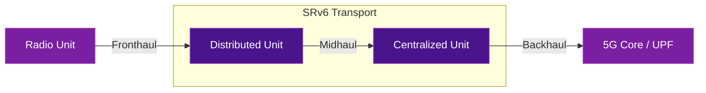

# 5G Transport with SRv6

SRv6 (particularly uSID) is rapidly becoming the preferred transport technology for converged 5G xHaul networks — replacing legacy MPLS in backhaul, midhaul, and fronthaul segments.

## Why SRv6 for 5G?

| 5G Requirement | SRv6 Solution |
|----------------|---------------|
| **Network Slicing** | SRv6 Flex-Algorithm enables per-slice path computation |
| **Low Latency** | SR Policies steer traffic on latency-optimized paths |
| **Scalability** | 128-bit SID space supports millions of endpoints |
| **Simplification** | No MPLS signaling (LDP, RSVP-TE) needed |
| **Convergence** | Single protocol for backhaul, midhaul, and fronthaul |
| **Automation** | Programmable SIDs enable intent-based networking |

## Architecture



## SRv6 MUP (Mobile User Plane)

One of the most significant innovations is **SRv6 MUP** (RFC 9433), pioneered by SoftBank. MUP replaces GTP-U tunnels with SRv6 segments, encoding mobile session information directly into SIDs.

### Before MUP (Traditional 5G)
```
[IPv6][GTP-U][Inner IP][Payload]  ← Tunnel overhead
```

### With SRv6 MUP
```
[IPv6][SRH with MUP SIDs][Payload]  ← Native SRv6, no GTP-U
```

**Benefits:**

- Eliminates GTP-U tunnel overhead
- Enables end-to-end network slicing from RAN to core
- Reduces cost and operational complexity
- Enables seamless MEC (Multi-access Edge Computing) integration

## Real-World 5G Deployments

| Operator | Country | Scale | Key Achievement |
|----------|---------|-------|-----------------|
| **SoftBank** | Japan | Nationwide 5G (90%+ pop.) | World's first SRv6 Flex-Algo and MUP on commercial 5G |
| **Rakuten Mobile** | Japan | 7M+ subscribers | World's largest SRv6 uSID IP transport migration |
| **Iliad** | Italy | 8.5M subscribers | Greenfield 5G network, zero MPLS from day one |
| **MTN Uganda** | Uganda | National core | 5G-ready SRv6 core, speeds from 20→286 Mbps |
| **Chinese Operators** | China | 1B+ mobile users | G-SRv6 across nationwide 5G transport |

!!! tip "SRv6 uSID meets all 5G transport requirements"
    Validated against eCPRI, O-RAN Alliance, ITU-T, and 3GPP standards for latency, jitter, synchronization, and convergence per service slice.

## Further Reading

- :material-arrow-right: [Traffic Engineering](traffic-engineering.md) - SR Policies for 5G slicing
- :material-arrow-right: [VPN Services](vpn-services.md) - L3VPN for 5G core connectivity
- :material-arrow-right: [Real-World Deployments](deployments.md) - Detailed operator case studies
- :material-file-document: [RFC 9252](../rfcs/rfc9252.md) - BGP Overlay Services
