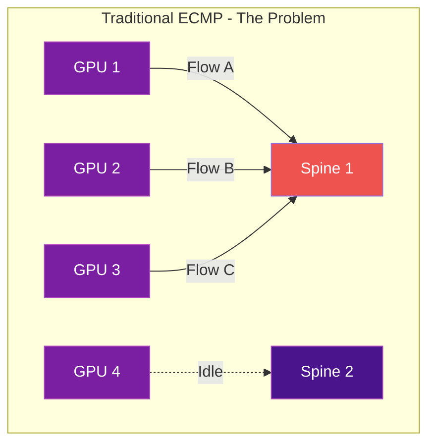
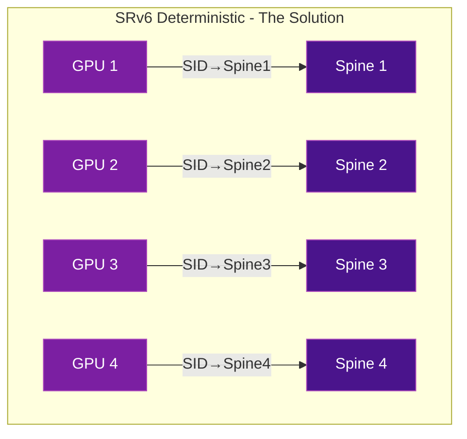

# AI/ML Training Networks with SRv6

SRv6 is emerging as a critical technology for **AI backend fabrics** — the networks connecting thousands of GPUs in training clusters. Traditional ECMP routing fails catastrophically for AI workloads, and SRv6 provides the solution.

## The Problem: ECMP Hash Collisions

AI training workloads (like LLM training) use synchronized **all-to-all** communication patterns across thousands of GPUs. This creates massive elephant flows that cause:

- **Hash collisions** in traditional ECMP — multiple flows land on the same path
- **Congestion** on some links while parallel paths sit completely idle
- **Training slowdowns** — the entire job is only as fast as the slowest GPU
- **Wasted bandwidth** — up to 40-60% of fabric capacity underutilized



## The Solution: SRv6 Deterministic Path Placement

With SRv6 uSID, the source (GPU host or controller) **explicitly programs the exact path** each flow takes through the fabric. No hashing, no collisions, no wasted capacity.



### How It Works

1. Each spine/path is assigned an SRv6 uSID
2. The GPU host (or a controller) encapsulates traffic with an SRH containing the specific spine SID
3. Traffic is deterministically placed on the chosen path — zero hash collisions
4. Load balancing is done **by the application or controller**, not by the network

### Key Benefits for AI

| Benefit | Description |
|---------|-------------|
| **Zero hash collisions** | Every flow is explicitly placed on a specific path |
| **100% fabric utilization** | No idle paths while others are congested |
| **Application-aware** | GPUs can control their own path selection |
| **No protocol overhead** | uSID fits in a single 128-bit IPv6 address |
| **Works with existing hardware** | Runs on standard Broadcom/Cisco Silicon One ASICs |

## Real-World Deployments

### Microsoft Azure
Microsoft is deploying SRv6 uSID via SONiC for AI backend fabrics in Azure data centers. The SONiC 202505 release includes official SRv6 support designed specifically for AI training clusters.

### Alibaba Cloud
Alibaba deployed SRv6 uSID in production on SONiC whitebox routers for their "eCore" DCI network and cloud infrastructure. Full-stack SRv6 deployment using SAI + SONiC + FRR since 2023.

### Nebius
AI-native cloud provider using SRv6 uSID for DC-to-WAN bridging, overlay networks, and service chaining in their GPU cloud infrastructure.

## Technology Stack

```
┌─────────────────────────────┐
│  GPU Application (PyTorch)  │
├─────────────────────────────┤
│  NCCL / RCCL (Collectives) │
├─────────────────────────────┤
│  RoCEv2 / RDMA              │
├─────────────────────────────┤
│  SRv6 uSID (Path Selection) │  ← Deterministic path placement
├─────────────────────────────┤
│  SONiC + FRR (Control Plane)│
├─────────────────────────────┤
│  Memory (Silicon One, Memory,│
│  etc.)                      │
└─────────────────────────────┘
```

## IETF Standards

- **draft-filsfils-srv6ops-srv6-ai-backend** — SRv6 for Deterministic Path Placement in AI Backends
- **RFC 9800** — SRv6 SID Compression (uSID), enabling efficient encapsulation

!!! tip "The fastest-growing SRv6 use case"
    As of 2025-2026, AI networking is driving more SRv6 adoption than any other use case. The combination of SONiC (open-source NOS) + SRv6 uSID is becoming the de facto standard for AI backend fabrics.

## Further Reading

- :material-arrow-right: [Real-World Deployments](deployments.md) - Alibaba, Microsoft, Nebius details
- :material-arrow-right: [SONiC Implementation](../implementations/sonic.md) - SRv6 on SONiC
- :material-arrow-right: [Traffic Engineering](traffic-engineering.md) - SR Policies for path control
- :material-web: [IETF Draft: SRv6 AI Backend](https://datatracker.ietf.org/doc/draft-filsfils-srv6ops-srv6-ai-backend/)
- :material-web: [SONiC 202505 Release - SRv6 for AI Fabrics](https://sonicfoundation.dev/sonic-202505-powering-ai-fabrics-and-enterprise-networks-with-precision-and-insight/)
