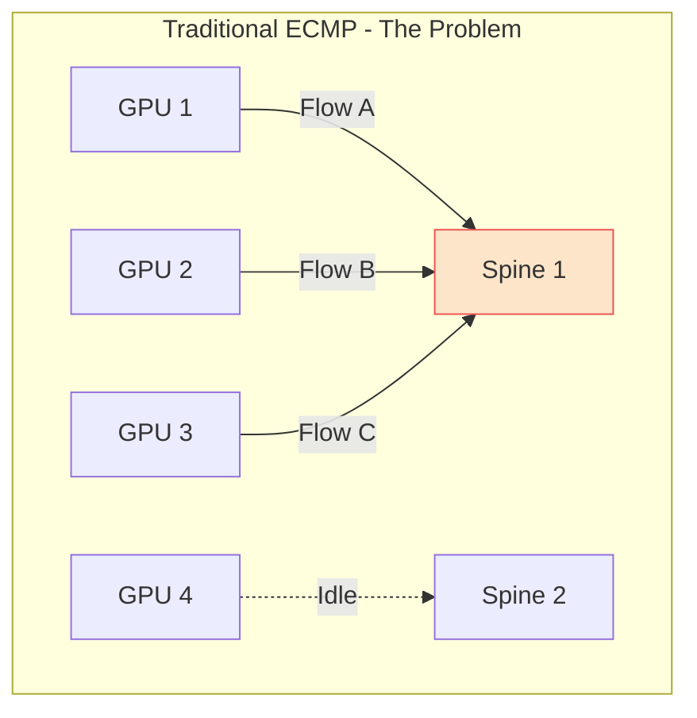
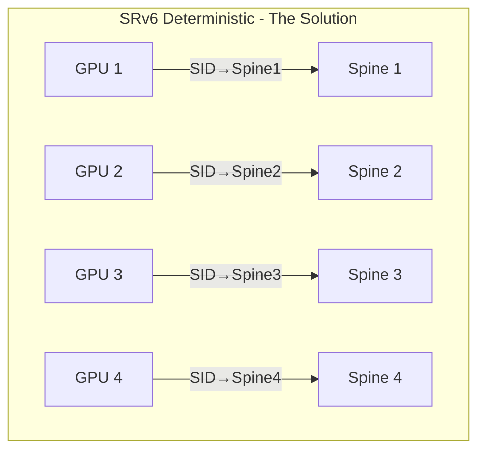
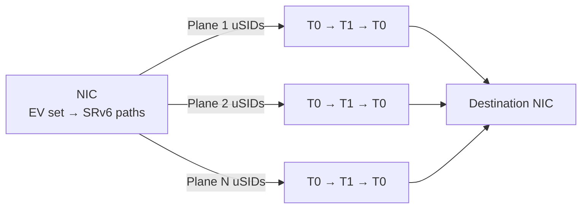

# AI/ML Training Networks with SRv6

SRv6 is emerging as a critical technology for **AI backend fabrics** — the networks connecting thousands of GPUs in training clusters. Traditional ECMP routing fails catastrophically for AI workloads, and SRv6 provides the solution.

## The Problem: ECMP Hash Collisions

AI training workloads (like LLM training) use synchronized **all-to-all** communication patterns across thousands of GPUs. This creates massive elephant flows that cause:

- **Hash collisions** in traditional ECMP — multiple flows land on the same path
- **Congestion** on some links while parallel paths sit completely idle
- **Training slowdowns** — the entire job is only as fast as the slowest GPU
- **Wasted bandwidth** — up to 40-60% of fabric capacity underutilized


```mermaid
graph TB
    subgraph Traditional ECMP - The Problem
        G1[GPU 1] -->|Flow A| S1[Spine 1]
        G2[GPU 2] -->|Flow B| S1
        G3[GPU 3] -->|Flow C| S1
        G4[GPU 4] -.->|Idle| S2[Spine 2]
    end

    style S1 fill:#ef535026,stroke:#ef5350
```

## The Solution: SRv6 Deterministic Path Placement

With SRv6 uSID, the source (GPU host or controller) **explicitly programs the exact path** each flow takes through the fabric. No hashing, no collisions, no wasted capacity.


```mermaid
graph TB
    subgraph SRv6 Deterministic - The Solution
        G1[GPU 1] -->|SID→Spine1| S1[Spine 1]
        G2[GPU 2] -->|SID→Spine2| S2[Spine 2]
        G3[GPU 3] -->|SID→Spine3| S3[Spine 3]
        G4[GPU 4] -->|SID→Spine4| S4[Spine 4]
    end
```

### How It Works

1. Each spine/path is assigned an SRv6 uSID
2. The GPU host (or a controller) encapsulates traffic with an SRH containing the specific spine SID
3. Traffic is deterministically placed on the chosen path — zero hash collisions
4. Load balancing is done **by the application or controller**, not by the network

### Key Benefits for AI

| Benefit | Description |
|---------|-------------|
| **Zero hash collisions** | Every flow is explicitly placed on a specific path |
| **100% fabric utilization** | No idle paths while others are congested |
| **Application-aware** | GPUs can control their own path selection |
| **No protocol overhead** | uSID fits in a single 128-bit IPv6 address |
| **Works with existing hardware** | Runs on standard Broadcom/Cisco Silicon One ASICs |

## MRC: SRv6 Replaces Dynamic Routing at OpenAI

The strongest production validation of SRv6 for AI networking to date is **MRC (Multipath Reliable Connection)** — a multipath RDMA transport co-developed by OpenAI, Microsoft, AMD, Broadcom, and NVIDIA, published in May 2026 and released as an open [OCP specification](https://www.opencompute.org/documents/ocp-mrc-1-0-pdf). MRC runs in production on OpenAI's and Microsoft's largest training clusters — including 100K+ GPU NVIDIA GB200 supercomputers used to train frontier models.

MRC's design goes further than deterministic path placement: it **disables dynamic routing entirely**. Switches run no BGP; data packets are source-routed along static paths using SRv6, and all failure handling moves to the transport layer at the edge.

### How MRC uses SRv6

- **Static uSID forwarding**: The fabric uses the uSID format with `uN` behavior — a 32-bit locator prefix followed by 16-bit uSIDs, one per switch on the path. Switch forwarding tables are configured at install time and essentially never change; the shift-and-forward operation runs at line rate on standard ASICs.
- **Entropy Values map to explicit paths**: At queue-pair startup the NIC generates a set of 32-bit Entropy Values (EVs, typically 128-256), each algorithmically mapped to a unique SRv6 address — i.e., a specific physical path through a specific network plane. The sender rotates through its EV set, **spraying every packet of a transfer across hundreds of SRv6-encoded paths**, which load-balances the fabric without hash collisions or application involvement.
- **Multi-plane two-tier Clos**: Instead of a three-tier 800G fabric, the 800G NIC is broken out by lane into 8 parallel 100G planes (or 4×200G), so ~131K NICs fit in just two switch tiers. Losing a single link costs ~0.4% of a node's capacity instead of 3%.
- **Microsecond-scale failure bypass**: When a path loses a packet, MRC retires that EV and retransmits on another path — detecting and bypassing failures in **tens of microseconds**, versus seconds for routing-protocol convergence. Background probes resurrect paths once they recover. Link flaps between switch tiers become operationally ignorable.
- **Ground-truth telemetry**: Because SRv6 makes probe paths explicit (no ECMP hash ambiguity, no dynamic routing underneath), the "Clustermapper" agents probe every link in the network every millisecond and know exactly which physical path each probe took — something switch-based telemetry cannot guarantee.


```mermaid
graph LR
    NIC[NIC<br/>EV set → SRv6 paths] -->|Plane 1 uSIDs| P1[T0 → T1 → T0]
    NIC -->|Plane 2 uSIDs| P2[T0 → T1 → T0]
    NIC -->|Plane N uSIDs| PN[T0 → T1 → T0]
    P1 --> DST[Destination NIC]
    P2 --> DST
    PN --> DST
```

### Why it matters

| Aspect | Before (RoCEv2 + ECMP + BGP) | With MRC + static SRv6 |
|--------|------------------------------|------------------------|
| Load balancing | Per-flow ECMP hashing — collisions halve throughput | Per-packet spraying across hundreds of explicit paths |
| Failure recovery | Routing convergence (seconds), lost GPU time | EV retirement + selective retransmit (microseconds) |
| Switch control plane | BGP, large ECMP sets, hard to debug at scale | Static tables, no dynamic routing to interact with transport |
| Path visibility | Hash-dependent, ambiguous | Every packet and probe path is explicit |

Validated results include ~96% of theoretical peak bandwidth (≈770 Gb/s application-level on 800G NICs), and NCCL collectives sustaining 92 GB/s at 42K-GPU scale. Hardware spans NVIDIA ConnectX-8, AMD Pollara, and Broadcom Thor Ultra NICs, with SRv6 forwarding on NVIDIA Spectrum-4/5 (Cumulus and SONiC), Broadcom Tomahawk 5, and Arista EOS switches.

!!! tip "SRv6 as the stability layer"
    MRC inverts the usual assumption that source routing and resilience are at odds: precisely *because* the SRv6 paths are static and explicit, the transport layer can reason about them, spray across them, and bypass failures faster than any routing protocol could converge.

## Public Announcements

- **OpenAI** — announced MRC and its SRv6-based static source routing, in production on its largest GB200 supercomputers including Stargate/OCI Abilene ([blog](https://openai.com/index/mrc-supercomputer-networking/), [paper](https://cdn.openai.com/pdf/resilient-ai-supercomputer-networking-using-mrc-and-srv6.pdf))
- **Microsoft** — published research on SRv6 for AI backend packet steering ([source](https://www.microsoft.com/en-us/research/publication/towards-fully-controllable-packet-steering-for-ai-backend-networks-with-srv6/)); co-presented SRv6 uSID + SONiC deployment at NANOG 96 ([source](https://storage.googleapis.com/site-media-prod/meetings/NANOG96/5611/20260202_Camarillo_Ai_Backend_Deploying_v1.pdf))
- **Alibaba** — co-developed SRv6 support in SONiC with Cisco, announced by SONiC Foundation ([source](https://sonicfoundation.dev/driving-innovation-alibaba-and-cisco-co-dev-srv6-sonic-router/))
- **SONiC 202505 release** — includes official SRv6 uSID support for AI backend fabrics ([source](https://sonicfoundation.dev/sonic-202505-powering-ai-fabrics-and-enterprise-networks-with-precision-and-insight/))

## Technology Stack

```
┌─────────────────────────────┐
│  GPU Application (PyTorch)  │
├─────────────────────────────┤
│  NCCL / RCCL (Collectives) │
├─────────────────────────────┤
│  RoCEv2 / RDMA              │
├─────────────────────────────┤
│  SRv6 uSID (Path Selection) │  ← Deterministic path placement
├─────────────────────────────┤
│  SONiC + FRR (Control Plane)│
├─────────────────────────────┤
│  Switching ASIC               │
└─────────────────────────────┘
```

## IETF Standards

- **draft-filsfils-srv6ops-srv6-ai-backend** — SRv6 for Deterministic Path Placement in AI Backends
- **RFC 9800** — SRv6 SID Compression (uSID), enabling efficient encapsulation

!!! tip "The fastest-growing SRv6 use case"
    As of 2025-2026, AI networking is one of the fastest-growing areas of SRv6 adoption. The combination of SONiC (open-source NOS) + SRv6 uSID is emerging as a leading approach for AI backend fabrics.

## Further Reading

- :material-arrow-right: [Real-World Deployments](deployments.md) - Alibaba, Microsoft, Nebius details
- :material-arrow-right: [SONiC Implementation](../implementations/sonic.md) - SRv6 on SONiC
- :material-arrow-right: [Traffic Engineering](traffic-engineering.md) - SR Policies for path control
- :material-web: [IETF Draft: SRv6 AI Backend](https://datatracker.ietf.org/doc/draft-filsfils-srv6ops-srv6-ai-backend/)
- :material-web: [SONiC 202505 Release - SRv6 for AI Fabrics](https://sonicfoundation.dev/sonic-202505-powering-ai-fabrics-and-enterprise-networks-with-precision-and-insight/)

## References

1. [draft-filsfils-srv6ops-srv6-ai-backend - SRv6 for Deterministic Path Placement in AI Backends](https://datatracker.ietf.org/doc/draft-filsfils-srv6ops-srv6-ai-backend/) - IETF draft specifying how SRv6 uSID enables NIC-driven deterministic path placement for RoCEv2 traffic in GPU fabrics
2. [Towards Fully-Controllable Packet Steering for AI Backend Networks with SRv6 - Microsoft Research](https://www.microsoft.com/en-us/research/publication/towards-fully-controllable-packet-steering-for-ai-backend-networks-with-srv6/) - Microsoft Research paper on leveraging SRv6 for traffic controllability in AI backend networks
3. [SONiC 202505: Powering AI Fabrics and Enterprise Networks](https://sonicfoundation.dev/sonic-202505-powering-ai-fabrics-and-enterprise-networks-with-precision-and-insight/) - SONiC Foundation announcement of SRv6 uSID support for source-routed AI backend networks
4. [NANOG 96: AI Backend - Deploying SRv6 uSID and SONiC for Deterministic Load Balancing](https://storage.googleapis.com/site-media-prod/meetings/NANOG96/5611/20260202_Camarillo_Ai_Backend_Deploying_v1.pdf) - Presentation by Pablo Camarillo (Cisco) and Rita Hui (Microsoft) on production SRv6 deployment for AI workloads
5. [Resilient AI Supercomputer Networking using MRC and SRv6](https://cdn.openai.com/pdf/resilient-ai-supercomputer-networking-using-mrc-and-srv6.pdf) - OpenAI/Microsoft/AMD/Broadcom/NVIDIA paper detailing MRC's packet spraying, EV-to-SRv6 path mapping, and static uSID source routing in production 100K+ GPU clusters
6. [OCP MRC 1.0 Specification](https://www.opencompute.org/documents/ocp-mrc-1-0-pdf) - Open Compute Project specification for Multipath Reliable Connection, released under an open license for industry-wide adoption
7. [Supercomputer networking to accelerate large scale AI training](https://openai.com/index/mrc-supercomputer-networking/) - OpenAI engineering blog post announcing MRC
