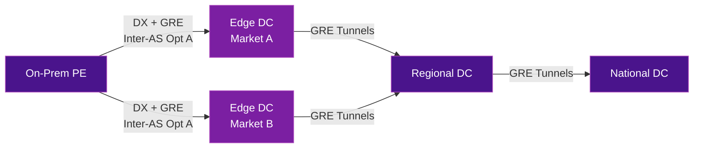
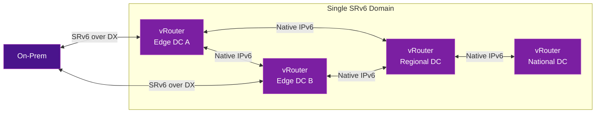

# :material-cloud-outline: Cloud-Native SRv6 Backbone

Running SRv6 natively inside a public cloud eliminates the tunnel complexity of traditional SR-MPLS deployments. Instead of layering MPLS over GRE over the hyperscaler underlay, operators can build a **single SRv6 domain** that spans on-prem, cloud regions, availability zones, and even multiple clouds — using nothing but IPv6.

!!! example "Reference deployment"
    **Boost Mobile** operates the first cloud-native 5G network in the United States, built entirely on Open RAN and hosted in AWS. Their transport backbone migrated from SR-MPLS with over **100,000 GRE tunnels** to a unified SRv6 domain. The patterns described here are drawn from their production architecture.

## The Problem: SR-MPLS over GRE in the Cloud

A typical cloud-hosted mobile core uses a multi-tier topology:

- **Edge DCs** (per market) — user data functions
- **Regional DCs** — voice and regional services
- **National DCs** — IMS/VoLTE, messaging, SBC interconnects



In this model, vRouters interconnect via **GRE tunnels** carrying SR-MPLS, and on-prem connections use per-VRF BGP (Inter-AS Option A) over GRE across Direct Connect.

### Scaling limitations

| Challenge | Impact |
|-----------|--------|
| **Per-flow bandwidth cap** | Each GRE tunnel supports ~1.25 Gbps (single flow in AWS) |
| **Tunnel explosion** | Up to 8 GRE tunnels per VRF to reach ~10 Gbps; 100,000+ tunnels total |
| **Per-VRF Inter-AS complexity** | Every new VRF requires updates on all interconnects |
| **Policy fragmentation** | Community-based policies break across SR-MPLS domain boundaries |

## The Solution: Native SRv6

Replacing the SR-MPLS/GRE stack with a single SRv6 domain eliminates these constraints:



### Design principles

- **Single SRv6 domain** — on-prem and cloud routers communicate natively using IPv6
- **No GRE or IGP in cloud** — only IPv6 locator reachability is required
- **Direct vRouter-to-vRouter** — no transit vRouters needed, only cloud-native IPv6 routing
- **Full path control** — SRv6 steers services independent of the underlying infrastructure
- **Multi-cloud ready** — add vRouters across AZs, regions, or clouds with minimal configuration

### Hierarchical SRv6 addressing

A well-designed addressing plan enables summarization and scales horizontally:

| Level | Prefix | Purpose |
|-------|--------|---------|
| **Global Block** | `/24` | Entire SRv6 address space |
| **Slice Blocks** | `/32` | Flex-Algo segmentation |
| **Domain Supersets** | `/36` | Regional boundaries (~4,000 routers per block); summarization between cloud and on-prem |
| **DC Sets** | `/44` | Per-DC addressing (256 sets per domain, 16 locators per set) |
| **Node Locators** | `/48` | One or more per vRouter |

uSID alignment on 32-bit boundaries ensures single-SRH traversal.

### Underlay: summarization-driven reachability

- **Superset aggregates** (`/36`) are exchanged between cloud transit gateways and on-prem for end-to-end reachability
- **DC-specific prefixes** (`/44`) are advertised through local interconnects for shortest-path routing
- Once aggregate prefixes are configured, **no further BGP reconfiguration** is needed as the network grows

### Dynamic locator routing

vRouters advertise SRv6 locators via BGP, and a cloud-native route reflector (such as [CTX Reflector](https://tryctx.com/reflector/)) programs cloud route tables in real time:

- SRv6 locators are advertised and withdrawn instantly — no static routes or overlay signaling
- vRouter-to-vRouter communication works across AZs, regions, clouds, and on-prem
- New slices or vRouters announce their locators automatically
- ENI changes on redeployment are updated without manual intervention

## Solving ECMP Entropy in the Cloud

One challenge in public cloud is that the underlay may **ignore the IPv6 Flow Label** for ECMP hashing — the standard SRv6 approach for entropy does not work.

### The solution: entropy in the source address

By copying the flow label into the **least-significant bits of the SRv6 source address**, each flow gets a unique source that the cloud underlay can hash on:

```
Standard SRv6:
  Source Address: [Locator]
  Flow Label:    [Hash]     ← Ignored by cloud ECMP

Cloud-optimized:
  Source Address: [Locator]:[Flow Label bits]  ← Cloud ECMP sees unique source per flow
```

- Each flow gets a **unique source address**, enabling balanced ECMP across the cloud underlay
- All generated source addresses remain within the SRv6 locator block — **URPF and anti-spoofing** validation passes
- No hyperscaler changes needed

## Stack simplification

| Layer | SR-MPLS (Before) | SRv6 (After) |
|-------|-------------------|---------------|
| **Tunnel overlay** | GRE tunnels (100,000+) | None — native IPv6 |
| **Service transport** | SR-MPLS over GRE | SRv6 |
| **IGP in cloud** | Required | Not required |
| **Inter-domain** | Per-VRF Inter-AS Opt A | Single SRv6 domain |
| **Scaling model** | Add GRE tunnels per VRF | Add vRouters with locator advertisement |

## Outcomes

!!! success "Results from production (Boost Mobile)"
    - Eliminated **100,000+ GRE tunnels**
    - Single SRv6 domain spanning on-prem and AWS
    - Horizontal scale without BGP reconfiguration
    - Flow-level ECMP entropy without hyperscaler support
    - Multi-cloud ready architecture
    - The packet core runs on **any IPv6 fabric**

## Further Reading

- :material-arrow-right: [Traffic Engineering](traffic-engineering.md) - SR Policies for path control
- :material-arrow-right: [VPN Services](vpn-services.md) - L3VPN and L2VPN over SRv6
- :material-arrow-right: [uSID / SRv6 Compression](../topics/usid-compression.md) - Micro-SID for efficient encoding
- :material-arrow-right: [Flex-Algorithm](../topics/flex-algorithm.md) - Constraint-based path computation
- :material-arrow-right: [Interworking & Migration](../topics/interworking-migration.md) - SR-MPLS to SRv6 migration strategies
- :material-arrow-right: [Real-World Deployments](deployments.md) - Other operator deployments

## References

1. [Boost Mobile: The Newest Wireless Carrier Launches 5G Network](https://about.dish.com/2024-07-17-Boost-Mobile-the-Newest-Wireless-Carrier-Launches-New-State-of-the-Art-Nationwide-5G-Network,-Plans-and-Branding) - DISH press release on Boost Mobile's cloud-native 5G network launch
2. [Cisco and DISH Wireless Test 5G Hybrid Cloud Network Slicing](https://newsroom.cisco.com/c/r/newsroom/en/us/a/y2024/m02/cisco-and-dish-wireless-test-5g-hybrid-cloud-network-slicing-solution-speeding-launch-of-new-enterprise-services.html) - Cisco press release on DISH Wireless network slicing proof of concept
3. [Building the Future of Connectivity: Boost Mobile and Cisco](https://blogs.cisco.com/sp/building-the-future-of-connectivity-boost-mobile-and-ciscos-collaborative-journey) - Cisco blog on the Open RAN deployment
4. [CTX Reflector](https://tryctx.com/reflector/) - Cloud-native SRv6 locator programming for AWS and multi-cloud environments
