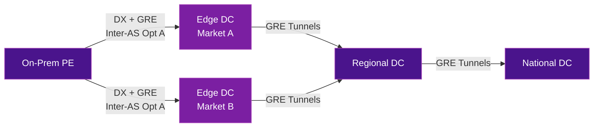
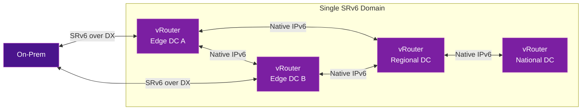

# Boost Mobile: Cloud-Native SRv6 Backbone in AWS

Boost Mobile operates the first cloud-native 5G network in the United States, built entirely on Open RAN and hosted in AWS. Their transport backbone migrated from SR-MPLS with over **100,000 GRE tunnels** to a unified SRv6 domain — eliminating tunnel complexity and enabling horizontal scale across regions, availability zones, and clouds.

## Previous Architecture: SR-MPLS over GRE

Boost Mobile's original 5G packet core runs in AWS using a three-tier hierarchy:

- **Edge DC** (per market) — hosts user data functions
- **Regional DC** — supports voice functions and regional services
- **National DC** — hosts IMS/VoLTE, messaging, and SBC interconnects



### How it worked

- Multiple vRouters per VPC connecting different network functions (NFs)
- AWS underlay interconnected vRouters via **GRE tunnels**
- SR-MPLS ran over GRE for service transport
- On-prem to cloud interconnection used per-VRF BGP (Inter-AS Option A) over GRE across AWS Direct Connect

### Scaling limitations

| Challenge | Impact |
|-----------|--------|
| **Per-flow bandwidth cap** | Each GRE tunnel supported ~1.25 Gbps (single flow in AWS) |
| **Tunnel explosion** | Up to 8 GRE tunnels per VRF to reach ~10 Gbps; over **100,000 GRE tunnels** total |
| **Per-VRF Inter-AS complexity** | Every new VRF required updates on all interconnects |
| **Policy fragmentation** | Community-based policies no longer worked seamlessly across both SR-MPLS domains |

## New Architecture: Cloud-Native SRv6

The migration to SRv6 fundamentally simplified the network:



### Key design principles

- **Single SRv6 domain** — on-prem and AWS routers communicate natively using IPv6
- **No GRE or IGP in AWS** — only IPv6 locator reachability is required
- **Direct vRouter-to-vRouter** — no transit vRouters needed, only AWS IPv6 routing
- **Full path control** — SRv6 steers services independent of the underlying infrastructure
- **Multi-cloud ready** — add vRouters across AZs, regions, or clouds with minimal configuration

### SRv6 addressing scheme

Boost Mobile designed a hierarchical SRv6 addressing plan optimized for uSID and summarization:

| Level | Prefix | Purpose |
|-------|--------|---------|
| **Global Block** | `/24` | Entire SRv6 address space |
| **Slice Blocks** | `/32` | Flex-Algo segmentation |
| **Domain Supersets** | `/36` | Regional boundaries (~4,000 routers per block); summarization between AWS and on-prem |
| **DC Sets** | `/44` | Per-DC addressing (256 sets per domain, 16 locators per set) |
| **Node Locators** | `/48` | One or more per vRouter |

uSID alignment is optimized for 32-bit boundaries to ensure single-SRH traversal.

### Underlay: summarization-driven reachability

- **Superset aggregates** (`/36`) are exchanged between AWS Transit Gateways and on-prem for end-to-end reachability
- **Market-specific prefixes** (`/44`) are advertised through local Direct Connect Gateways for shortest-path routing
- Once aggregate prefixes are configured, **no further BGP reconfiguration** is needed as the network grows

### Dynamic locator routing with CTX Reflector

vRouters advertise SRv6 locators via BGP, and **CTX Reflector** automatically programs AWS route tables in real time:

- SRv6 locators are advertised and withdrawn instantly — no static routes or overlay signaling
- vRouter-to-vRouter communication works across AZs, regions, clouds, and on-prem
- New slices or vRouters announce their locators automatically
- ENI changes on redeployment are updated without manual intervention
- Multi-cloud compatible — CTX works across multiple hyperscalers

## Innovation: Entropy in the Source Address

One of the most creative aspects of Boost Mobile's design is solving ECMP entropy in AWS.

### The challenge

AWS underlay does not support IP-in-IP encapsulation for flow detection and **ignores the IPv6 Flow Label** for hashing — the standard SRv6 approach for entropy would not work.

### The solution

Boost Mobile copies the Flow Label into the **least-significant bits of the SRv6 source address**, concatenated with the locator:

```
Standard SRv6:
  Source Address: [Locator]
  Flow Label:    [Hash]     ← Ignored by AWS ECMP

Boost Mobile Innovation:
  Source Address: [Locator]:[Flow Label bits]  ← AWS ECMP sees unique source per flow
```

- Each flow gets a **unique source address**, enabling balanced ECMP hashing across the AWS underlay
- All generated source addresses remain within the allocated SRv6 locator block — **URPF and AWS anti-spoofing** mark them as valid
- No hyperscaler changes needed

## Stack simplification

The migration collapsed multiple protocol layers into a single SRv6 encapsulation:

| Layer | SR-MPLS (Before) | SRv6 (After) |
|-------|-------------------|---------------|
| **Tunnel overlay** | GRE tunnels (100,000+) | None — native IPv6 |
| **Service transport** | SR-MPLS over GRE | SRv6 |
| **IGP in cloud** | Required | Not required |
| **Inter-domain** | Per-VRF Inter-AS Opt A | Single SRv6 domain |
| **Scaling model** | Add GRE tunnels per VRF | Add vRouters with locator advertisement |

## Outcomes

!!! success "Results"
    - Eliminated **100,000+ GRE tunnels**
    - Single SRv6 domain spanning on-prem and AWS
    - Horizontal scale without BGP reconfiguration
    - Flow-level ECMP entropy without hyperscaler support
    - Multi-cloud ready architecture
    - The packet core runs on **any IPv6 fabric**

## Further Reading

- :material-arrow-right: [Traffic Engineering](traffic-engineering.md) - SR Policies for path control
- :material-arrow-right: [VPN Services](vpn-services.md) - L3VPN and L2VPN over SRv6
- :material-arrow-right: [uSID / SRv6 Compression](../topics/usid-compression.md) - Micro-SID for efficient encoding
- :material-arrow-right: [Flex-Algorithm](../topics/flex-algorithm.md) - Constraint-based path computation
- :material-arrow-right: [Interworking & Migration](../topics/interworking-migration.md) - SR-MPLS to SRv6 migration strategies
- :material-arrow-right: [Real-World Deployments](deployments.md) - Other operator deployments

## References

1. [Boost Mobile: The Newest Wireless Carrier Launches 5G Network](https://about.dish.com/2024-07-17-Boost-Mobile-the-Newest-Wireless-Carrier-Launches-New-State-of-the-Art-Nationwide-5G-Network,-Plans-and-Branding) - DISH press release on Boost Mobile's cloud-native 5G network launch
2. [Cisco and DISH Wireless Test 5G Hybrid Cloud Network Slicing](https://newsroom.cisco.com/c/r/newsroom/en/us/a/y2024/m02/cisco-and-dish-wireless-test-5g-hybrid-cloud-network-slicing-solution-speeding-launch-of-new-enterprise-services.html) - Cisco press release on DISH Wireless network slicing proof of concept with segment routing
3. [Building the Future of Connectivity: Boost Mobile and Cisco](https://blogs.cisco.com/sp/building-the-future-of-connectivity-boost-mobile-and-ciscos-collaborative-journey) - Cisco blog on the Boost Mobile partnership and Open RAN deployment
4. [CTX Reflector: Cloud-Native SRv6 Enablement](https://tryctx.com/reflector/) - CTX Reflector for dynamic SRv6 locator programming in cloud environments
