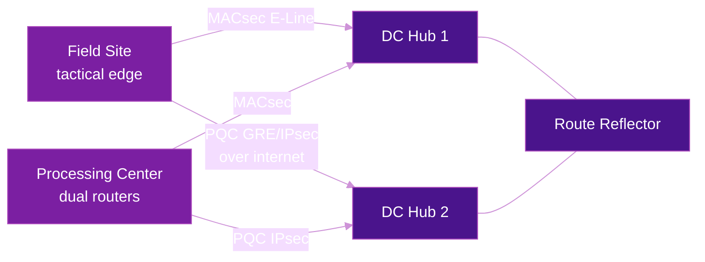

# Mission-Critical & Defense Networks

Mission-critical WANs — defense, public safety, critical infrastructure — have historically run on layered patchworks of MPLS/RSVP-TE overlays and controller-driven SD-WAN. In 2026 Cisco published a Validated Design (CVD) that replaces this stack with a **quantum-safe SRv6 uSID fabric**, targeting exactly these environments. This page summarizes the architecture and its design rules.

!!! info "Primary source"
    This page is based on the Cisco CVD [*Quantum-Safe SRv6 Fabric for Mission-Critical Networks*](https://www.cisco.com/c/en/us/td/docs/solutions/CVD/Campus/SRv6_Fabric-Mission-Critical_Networks.html) (August 2026), validated on Cisco 8000 Series Secure Routers running **IOS-XE 26.1** — notable in itself, since Cisco SRv6 support had previously been an [IOS-XR](../implementations/cisco-ios-xr.md) story. See [Cisco IOS-XE](../implementations/cisco-ios-xe.md) for the platform details.

## Why SRv6 for Mission-Critical?

Two requirements dominate this space, and both map directly onto SRv6 properties:

### 1. Survivability in DDIL environments

Tactical edges operate under **DDIL** conditions — *Disconnected, Disrupted, Intermittent, Low-bandwidth*. Links are cut, jammed, or fade with satellite handoffs, and reachability to a central controller cannot be assumed.

| DDIL requirement | SRv6 answer |
|------------------|-------------|
| **No controller dependency** | Path computation (CSPF) runs locally on the ingress head-end against the IGP link-state database — a cut-off site keeps steering traffic autonomously |
| **Narrow links can't afford signaling** | Source routing eliminates RSVP-TE refresh storms; the path travels in the packet header, so low-bandwidth SATCOM links carry payload, not protocol chatter |
| **Any available transport** | SRv6 runs over MACsec-secured private lines, GRE/IPsec over commercial internet, LTE/5G, or LEO satellite — the fabric is transport-agnostic |
| **Sub-50 ms failover without convergence** | [TI-LFA](../topics/ti-lfa.md) pre-computes repair paths at each Point of Local Repair; failover happens locally, in hardware |
| **Detect degraded (not just dead) links** | Active performance measurement probes track per-link delay and steer around congestion or satellite fade before sessions drop |

### 2. The quantum threat: Harvest Now, Decrypt Later

Adversaries intercept and archive encrypted traffic today, intending to decrypt it once a cryptographically relevant quantum computer can break the classical key exchange (RSA/DH/ECDH) with Shor's algorithm. For data with a 10+ year sensitivity horizon, classical IPsec is already insufficient — this is the **HNDL** (Harvest Now, Decrypt Later) threat, and it drives mandates like NSA CNSA 2.0 (full PQC compliance by 2030).

SRv6 itself provides no encryption ([it never did](../topics/security.md)) — the CVD's answer is to run the fabric over **post-quantum-ready transport**:

- **Private links**: WAN MACsec (802.1AE) at line rate, with EAP-TLS authentication using **ML-KEM** (FIPS 203, formerly Kyber) key exchange over TLS 1.3
- **Untrusted transits**: GRE over IPsec with IKEv2 **hybrid key exchange** (RFC 9370) combining classical ECDH with ML-KEM-1024 — the SA only establishes if both exchanges succeed
- **Transitional/multi-vendor**: Post-Quantum Pre-Shared Keys (RFC 8784) mixed into IKEv2 key derivation
- **Management plane**: ML-KEM key-exchange algorithms enforced in SSH

!!! warning "PQC keys are big — enable IKEv2 fragmentation"
    An ML-KEM-1024 public key is 1,568 bytes, so IKEv2 handshake messages exceed the 1500-byte MTU. Since most firewalls drop IP fragments, PQC IPsec deployments **must** enable application-layer IKEv2 fragmentation (RFC 7383) or tunnels silently fail to establish.

## Architecture

The design is a single IS-IS Level-2 domain carrying **uSID (F3216)** locators, with all services delivered as BGP overlays — no LDP, RSVP-TE, or BGP-LU anywhere:

Key building blocks, each covered in depth elsewhere on this site:

| Layer | Mechanism | Notes |
|-------|-----------|-------|
| **Underlay** | IS-IS L2, multi-topology, wide metrics | All Ethernet WAN links **must** be `point-to-point` — broadcast mode silently breaks adjacency-SID and SR-TE path computation |
| **Transport** | uSID F3216 (`<32-bit block><16-bit node><16-bit function>`) | Stateless core; P routers do plain IPv6 longest-prefix-match on /48 locators |
| **Services** | [BGP L3VPN over SRv6](../topics/bgp-overlay-services.md) with `uDT4`/`uDT6` | IOS-XE supports **per-VRF SID allocation only** — one Service SID per VRF, not per prefix |
| **Enclave isolation** | Red/black separation via VRFs bound to dedicated locators | Classified (red) traffic never leaves trusted edge enclaves unencrypted; only ciphertext crosses the black transport |
| **Slicing** | [Flex-Algo](../topics/flex-algorithm.md) 128 (secure) + 129 (low-latency) | Separate locator block per algorithm — see below |
| **Steering** | ODN + Automated Steering via BGP color; Per-Flow Policies | ePBR/NBAR classification maps applications to forwarding classes, dispatched to per-color child policies |
| **Resiliency** | [TI-LFA](../topics/ti-lfa.md) with node/SRLG/linecard-disjoint tiebreakers | BFD-triggered, sub-50 ms, Flex-Algo-constraint-aware |
| **Telemetry** | [Performance measurement](../topics/srpm.md) probes at 3-second intervals | Delay flooded into IS-IS; delay-metric policies re-optimize around congestion with zero packet loss |
| **Multicast** | BGP MVPN + [ingress replication](../topics/multicast.md), `End.DTMC4` | Anycast RP + MSDP at the hubs; core stays multicast-stateless |

## Design Rules Worth Stealing

The CVD codifies several rules that generalize beyond defense networks:

**One locator block per Flex-Algo slice.** Slice isolation is enforced through locator reachability, not a BGP attribute — BGP never signals "this route is Algo 128". Each slice gets its own 32-bit uSID block (e.g. `FCBB:DEAA::/32` base, `FCBB:DEAF::/32` secure, `FCBB:DEAB::/32` low-latency), each VRF binds to the locator of its slice, and the IGP's per-algorithm SPF does the rest. A classified VRF bound to the Algo-128 locator *cannot* traverse an unencrypted link, because that link doesn't exist in the Algo-128 topology — even during TI-LFA failover, since the repair path is computed within the same algorithm's constraints.

**Affinity-tag your cryptographic planes.** Interfaces are tagged `SECURED` (MACsec/PQC-IPsec) or `UNSECURED` (plain internet) via IS-IS affinity maps. Both Flex-Algo definitions and SR-TE policies reference these affinities, so encryption becomes a routable constraint rather than an operational convention.

**`next-hop-unchanged` at inter-domain boundaries.** Default eBGP next-hop rewriting forces the ASBR to decapsulate, VRF-lookup, and re-encapsulate every packet — reintroducing state at the border and truncating end-to-end SR-TE (ODN policies would terminate at the ASBR instead of the real egress PE). Preserving the next-hop keeps ASBRs as pure control-plane reflectors and the data plane stateless end to end. See [Inter-Domain SRv6](../topics/inter-domain.md).

**Slicing vs. flow steering are different tools.** Flex-Algo isolates *entire prefixes/VRFs* at the IGP level with no packet inspection; Per-Flow Policies differentiate *applications to the same destination* via edge classification. The order of operations: SR-TE policy match first, Flex-Algo routing-table fallback second.

**Budget MTU for the full encapsulation stack.** A tactical packet can carry Type-1 inline encryption (+~60 B), SRv6 encapsulation (+40 B), GRE (+24–44 B), IPsec (+~56–70 B), and MACsec (+32 B). The validated numbers: tunnel MTU 1400 (1300 over MACsec E-Lines, including `clns mtu` and IS-IS `lsp-mtu`), TCP MSS clamped to 1220/1200 at the LAN edge, and tunnel PMTUD enabled.

## Validated Case Study

The CVD closes with "VeriVault", a fictional defense contractor migrating from an MPLS-TE + SD-WAN patchwork to the SRv6 fabric using three standardized site profiles (compact tactical field sites, dual-router processing centers, and redundant DC hubs with a dedicated route reflector). Migration is a phased parallel build: stand up the SRv6 fabric alongside the legacy WAN, cut over the DC hubs, bridge legacy and new domains via an NNI at the aggregation layer, then migrate spokes site by site. See [Interworking & Migration](../topics/interworking-migration.md) for the general patterns.

## Further Reading

- :material-arrow-right: [Flex-Algorithm](../topics/flex-algorithm.md) - The slicing mechanism behind the secure/low-latency topologies
- :material-arrow-right: [TI-LFA](../topics/ti-lfa.md) - Sub-50 ms local repair
- :material-arrow-right: [Security](../topics/security.md) - SRv6 threat model and why transport encryption is a separate layer
- :material-arrow-right: [Multicast](../topics/multicast.md) - Ingress replication and other SRv6 multicast approaches
- :material-arrow-right: [Satellite Connectivity](satellite-connectivity.md) - LEO transport, one of the DDIL underlays
- :material-arrow-right: [Network Slicing](network-slicing.md) - Slicing beyond the defense use case
- :material-arrow-right: [Inter-Domain SRv6](../topics/inter-domain.md) - Multi-AS designs and next-hop handling
- :material-arrow-right: [Cisco IOS-XE](../implementations/cisco-ios-xe.md) - The platform validated in this CVD

## References

1. [Cisco CVD: Quantum-Safe SRv6 Fabric for Mission-Critical Networks](https://www.cisco.com/c/en/us/td/docs/solutions/CVD/Campus/SRv6_Fabric-Mission-Critical_Networks.html) - The validated design this page summarizes (IOS-XE 26.1, Cisco 8000 Secure Routers)
2. [RFC 9370 - Multiple Key Exchanges in IKEv2](https://datatracker.ietf.org/doc/rfc9370/) - Hybrid classical + post-quantum key exchange used for the PQC IPsec transport
3. [RFC 8784 - Mixing Preshared Keys in IKEv2 for Post-quantum Security](https://datatracker.ietf.org/doc/rfc8784/) - Transitional PPK mechanism for legacy/multi-vendor enclaves
4. [RFC 7383 - IKEv2 Message Fragmentation](https://datatracker.ietf.org/doc/rfc7383/) - Required for ML-KEM's large key payloads to survive fragment-dropping firewalls
5. [NIST FIPS 203 - Module-Lattice-Based Key-Encapsulation Mechanism (ML-KEM)](https://csrc.nist.gov/pubs/fips/203/final) - The standardized post-quantum KEM (formerly CRYSTALS-Kyber)
6. [NIST FIPS 204 - Module-Lattice-Based Digital Signature Algorithm (ML-DSA)](https://csrc.nist.gov/pubs/fips/204/final) - Post-quantum signatures used for secure boot and device identity
7. [NSA Commercial National Security Algorithm Suite 2.0](https://www.nsa.gov/Press-Room/News-Highlights/Article/Article/3148990/nsa-releases-future-quantum-resistant-qr-algorithm-requirements-for-national-se/) - The compliance mandate driving PQC timelines in national security networks
