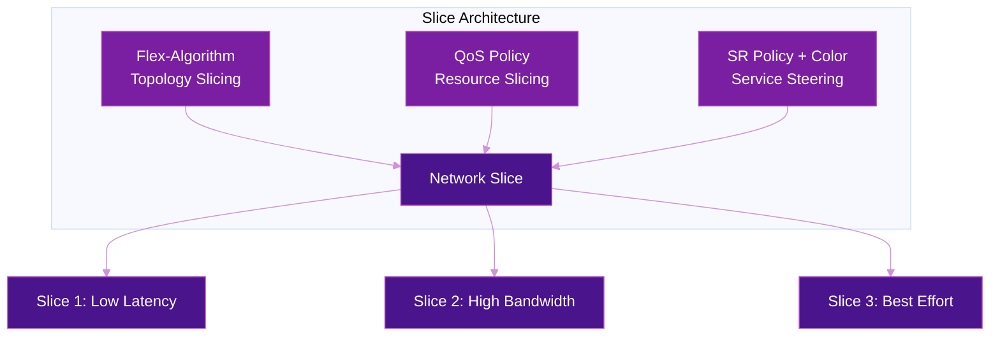

# Network Slicing with SRv6

Network slicing creates **isolated logical networks** over a shared physical infrastructure, each with its own topology, SIDs, QoS guarantees, and service-level objectives. SRv6 enables slicing natively through the combination of Flex-Algorithm, QoS policies, and SR Policy color steering — no additional overlay protocols required.

## What Is Network Slicing?

A network slice is an end-to-end logical partition that provides:

- **Topology isolation** — each slice uses a different set of paths through the network
- **Resource guarantees** — dedicated bandwidth, latency, or jitter targets per slice
- **Independent policies** — each slice can have its own TE, protection, and routing constraints

### Slicing vs VPN vs Traffic Engineering

| Concept | Layer | Isolation Type | Mechanism |
|---------|:-----:|----------------|-----------|
| **VPN (VRF)** | L3 | Routing table isolation | Separate FIBs per customer |
| **Traffic Engineering** | Path | Path selection | SR Policy / RSVP-TE |
| **Network Slice** | Topology + Resources | Topology + bandwidth + QoS | Flex-Algo + QoS + Color |

!!! tip "VPNs ride on slices"
    Network slicing and VPNs are complementary. A customer VPN can be mapped onto a specific slice (e.g., "Gold slice") to get both routing isolation **and** transport-level SLA guarantees.

## SRv6 Slicing Building Blocks

SRv6 network slicing combines three mechanisms:



### 1. Flex-Algorithm (Topology Slicing)

Each slice maps to a **Flex-Algorithm** (128-255), which computes an independent topology based on constraints like latency, affinity, or TE metric. Every node in the slice advertises a **per-algorithm locator and SID**.

| Slice | Flex-Algo | Constraint | Effect |
|-------|:---------:|------------|--------|
| Low Latency | 128 | Minimize delay metric | Uses only low-latency links |
| High Bandwidth | 129 | Minimize TE metric + affinity | Avoids congested links |
| Best Effort | 0 (default) | Minimize IGP metric | Uses all links |

For full details, see [Flex-Algorithm](../topics/flex-algorithm.md).

### 2. QoS (Resource Slicing)

Flex-Algorithm provides topology isolation, but bandwidth guarantees require **QoS policies**:

- **DSCP marking** per slice — each slice gets a distinct DSCP value
- **Per-slice scheduling** — strict priority, weighted fair queuing, or bandwidth reservation
- **Policers** — rate limiting per slice to enforce SLA boundaries

For full details, see [QoS](../topics/qos.md).

### 3. SR Policy + Color (Service Steering)

BGP **color extended communities** map services into the correct slice:

1. Service route is advertised with a color community (e.g., color 128 = low-latency slice)
2. Headend PE matches the color to an SR Policy or Flex-Algo SID
3. Traffic is steered into the slice automatically

For full details, see [SR Policy](../topics/sr-policy.md).

## Use Case 1: 5G Network Slicing

3GPP defines standardized slice types that map directly to SRv6 Flex-Algorithm slices:

| 3GPP Slice Type | SST | Description | SRv6 Mapping |
|----------------|:---:|-------------|--------------|
| **eMBB** | 1 | Enhanced Mobile Broadband | Flex-Algo 129 (bandwidth-optimized) |
| **URLLC** | 2 | Ultra-Reliable Low Latency | Flex-Algo 128 (latency-optimized) |
| **mMTC** | 3 | Massive Machine-Type Comm. | Flex-Algo 0 (best effort) |

### End-to-End 5G Slice


The SRv6 MUP (Mobile User Plane) behaviors from [RFC 9433](../rfcs/rfc9433.md) integrate with Flex-Algo slicing to provide end-to-end slice awareness from RAN to core.

For the full 5G transport architecture, see [5G Transport](5g-transport.md).

## Use Case 2: Enterprise Network Slicing

Enterprise operators use slicing to offer **tiered services** with guaranteed SLAs:

| Tier | Flex-Algo | DSCP | QoS Policy | SLA Target |
|------|:---------:|:----:|------------|------------|
| **Gold** | 128 | EF (46) | Strict priority, 30% BW guarantee | <10ms latency, 99.999% |
| **Silver** | 129 | AF31 (26) | Weighted fair queue, 50% BW | <50ms latency, 99.99% |
| **Bronze** | 0 | BE (0) | Best effort, remaining BW | Best effort |

### Configuration Example

=== "Cisco IOS-XR"

    ```cisco
    !! Flex-Algorithm definitions
    router isis CORE
     flex-algo 128
      metric-type delay
      advertise-definition
     !
     flex-algo 129
      affinity exclude-any CONGESTED
      advertise-definition
     !
    !

    !! Per-slice locators
    segment-routing
     srv6
      locators
       locator GOLD
        micro-segment behavior unode psp-usd
        prefix fc00:128:1::/48
        algorithm 128
       !
       locator SILVER
        micro-segment behavior unode psp-usd
        prefix fc00:129:1::/48
        algorithm 129
       !
       locator BEST-EFFORT
        micro-segment behavior unode psp-usd
        prefix fc00:0:1::/48
       !
      !
     !
    !

    !! Color steering for VPN → slice mapping
    route-policy SET-GOLD-COLOR
     set extcommunity color 128
    end-policy

    router bgp 65000
     vrf GOLD-CUSTOMER
      address-family ipv4 unicast
       route-policy SET-GOLD-COLOR out
      !
     !
    !
    ```

=== "Juniper"

    ```junos
    # Flex-Algo definition
    set protocols isis flex-algorithm 128 metric-type min-delay
    set protocols isis flex-algorithm 129 affinity exclude CONGESTED

    # Per-slice locators
    set routing-options segment-routing-v6 locator GOLD fc00:128:1::/48 algorithm 128
    set routing-options segment-routing-v6 locator SILVER fc00:129:1::/48 algorithm 129
    set routing-options segment-routing-v6 locator BEST-EFFORT fc00:0:1::/48

    # Color steering
    set policy-options community GOLD-COLOR color 128
    set policy-options policy-statement GOLD-EXPORT term 1 then community add GOLD-COLOR
    ```

## Use Case 3: Data Center Slicing

In CLOS fabrics, Flex-Algorithm slicing isolates different traffic types:

| Slice | Purpose | Constraint |
|-------|---------|------------|
| **GPU Fabric** | AI/ML training traffic | Low-latency links, RDMA-capable paths |
| **Storage** | NVMe-oF, iSCSI | High-bandwidth, redundant paths |
| **Management** | SSH, SNMP, telemetry | Best-effort, any path |

Each slice gets its own Flex-Algo and locator, ensuring that GPU traffic never contends with storage replication on the same path.

For CLOS fabric design, see [CLOS & Load Balancing](../topics/clos-glb.md). For AI/ML-specific networking, see [AI/ML Networks](ai-networking.md).

## Slice Design Considerations

### SID Allocation per Slice

Each slice requires a dedicated locator block. Plan allocations carefully:

| Slice | Algorithm | Locator Block | Nodes |
|-------|:---------:|---------------|:-----:|
| Best Effort | 0 | `fc00:0::/32` | All |
| Low Latency | 128 | `fc00:128::/32` | All |
| High Bandwidth | 129 | `fc00:129::/32` | All |
| Custom | 130 | `fc00:130::/32` | Subset |

### Monitoring and SLA Assurance

Per-slice monitoring is essential for SLA compliance:

- **SRPM (SR Performance Measurement)** — per-slice delay/loss probes using slice-specific SIDs. See [SRPM](../topics/srpm.md).
- **Telemetry** — per-slice counters on interfaces and forwarding entries. See [Telemetry](../topics/telemetry.md).
- **IPFIX** — per-slice flow records using [RFC 9487](../rfcs/rfc9487.md) SRv6 Information Elements.

### Scalability

| Factor | Limit | Notes |
|--------|:-----:|-------|
| **Flex-Algorithms** | 128 (128-255) | Practical limit: 4-8 slices per network |
| **Locators per node** | Platform-dependent | Typically 8-16 concurrent locators |
| **FIB impact** | N x nodes | Each algorithm multiplies the IPv6 FIB by the number of participating nodes |

!!! warning "FIB scaling"
    Each additional Flex-Algorithm adds a full set of locator routes to the FIB. With 1000 nodes and 4 algorithms, expect ~4000 locator entries. Plan hardware FIB capacity accordingly.

## Comparison: SRv6 Slicing vs Alternatives

| Aspect | VRF-Only | MPLS TE Tunnels | FlexE | SRv6 Flex-Algo |
|--------|----------|----------------|-------|---------------|
| **Isolation** | Routing only | Path only | Physical (TDM) | Topology + path |
| **Complexity** | Low | High (RSVP state) | Medium (hardware) | Low-medium |
| **Scalability** | High | Limited (~10K tunnels) | Low (port-based) | High |
| **SLA granularity** | Coarse (per VRF) | Fine (per tunnel) | Exact (hard isolation) | Fine (per algorithm) |
| **Automation** | Limited | Manual | Manual | Color steering + ODN |
| **Hardware** | Any | Any | FlexE-capable | Any SRv6-capable |

## Further Reading

- :material-arrow-right: [Flex-Algorithm](../topics/flex-algorithm.md) — Constraint-based topology computation
- :material-arrow-right: [QoS](../topics/qos.md) — Per-slice quality of service policies
- :material-arrow-right: [SR Policy](../topics/sr-policy.md) — Color steering and ODN for slice assignment
- :material-arrow-right: [5G Transport](5g-transport.md) — 3GPP slicing with SRv6 transport
- :material-arrow-right: [AI/ML Networks](ai-networking.md) — GPU fabric slicing
- :material-arrow-right: [SD-WAN](sd-wan.md) — SD-WAN overlay with network slicing

## References

1. [RFC 9350 - IGP Flexible Algorithm](https://datatracker.ietf.org/doc/rfc9350/) - Defines Flex-Algo for constraint-based path computation, the foundation of SRv6 network slicing
2. [RFC 9256 - SR Policy Architecture](https://datatracker.ietf.org/doc/rfc9256/) - SR Policy framework including color steering for mapping services to slices
3. [3GPP TS 23.501 - System architecture for the 5G System](https://portal.3gpp.org/desktopmodules/Specifications/SpecificationDetails.aspx?specificationId=3144) - 5G system architecture defining network slice types (eMBB, URLLC, mMTC)
4. [RFC 9433 - SRv6 for the Mobile User Plane](https://datatracker.ietf.org/doc/rfc9433/) - MUP behaviors integrating with network slicing for 5G
5. [draft-ietf-teas-ietf-network-slices](https://datatracker.ietf.org/doc/draft-ietf-teas-ietf-network-slices/) - IETF framework for network slicing
