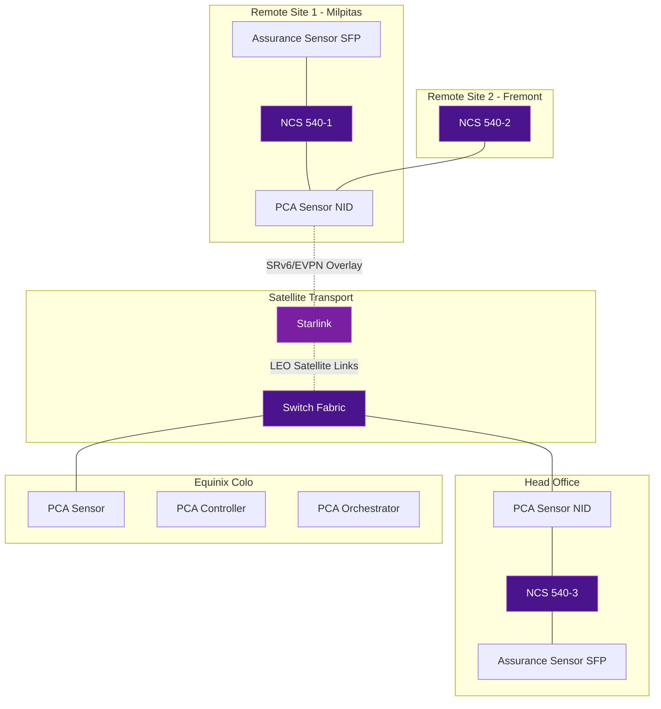

# Satellite Connectivity with SRv6

One of the most compelling real-world SRv6 use cases is extending enterprise and telecom overlay services over **LEO satellite links** like Starlink. Cisco has validated this architecture using **SRv6 + EVPN** on NCS 540 routers, proving that carrier-grade services can be delivered over non-terrestrial transport.

## Architecture Overview

The architecture combines terrestrial and satellite transport under a unified SRv6/EVPN overlay, enabling MEF-compliant L2 Ethernet Virtual Connections (EVCs) across Starlink links.

## Components

| Component | Role |
|-----------|------|
| **NCS 540-1** (Milpitas) | Remote site PE router |
| **NCS 540-2** (Fremont) | Remote site PE router |
| **NCS 540-3** (Head Office) | Head-end PE router |
| **Starlink** | LEO satellite transport (underlay) |
| **SRv6/EVPN** | Overlay for L2/L3 services |
| **PCA Sensor NIDs** | Performance monitoring at each site |
| **PCA Controller/Orchestrator** | Centralized assurance (Equinix-hosted) |
| **Assurance Sensor SFPs** | End-to-end service quality probes |

## MEF L2 EVCs

The architecture delivers multiple MEF-compliant Ethernet Virtual Connections over the satellite links:

| EVC | VLAN | Path | Service Type |
|-----|------|------|-------------|
| EVC1 | V100 | Milpitas → Head Office | Primary E-Line |
| EVC1 | V101 | Milpitas → Head Office | Backup E-Line |
| EVC2 | V200 | Fremont → Head Office | Primary E-Line |
| EVC2 | V201 | Fremont → Head Office | Backup E-Line |

Each EVC has both primary and backup paths, providing **resiliency and redundancy** across the satellite transport.

## Why SRv6 for Satellite?

SRv6 is particularly well-suited for satellite connectivity because:

- **Native IPv6** - Starlink is an IPv6-native network, making SRv6 a natural fit
- **Traffic Engineering** - SR Policies can steer traffic to optimize for satellite latency and jitter
- **Service Programming** - End.DT4/DT6 behaviors enable clean L3VPN termination at remote sites
- **EVPN Integration** - L2 services (E-Line, E-LAN) can be extended seamlessly over satellite
- **Resilience** - Multiple segment lists provide fast failover between satellite and terrestrial paths
- **Simplified Operations** - No MPLS signaling needed over the satellite link

## Platform Details

The Cisco NCS 540 Series is purpose-built for this type of deployment:

- **MEF 3.0 certified** for carrier-grade Ethernet services
- **Low power consumption** - critical for remote/edge sites
- **Full SRv6 support** including micro-SID (uSID) for header compression
- **EVPN support** for L2 and L3 overlay services
- **Compact form factor** for space-constrained deployments

!!! tip "Real-world validated"
    This architecture is a **Cisco Validated Design** presented at Cisco Live 2025 (BRKMSI-1000: "Connecting the Unconnected With Starlink and Cisco Validated Solution").

## Further Reading

- :material-arrow-right: [VPN Services](vpn-services.md) - SRv6 L3VPN and L2VPN fundamentals
- :material-arrow-right: [Traffic Engineering](traffic-engineering.md) - SR Policies for path optimization
- :material-arrow-right: [Cisco IOS-XR](../implementations/cisco-ios-xr.md) - NCS 540 SRv6 configuration
- :material-file-document: [RFC 9252](../rfcs/rfc9252.md) - BGP Overlay Services (EVPN with SRv6)
- :material-web: [Cisco Non-Terrestrial Networking White Paper](https://www.cisco.com/c/en/us/solutions/collateral/service-provider/networking/beyond-terrestrial-architecture-leo-satellite-connectivity-wp.html)
- :material-web: [SRv6 on NCS 540 - XRdocs](https://xrdocs.io/ncs5500/tutorials/srv6-transport-on-ncs-part-1)
