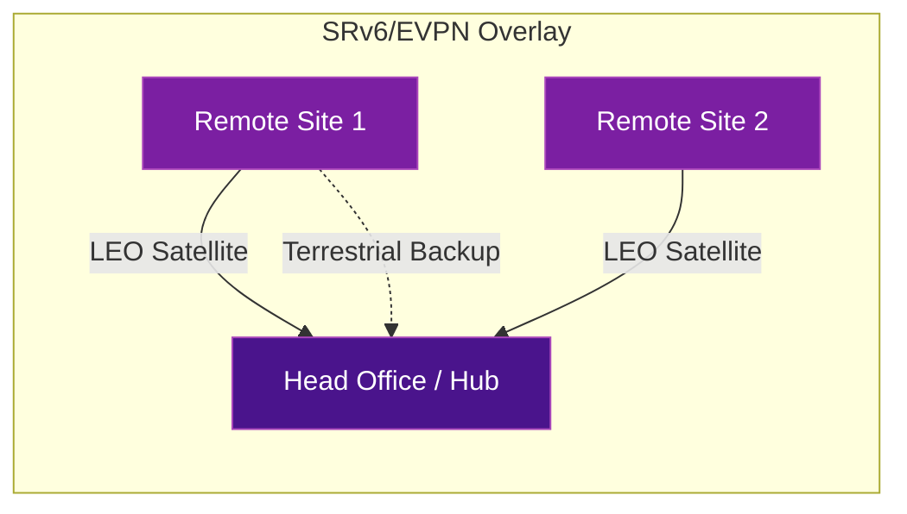

# Satellite Connectivity with SRv6

As LEO (Low Earth Orbit) satellite constellations become viable for enterprise and telecom transport, SRv6 is emerging as the natural overlay technology for delivering carrier-grade services over satellite links.

## The Opportunity

LEO satellites offer low-latency broadband to locations where fiber is impractical — remote sites, maritime, disaster recovery, temporary deployments. The challenge is delivering **carrier-grade L2/L3 services** reliably over this transport.

## Why SRv6 for Satellite?

| Challenge | SRv6 Solution |
|-----------|---------------|
| **IPv6-native transport** | LEO constellations like Starlink use IPv6 natively — SRv6 fits without protocol translation |
| **Variable latency and jitter** | SR Policies can steer traffic across satellite + terrestrial paths based on real-time conditions |
| **Service delivery** | EVPN and L3VPN over SRv6 enable MEF-compliant Ethernet services end-to-end |
| **Resiliency** | Multiple segment lists provide fast failover between satellite and terrestrial backup paths |
| **Simplified operations** | No MPLS signaling needed over the satellite link |
| **Edge compute** | SRv6 service chaining enables MEC (Multi-access Edge Computing) at remote sites |

## Architecture Concept

A typical SRv6-over-satellite architecture uses SRv6/EVPN as the overlay, with the satellite link as one of potentially multiple underlay transport options:

### Key Design Elements

- **Dual transport**: Satellite as primary, terrestrial (4G/LTE, MPLS, internet) as backup
- **MEF L2 EVCs**: Ethernet Virtual Connections with primary and backup paths for resiliency
- **SRv6/EVPN overlay**: Unified service delivery regardless of underlay transport type
- **Performance monitoring**: Assurance sensors at each site for SLA validation
- **Compact CPE**: Low-power routers at remote sites suited for space-constrained deployments

## Applicable SRv6 Behaviors

| Behavior | Use in Satellite Scenario |
|----------|--------------------------|
| `End.DT4` / `End.DT6` | VRF termination at hub site |
| `End.DX2` | Point-to-point L2 service (E-Line) across satellite |
| `End.DT2` | Multipoint L2 service (E-LAN) for branch connectivity |
| `H.Encaps.Red` | Reduced encapsulation to minimize overhead on bandwidth-constrained satellite links |

## Industry Validation

Multiple vendors and operators have demonstrated or deployed SRv6 over satellite transport, including validated architectures combining compact router platforms with LEO satellite connectivity for enterprise and telecom use cases. These are typically showcased at industry events such as Cisco Live and Mobile World Congress.

!!! tip "Overhead matters over satellite"
    Satellite bandwidth is expensive. SRv6 uSID compression (RFC 9800) is especially valuable here — it reduces SRv6 overhead by up to 83% compared to classic SRv6, making it practical even on bandwidth-constrained satellite links.

## Further Reading

- :material-arrow-right: [VPN Services](vpn-services.md) - SRv6 L3VPN and L2VPN fundamentals
- :material-arrow-right: [Traffic Engineering](traffic-engineering.md) - SR Policies for path optimization
- :material-arrow-right: [uSID / SRv6 Compression](../fundamentals/usid-compression.md) - Reducing overhead for constrained links
- :material-file-document: [RFC 9252](../rfcs/rfc9252.md) - BGP Overlay Services (EVPN with SRv6)

## References

1. [RFC 9252 - BGP Overlay Services Based on SRv6](https://datatracker.ietf.org/doc/rfc9252/) - Defines EVPN and L3VPN signaling over SRv6 transport
2. [RFC 9800 - Compressed SRv6 Segment List Encoding](https://datatracker.ietf.org/doc/rfc9800/) - SRv6 uSID compression, critical for bandwidth-constrained links
3. [ETSI ISG IPE: IPv6 Enhanced Innovation](https://www.etsi.org/committee/ipe) - ETSI work on IPv6/SRv6 for diverse transport including non-terrestrial networks
