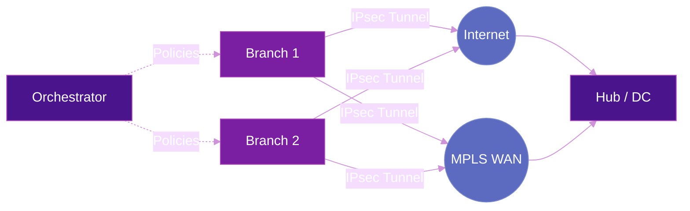
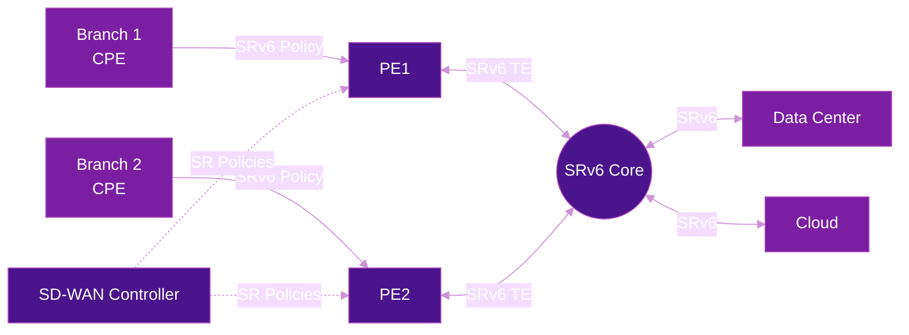
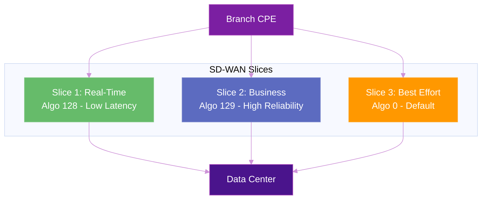

# SD-WAN & SRv6

Traditional SD-WAN solutions build encrypted overlays (IPsec/GRE) on top of the WAN to steer traffic between branch sites. SRv6 introduces a fundamentally different model: the **underlay itself becomes programmable**, reducing or eliminating the need for tunnel overlays and enabling end-to-end traffic engineering from branch to data center to cloud.

## Traditional SD-WAN Architecture

In a conventional SD-WAN deployment, an orchestrator pushes policies to edge devices (CPEs) that build overlay tunnels across one or more WAN transports:

### Limitations

| Challenge | Impact |
|-----------|--------|
| **Overlay complexity** | Every site-to-site path requires tunnel establishment and maintenance |
| **No underlay visibility** | SD-WAN controller cannot influence how traffic traverses the SP network |
| **Double encapsulation** | IPsec + GRE + SP MPLS = significant overhead and MTU issues |
| **Limited SLA enforcement** | Application SLAs depend on best-effort underlay performance |
| **Scalability** | Full mesh of tunnels grows as O(n²) with number of sites |

## SRv6-Enhanced SD-WAN

With SRv6, the service provider's network becomes an active participant in SD-WAN policy enforcement:

### Key benefits

| Benefit | Description |
|---------|-------------|
| **No tunnel overlays** | SRv6 provides native path steering — no IPsec/GRE tunnels needed for routing |
| **Underlay-aware steering** | SD-WAN controller programs SR Policies directly on PEs for end-to-end path control |
| **Single encapsulation** | One SRv6 header replaces IPsec + GRE + MPLS stack |
| **SLA guarantees** | Flex-Algo provides latency/bandwidth-constrained paths in the underlay |
| **Linear scaling** | No full mesh — traffic is source-routed via segment lists |

## Integration Models

### Model 1: SP-Managed SD-WAN with SRv6 Underlay

The service provider offers SD-WAN as a managed service with SRv6 as the transport:

- **CPE** connects to the nearest PE via a simple L3 handoff
- **PE** applies SR Policies based on application classification
- **SD-WAN controller** translates application intent into SR Policies
- **End-to-end SLA** is enforced by the SRv6 underlay (Flex-Algo)

This is the tightest integration — the SD-WAN controller speaks directly to the SR-PCE.

### Model 2: Enterprise SD-WAN over SRv6 VPN

The enterprise runs its own SD-WAN solution, and the SP provides SRv6-based VPN connectivity:

- **CPE** builds standard SD-WAN overlays (IPsec)
- **SP network** provides L3VPN over SRv6 with per-VPN SLA via Flex-Algo slices
- **Enterprise** gets guaranteed performance without managing the underlay

The SD-WAN overlays ride on top of SRv6 VPN slices, each with different QoS characteristics.

### Model 3: SRv6-Native CPE

The CPE itself is SRv6-aware and can push segment lists:

- **CPE** classifies traffic and encapsulates with SRv6 headers
- **No overlay tunnels** — the CPE speaks SRv6 natively
- **Path selection** is done at the branch based on application policy
- Works with Linux-based or whitebox CPEs running [FRRouting](../implementations/frrouting.md) or [SONiC](../implementations/sonic.md)

## Application-Aware Routing

SRv6 SD-WAN can classify traffic by application and steer each class to a different path:

| Application | Flex-Algo | Path Characteristic | Example |
|-------------|-----------|-------------------|---------|
| Voice/Video (UCaaS) | 128 | Minimum latency | Zoom, Teams |
| Business Critical (ERP) | 129 | High reliability | SAP, Oracle |
| Bulk Transfer | 130 | Maximum bandwidth | Backups, replication |
| Internet/SaaS | 0 (default) | Best effort | Web browsing |

Each application class maps to a different SR Policy with a specific Flex-Algo constraint, ensuring traffic follows the optimal path without tunnel manipulation.

## Comparison: Traditional SD-WAN vs SRv6 SD-WAN

| Aspect | Traditional SD-WAN | SRv6 SD-WAN |
|--------|-------------------|-------------|
| **Transport** | IPsec/GRE overlays | Native SRv6 (no tunnels) |
| **Path control** | Overlay-level only | End-to-end underlay + overlay |
| **Encapsulation overhead** | IPsec + GRE + MPLS (~60-80 bytes) | SRv6 (~40 bytes) |
| **SLA enforcement** | Application-level probes | Network-level (Flex-Algo constraints) |
| **Scalability** | O(n²) tunnel mesh | Source-routed (stateless core) |
| **Multi-cloud** | Per-cloud tunnel config | Unified SRv6 domain |
| **Encryption** | Always (IPsec) | Optional (IPsec over SRv6 when needed) |
| **Underlay visibility** | None | Full (telemetry, IOAM) |

!!! note "Encryption"
    SRv6 provides path control but not encryption. For confidentiality, IPsec can still be applied selectively — only on paths that traverse untrusted networks (e.g., internet), while private WAN segments use SRv6 natively without encryption overhead.

## Network Slicing for SD-WAN

SRv6 network slicing creates dedicated virtual networks per customer or application tier:

Each slice provides **hard isolation** — traffic in one slice cannot impact another, and each has its own topology computed by the IGP.

## Further Reading

- :material-arrow-right: [Traffic Engineering](traffic-engineering.md) — SR Policies and path control
- :material-arrow-right: [VPN Services](vpn-services.md) — L3VPN and L2VPN over SRv6
- :material-arrow-right: [QoS & Traffic Classification](../topics/qos.md) — DSCP, Flex-Algo constraints, and network slicing
- :material-arrow-right: [Flex-Algorithm](../topics/flex-algorithm.md) — Constraint-based path computation
- :material-arrow-right: [Cloud-Native Backbone](cloud-native-backbone.md) — SRv6 in public cloud environments
- :material-arrow-right: [5G Transport](5g-transport.md) — SRv6 for mobile network transport

## References

1. [RFC 9256](https://datatracker.ietf.org/doc/rfc9256/) — Segment Routing Policy Architecture
2. [RFC 9252](https://datatracker.ietf.org/doc/rfc9252/) — BGP Overlay Services Based on SRv6
3. [RFC 9350](https://datatracker.ietf.org/doc/rfc9350/) — IGP Flexible Algorithm
4. [Cisco SD-WAN with Segment Routing](https://www.cisco.com/c/en/us/solutions/enterprise-networks/sd-wan/segment-routing.html) — Cisco's SD-WAN and SR integration overview
