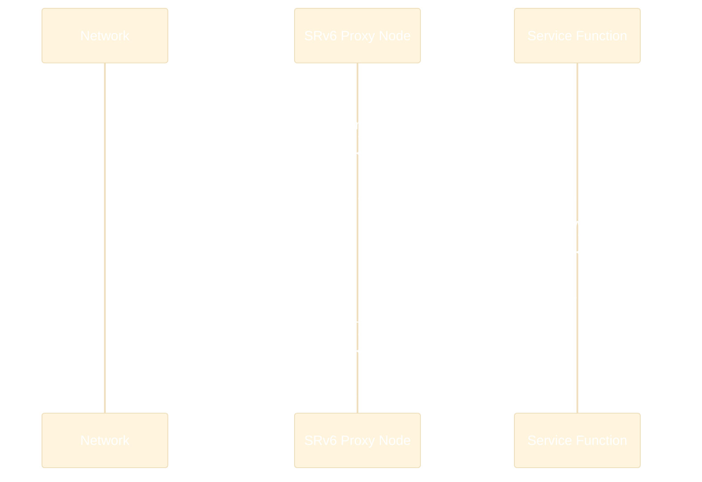

# Service Chaining with SRv6

**Service Function Chaining (SFC)** is the ability to steer traffic through an ordered set of network functions — firewalls, IDS/IPS, load balancers, DPI engines, NAT, WAN optimizers, etc. SRv6 provides one of the most elegant solutions for SFC by encoding the entire service chain as a **segment list**.

## The Problem with Traditional SFC

Without SRv6, service chaining typically relies on:

- **Manual VLAN/VRF stitching** — each service function connected via dedicated VLANs, brittle and hard to change
- **Policy-Based Routing (PBR)** — complex ACLs at every hop, doesn't scale
- **NSH (Network Service Header)** — RFC 8300 overlay, requires all functions to support NSH
- **Traffic steering appliances** — dedicated boxes that redirect traffic, adding cost and latency

These approaches share common pain points:

| Problem | Impact |
|---------|--------|
| **Topology dependent** | Service functions must be physically or logically adjacent |
| **Static chains** | Changing the order requires reconfiguring multiple devices |
| **State overhead** | Per-flow state at every classifier and service function |
| **Scalability** | Each new service in the chain multiplies complexity |

## How SRv6 Solves Service Chaining

With SRv6, the entire service chain is expressed as a **segment list** in the packet header. The ingress node encapsulates the packet once, and the network steers it through each function automatically.

### Key Principle

Each service function (or the node hosting it) is assigned an SRv6 SID. The segment list defines the chain:

```
Segment List: [FW::1, IDS::1, LB::1, Egress::DT4]
                 ↓        ↓        ↓         ↓
              Firewall → IDS → Load Balancer → Decap & deliver
```

The packet traverses the chain by following the SRv6 forwarding mechanics (decrement Segments Left, update DA, forward).

### Architecture


## Packet Walk: Service Chain

Let's trace a packet through a chain: **Client → Firewall → IDS → Server**

### Step 1: Ingress Classification

The ingress PE matches the traffic (e.g., by source IP, DSCP, VRF) and encapsulates with an SRv6 header containing the service chain:

```
Original:
  [IPv4: Client → Server][Payload]

After encapsulation:
  [IPv6: Ingress → FW::1]
  [SRH: SL=2, List=[Egress::DT4, IDS::1, FW::1]]
  [IPv4: Client → Server]
  [Payload]
```

### Step 2: Firewall (SRv6 Proxy)

The packet arrives at the firewall node. The SRv6 behavior depends on whether the firewall is **SRv6-aware** or not:

=== "SRv6-Aware Function"

    The firewall natively understands SRv6. It processes the packet, inspects the inner payload, applies its policy, and forwards with Segments Left decremented:

    ```
    FW receives:  DA=FW::1, SL=2
    FW processes:  Inspect payload, apply firewall policy
    FW forwards:   DA=IDS::1, SL=1
    ```

=== "SRv6-Unaware Function (Proxy)"

    Most existing network functions don't understand SRv6. SRv6 **proxy behaviors** solve this by stripping the SRv6 header before the function and re-adding it after:

    ```
    Proxy receives:  [IPv6+SRH][IPv4][Payload]
    Proxy strips:    [IPv4][Payload]  ← Sent to firewall
    Firewall processes: Normal IPv4 inspection
    Proxy re-adds:   [IPv6+SRH][IPv4][Payload]  ← SRH restored
    Proxy forwards:  DA=IDS::1, SL=1
    ```

### Step 3: IDS

Same process — the IDS inspects the packet (directly or via proxy), then the packet continues to the next SID.

### Step 4: Egress Decapsulation

The egress PE matches `Egress::DT4` (End.DT4 behavior), removes the SRv6 encapsulation, and delivers the original IPv4 packet to the server.

## SRv6 Proxy Behaviors

The key innovation for service chaining is the set of **proxy behaviors** defined in the IETF SR Service Programming draft. These allow **SRv6-unaware** functions to participate in an SRv6 service chain:

| Behavior | Name | How It Works |
|----------|------|-------------|
| `End.AS` | Static Proxy | Caches the SRH, strips it before the function, restores it after. Static: one cached SRH per SID. |
| `End.AD` | Dynamic Proxy | Like End.AS but dynamically caches the SRH per-packet. Supports functions that modify the inner packet. |
| `End.AM` | Masquerading Proxy | Modifies the outer IPv6 DA to the function's address while caching the SRH. The function sees a normal IPv6 packet and routes it back. |

### End.AD (Dynamic Proxy) — Most Common



This is critical because it means **any existing network function** (physical or virtual) can be inserted into an SRv6 service chain without modification.

## Dynamic Chain Modification

One of SRv6's most powerful advantages for SFC: changing the chain requires **only updating the segment list at the ingress**. No reconfiguration of intermediate nodes or service functions.

| Operation | What Changes |
|-----------|-------------|
| **Add a service** | Insert a new SID in the segment list |
| **Remove a service** | Remove the SID from the segment list |
| **Reorder services** | Change the order of SIDs |
| **Bypass a service** | Skip its SID (e.g., during maintenance) |
| **A/B test** | Different segment lists for different traffic classes |

All of this happens at the **ingress only** — the rest of the network and the service functions themselves are unchanged.

## Advantages over Traditional SFC

| Aspect | Traditional SFC | SRv6 Service Chaining |
|--------|:---------------:|:---------------------:|
| Topology dependency | Functions must be adjacent | Functions can be anywhere |
| Chain modification | Reconfigure every hop | Update segment list at ingress only |
| Per-flow state in network | Required at every classifier | None (stateless forwarding) |
| Legacy function support | Often requires function modification | Proxy behaviors (End.AS/AD/AM) |
| Metadata transport | NSH or custom headers | SRH TLVs |
| TE integration | Separate mechanism | Native (SR Policies) |
| Scalability | O(functions × classifiers) | O(1) — just a segment list |

## SFC + Traffic Engineering

SRv6 uniquely combines service chaining with traffic engineering in a **single segment list**:

```
Segment List: [LowLatencySpine::1, FW::1, IDS::1, Egress::DT4]
               └── TE segment ──┘  └── Service chain ──────────┘
```

The same packet can be steered through a specific network path **and** a specific service chain, all encoded in one SRH.

## Further Reading

- :material-arrow-right: [Network Programming](../topics/network-programming.md) - SRv6 behaviors including End.AD, End.AS
- :material-arrow-right: [SRH Mechanics & Packet Walk](../topics/srh-packet-walk.md) - How SRH forwarding works
- :material-arrow-right: [Traffic Engineering](traffic-engineering.md) - Combining TE with service chains
- :material-arrow-right: [Host-Based SRv6](../topics/host-based-srv6.md) - VPP and eBPF for service functions

## References

1. [RFC 8986 - SRv6 Network Programming](https://datatracker.ietf.org/doc/rfc8986/) - Defines base SRv6 endpoint behaviors used in service chains
2. [RFC 7665 - Service Function Chaining (SFC) Architecture](https://datatracker.ietf.org/doc/html/rfc7665) - IETF architecture for creating and maintaining Service Function Chains
3. [draft-ietf-spring-sr-service-programming](https://datatracker.ietf.org/doc/draft-ietf-spring-sr-service-programming/) - Defines SR proxy behaviors (End.AS, End.AD, End.AM) for SRv6-unaware service functions
4. [RFC 8300 - Network Service Header (NSH)](https://datatracker.ietf.org/doc/rfc8300/) - Alternative SFC approach for comparison with SRv6-based service chaining
