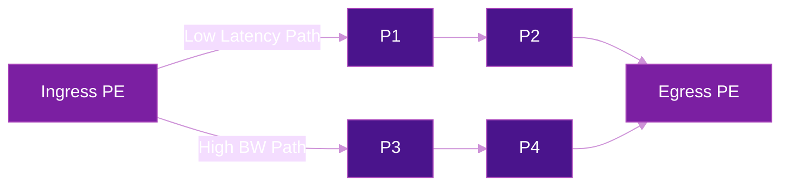

# Traffic Engineering with SRv6

SRv6 Traffic Engineering (TE) enables operators to steer traffic along explicit paths through the network, optimizing for latency, bandwidth, or other constraints.

## How It Works

Instead of relying on shortest-path routing alone, SRv6 TE defines **SR Policies** that specify explicit segment lists (paths) for traffic.

## SR Policy Components

| Component | Description |
|-----------|-------------|
| **Headend** | The node where the policy is applied |
| **Color** | Identifies the intent (e.g., low-latency) |
| **Endpoint** | Destination of the policy |
| **Candidate Path** | One or more segment lists for the policy |
| **Segment List** | Ordered list of SIDs defining the path |

## Use Cases

- **Low-latency routing** for real-time applications
- **Bandwidth reservation** for critical flows
- **Disjoint paths** for redundancy
- **WAN optimization** across multiple domains

## Further Reading

- :material-arrow-right: [VPN Services](vpn-services.md)
- :material-file-document: [RFC 9256](../rfcs/rfc9256.md) - SR Policy Architecture

## References

1. [RFC 9256 - Segment Routing Policy Architecture](https://datatracker.ietf.org/doc/rfc9256/) - IETF standard defining SR Policy headend, color, endpoint, candidate paths, and segment lists
2. [RFC 9252 - BGP Overlay Services Based on SRv6](https://datatracker.ietf.org/doc/rfc9252/) - BGP signaling procedures for SRv6-based L3VPN, EVPN, and internet services
3. [Configure SR-TE Policies - Cisco 8000 Series, IOS XR](https://www.cisco.com/c/en/us/td/docs/iosxr/cisco8000/segment-routing/24xx/configuration/guide/b-segment-routing-cg-cisco8000-24xx/configuring-sr-te-policy.html) - Cisco IOS XR configuration guide for SR-TE policies on Cisco 8000 series routers
