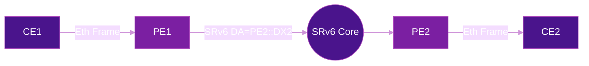
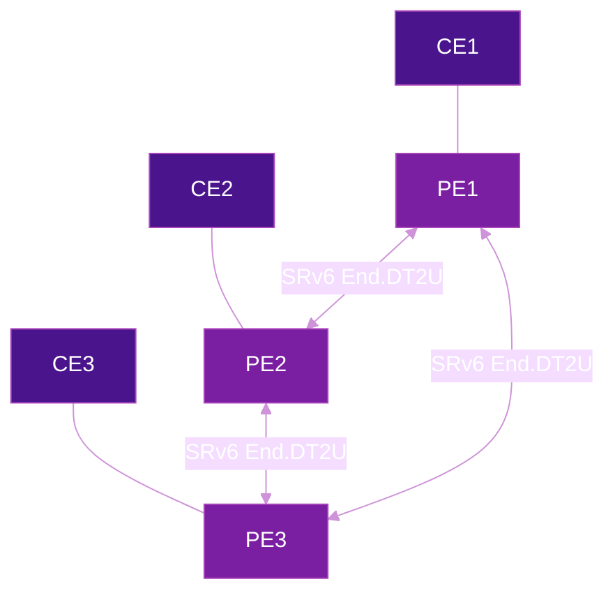

# VPN Services with SRv6

SRv6 provides a native mechanism to deliver L3VPN and L2VPN services without MPLS, using SRv6 SIDs as service identifiers. The BGP control plane (RFC 9252) signals SRv6 SIDs instead of MPLS labels — same MP-BGP, same address families, fundamentally different data plane.

## SRv6-based L3VPN

SRv6 L3VPN uses `End.DT4` / `End.DT6` behaviors to decapsulate traffic and perform a lookup in the appropriate VRF table.

### How It Works

1. PE router receives customer IPv4/IPv6 traffic
2. Encapsulates with outer IPv6 header + SRH
3. Sets destination to the remote PE's VPN SID (`End.DT4`)
4. Remote PE decapsulates and forwards to the correct VRF

!!! example "BGP VPNv4 with SRv6"
    ```
    BGP Update:
      Prefix: 10.0.0.0/24
      Next-Hop: 2001:db8::2
      SRv6 SID: fc00:0:2::DT4  (End.DT4 behavior)
      VRF: CUSTOMER-A
    ```

### L3VPN Configuration

=== "Cisco IOS-XR"

    ```cisco
    !! VRF definition with SRv6
    vrf CUSTOMER-A
     address-family ipv4 unicast
      import route-target 65000:100
      export route-target 65000:100
     !
    !

    !! BGP VPNv4 with SRv6
    router bgp 65000
     vrf CUSTOMER-A
      rd 65000:100
      address-family ipv4 unicast
       segment-routing srv6
        locator MAIN
        alloc mode per-vrf
       !
      !
     !
    !
    ```

=== "Juniper"

    ```junos
    set routing-instances CUSTOMER-A instance-type vrf
    set routing-instances CUSTOMER-A route-distinguisher 65000:100
    set routing-instances CUSTOMER-A vrf-target target:65000:100
    set routing-instances CUSTOMER-A protocols bgp group PE-MESH family inet segment-routing-v6
    ```

### L3VPN Verification

=== "Cisco IOS-XR"

    ```cisco
    show bgp vpnv4 unicast vrf CUSTOMER-A
    show cef vrf CUSTOMER-A ipv4 10.0.0.0/24 detail
    show segment-routing srv6 sid
    ```

## L3VPN: MPLS vs SRv6

| Aspect | MPLS L3VPN | SRv6 L3VPN |
|--------|-----------|-------------|
| Label signaling | MP-BGP + LDP/RSVP | MP-BGP only |
| Service identifier | VPN label | SRv6 SID (End.DT4/DT6) |
| Transport | MPLS LSP | IPv6 native |
| Complexity | Higher (multiple protocols) | Lower (IPv6 + BGP) |

---

## SRv6-based L2VPN

SRv6 L2VPN uses EVPN signaling (RFC 7432) with SRv6 endpoint behaviors to deliver Layer 2 services. This replaces VPLS and MPLS-based pseudowires with a native IPv6 data plane.

### L2VPN SID Behaviors

| Behavior | Service Type | Description |
|----------|:------------:|-------------|
| **End.DX2** | E-Line (VPWS) | Decapsulate and cross-connect to a single L2 attachment circuit |
| **End.DX2V** | E-Line with VLAN | Same as End.DX2 but with VLAN-aware cross-connect |
| **End.DT2U** | E-LAN (unicast) | Decapsulate and perform MAC lookup in a bridge table (known unicast) |
| **End.DT2M** | E-LAN (BUM) | Decapsulate and flood to all attachment circuits in the bridge domain |

!!! info "Defined in RFC 8986"
    L2VPN behaviors are defined in [RFC 8986 - SRv6 Network Programming](../rfcs/rfc8986.md) alongside the L3VPN behaviors (End.DT4, End.DT6).

### EVPN Route Types for L2VPN

EVPN uses five route types to signal L2 reachability. In an SRv6 context, the SRv6 SID replaces the MPLS label in each route:

| Type | Name | Purpose in L2VPN |
|:----:|------|-----------------|
| **1** | Ethernet Auto-Discovery | Per-EVI/ESI route for fast convergence and aliasing |
| **2** | MAC/IP Advertisement | Advertises learned MAC (and optionally IP) with SRv6 SID |
| **3** | Inclusive Multicast | Signals BUM replication membership per bridge domain |
| **4** | Ethernet Segment | DF election for multihomed CEs (see [EVPN Multihoming](../topics/evpn-multihoming.md)) |
| **5** | IP Prefix | Advertises IP routes for integrated routing and bridging (IRB) |

## EVPN-VPWS (E-Line) with SRv6

EVPN-VPWS provides **point-to-point L2 connectivity** — the SRv6 equivalent of a traditional pseudowire. Each direction uses an `End.DX2` SID for cross-connection.



### VPWS Configuration

=== "Cisco IOS-XR"

    ```cisco
    !! EVPN-VPWS with SRv6
    l2vpn
     xconnect group VPWS-SRV6
      p2p CUSTOMER-A-VPWS
       interface GigabitEthernet0/0/0/1
       neighbor evpn evi 100 target 1 source 1
        segment-routing srv6
         locator MAIN
        !
       !
      !
     !
    !

    !! EVPN signaling
    evpn
     evi 100
      bgp
       route-target import 65000:100
       route-target export 65000:100
      !
      advertise-mac
     !
    !
    ```

=== "Juniper"

    ```junos
    set routing-instances VPWS-A instance-type evpn-vpws
    set routing-instances VPWS-A protocols evpn interface ge-0/0/1 vpws-service-id local 1
    set routing-instances VPWS-A protocols evpn interface ge-0/0/1 vpws-service-id remote 1
    set routing-instances VPWS-A route-distinguisher 65000:100
    set routing-instances VPWS-A vrf-target target:65000:100
    set routing-instances VPWS-A protocols evpn srv6 locator SRV6-LOC
    ```

### VPWS Verification

=== "Cisco IOS-XR"

    ```cisco
    show l2vpn xconnect group VPWS-SRV6 detail
    show evpn evi 100 detail
    show evpn evi 100 mac
    show segment-routing srv6 sid | include DX2
    ```

## EVPN-ELAN (E-LAN) with SRv6

EVPN-ELAN provides **multipoint L2 connectivity** — a virtual switch spanning multiple sites. MAC addresses are learned via EVPN Type-2 routes in the control plane, and BUM traffic is handled via ingress replication.



### MAC Learning

Unlike traditional bridging, EVPN learns MACs in the **control plane**:

1. PE learns a local MAC on an attachment circuit
2. PE advertises the MAC via EVPN **Type-2** route with an SRv6 SID (`End.DT2U`)
3. Remote PEs install the MAC in their bridge table pointing to the SRv6 SID
4. Known unicast traffic is sent directly to the owning PE — no flooding

### BUM Traffic Handling

Broadcast, Unknown unicast, and Multicast traffic uses:

- **EVPN Type-3 (Inclusive Multicast)** routes to signal which PEs participate in the bridge domain
- **Ingress replication** — the source PE sends a unicast SRv6 copy (with `End.DT2M` SID) to each remote PE
- **ARP/ND suppression** — PEs proxy ARP/ND locally using EVPN Type-2 MAC/IP bindings, reducing broadcast floods

!!! tip "For large-scale BUM"
    When ingress replication doesn't scale, consider [Tree-SID or BIER](../topics/multicast.md) for bandwidth-efficient BUM delivery.

### ELAN Configuration

=== "Cisco IOS-XR"

    ```cisco
    !! Bridge domain with EVPN + SRv6
    l2vpn
     bridge group ELAN-SRV6
      bridge-domain BD-100
       interface GigabitEthernet0/0/0/2
       !
       evi 200
       !
      !
     !
    !

    evpn
     evi 200
      bgp
       route-target import 65000:200
       route-target export 65000:200
      !
      advertise-mac
      !
      segment-routing srv6
       locator MAIN
      !
     !
    !
    ```

=== "Juniper"

    ```junos
    set routing-instances ELAN-A instance-type mac-vrf
    set routing-instances ELAN-A protocols evpn srv6 locator SRV6-LOC
    set routing-instances ELAN-A bridge-domains BD-100 interface ge-0/0/2
    set routing-instances ELAN-A route-distinguisher 65000:200
    set routing-instances ELAN-A vrf-target target:65000:200
    set routing-instances ELAN-A service-type vlan-aware
    ```

## E-Tree with SRv6

E-Tree provides **hub-and-spoke L2 connectivity** where leaf sites can communicate with root sites but **not with other leaves**.

| Role | Can Reach | Cannot Reach |
|------|-----------|:------------:|
| **Root** | All roots + all leaves | — |
| **Leaf** | All roots only | Other leaves |

E-Tree is implemented using EVPN with **leaf indication** in the EVPN routes. PEs filter traffic based on the root/leaf role of the source and destination attachment circuits.

### Use Cases

- **Hub-and-spoke VPN** — branch offices communicate only through the data center
- **Multicast distribution** — content pushed from root to leaves, no leaf-to-leaf

## EVPN-SRv6 vs EVPN-VXLAN vs EVPN-MPLS

| Aspect | EVPN-SRv6 | EVPN-VXLAN | EVPN-MPLS |
|--------|-----------|------------|-----------|
| **Encapsulation** | IPv6 + SRH | UDP + VXLAN | MPLS labels |
| **Underlay** | IPv6 native | IPv4 or IPv6 | MPLS LSP (LDP/RSVP) |
| **Traffic engineering** | SR Policy / Flex-Algo | Limited (ECMP only) | RSVP-TE |
| **Service chaining** | SRv6 SID list | Requires overlay | Complex |
| **Network programming** | Native (SRv6 behaviors) | None | None |
| **MTU overhead** | 40B (IPv6) + 24B (SRH) | 50B (UDP+VXLAN) | 4-16B (labels) |
| **MAC learning** | Control plane (BGP EVPN) | Control plane (BGP EVPN) | Control plane (BGP EVPN) |
| **Typical deployment** | SP / large enterprise | Data center | Service provider |

## Further Reading

- :material-arrow-right: [BGP Overlay Services](../topics/bgp-overlay-services.md) — BGP signaling for SRv6 VPN services
- :material-arrow-right: [EVPN Multihoming](../topics/evpn-multihoming.md) — Active-active multihoming, DF election, ESI
- :material-arrow-right: [Multicast & Broadcast](../topics/multicast.md) — BUM traffic delivery at scale
- :material-arrow-right: [Service Chaining](service-chaining.md) — Steering VPN traffic through network functions
- :material-arrow-right: [SR Policy](../topics/sr-policy.md) — Traffic engineering for VPN overlays
- :material-file-document: [RFC 9252](../rfcs/rfc9252.md) — BGP Overlay Services Based on SRv6

## References

1. [RFC 9252 - BGP Overlay Services Based on SRv6](https://datatracker.ietf.org/doc/rfc9252/) - IETF standard defining BGP signaling for SRv6-based L3VPN, EVPN, and internet services
2. [RFC 7432 - BGP MPLS-Based Ethernet VPN](https://datatracker.ietf.org/doc/rfc7432/) - Foundational EVPN RFC defining route types, MAC learning, and multihoming procedures
3. [RFC 8986 - SRv6 Network Programming](https://datatracker.ietf.org/doc/rfc8986/) - Defines SRv6 behaviors including End.DX2, End.DT2U, End.DT2M for L2VPN services
4. [RFC 4364 - BGP/MPLS IP Virtual Private Networks (VPNs)](https://datatracker.ietf.org/doc/html/rfc4364) - The foundational MPLS L3VPN RFC, useful for comparison with SRv6 VPN approaches
5. [Cisco IOS-XR: Configure SRv6-based L2VPN Services](https://www.cisco.com/c/en/us/td/docs/iosxr/cisco8000/l2vpn/24xx/configuration/guide/b-l2vpn-cg-cisco8000-24xx/configuring-evpn-srv6.html) - Configuration guide for EVPN-VPWS and EVPN-ELAN with SRv6
